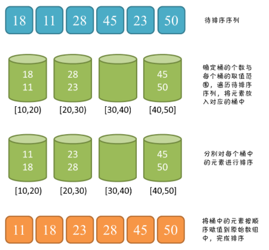

## 8sort-algo

> 原地排序：是否使用了利用辅助的空间。
> 稳定排序：数列值相等的元素排序后相对顺序不变


 

## 堆排序(不稳定,原地)

#### 思路

1）数组构建成二叉堆。(小到大排序,则构建最大堆)；
2）循环删除堆顶元素,替换到二叉堆的末尾,调整堆产生新的堆顶。

#### 代码

```java
class T{
/**
 * 下沉调整
 * @param arr 待调整的堆
 * @param parent 要下沉的父节点
 */
public static void downAdjust(int[] arr, int parent,int length) {
    //temp保存父节点值,用于最后的赋值
    int temp = arr[parent];
    int child= 2 * parent+1;
    while (child< length) {
        //如果有右孩子,且右孩子大于左孩子的值,则定位到右孩子
        if (child+ 1 < length && arr[child+ 1] > arr[child]) {
            childIndex++;
        }
        //如果父节点小于任何一个孩子的值,则直接跳出
        if (temp >= arr[child]) {
            break;
        }
        //无须真正交换,单向赋值即可
        arr[parent] = array[child];
        parent= child;
        child= 2 * parent+ 1;
    }
    arr[parent] = temp;

}
/**
 * 堆排序（升序）
 * @param arr待调整的堆
 */
public static void heapSort(int[] arr) {
    //1. 把无序数组构建成最大堆
    for (int i = (arr.length -2)/ 2; i >= 0; i--) {
        downAdjust(arr,i,arr.length);
    }
    System.out.println(Arrays.toString(arr));
    //2. 循环删除堆顶元素,移到集合尾部,调整堆产生新的堆顶
    for (int i = arr.length; i > 0; i--) {
        //最后1个元素和第一个元素进行交换
  swap(arr,0,i);
        //“下沉”调整最大堆
        downAdjust(arr, 0, i);
    }
}

public static void swap(int[] a,int i,int j) {
 int temp = a[i];
 a[i] = a[j];
 a[j] = temp;
}

public static void main(String[] args) {
    int[] arr = new int[] {1,3,2,6,5,7,8,9,10,0};
    heapSort(arr);
    System.out.println(Arrays.toString(arr));
}
}

```

## 快速排序

快速排序是一种原地排序,只需要一个很小的栈作为辅助空间,空间复杂度为 O(log2n),所以适合在数据集比较大的时候使用。

#### 思路 (双边循环法)

使用递归方法

1. 找一个基线条件(递归结束条件)区间不可再分；
2. 每一轮挑选一个基准元素,比基准元素大的元素移动到数列一边,小的元素移动到数列的另一边；
3. 然后分别对得到的子数组第二步的操作,直到符合基线条件。

#### 代码 (双边循环法)

```java
class T{
public static void quickSort(int[] arr, int startIndex,int endIndex) {
    // 递归结束条件：startIndex大于或等于endIndex时
    if (startIndex >= endIndex) {
        return;
    }
    // 得到基准元素位置
    int pivotIndex = partition(arr,startIndex, endIndex);
    //根据基准元素,分成两部分进行递归排序
    quickSort(arr, startIndex, pivotIndex - 1);
    quickSort(arr, pivotIndex + 1, endIndex);
}

    /**
     * 分治（双边循环法）
     * 让数列中的元素依据自身大小,分别交换到基准元素的左右两边。
     * @param arr         待交换的数组
     * @param startIndex  起始下标
     * @param endIndex    结束下标
     */
    private static int partition(int[] arr,int startIndex,int endIndex){
        // 取第一个位置（也可以选择随机位置）的元素作为基准元素
        int pivot = arr[startIndex];
        int left = startIndex;
        int right = endIndex;

        while (left != right){
            //控制right指针比较并左移
            while(left < right && arr[right] >= pivot){
                right--;
            }
            //控制left指针比较并右移
            while (left < right && arr[left] <= pivot){
                left++;
            }
            //交换left 和 right指针所指向的元素
            if(left<right){
                int tmp = arr[left];
                arr[left] = arr[right];
                arr[right] = tmp;
            }
        }

        //pivot和指针重合点交换
        arr[startIndex] = arr[left];
        arr[left] = pivot;

        return left;
    }

    public static void main(String[] args) {
        int[] arr = int[] {4,4,6,5,3,2,8,1};
        quickSort(arr,0,arr.length-1);
        System.out.println(Arrays.toString(arr));
    }
}
```

**单边循环法**

#### 思路 (单边循环法)

1）设置一个 mark 指针指向数列起始位置,这个 mark 指针代表小于基准元素的**区域边界**。

2）从基准元素的下一个位置开始遍历数组。

如果遍历到的元素大于基准元素,就继续往后遍历。

如果遍历到的元素小于基准元素,则需要做两件事：

- mark 指针右移一位,小于 pivot 的区域边界增大；
- 让最新遍历到的元素和 mark 指针所在的元素交互位置。

#### 代码 (单边循环法)

```java
class T{
    private static int partitionV2(int[] arr, int startIndex, int endIndex){
        int pivot = arr[startIndex];
        int mark = startIndex;

        //从基准元素的下一个位置开始遍历数组
        for(int i=startIndex+1; i<=endIndex; i++){
            //遍历到的元素小于基准元素
            if(arr[i]<pivot){
                //mark指针右移1位,小于pivot的区域边界增大了1;
                mark++;
                //让最新遍历到的元素和mark指针所在位置的元素交换位置
                int p = arr[mark];
                arr[mark] = arr[i];
                arr[i] = p;
            }
            //最后把pivot元素交换到mark指针所在位置,该数列的分治就宣告结束了。
            arr[startIndex] = arr[mark];
            arr[mark] = pivot;
            return mark;
        }
    }
}

```

## 冒泡排序

#### 思路

1. 比较相邻的两个数据,前一个元素比后一个元素大就交换位置
2. 从前往后,两两比较,得到最大数
3. 重复操作,直到最后一个值结束,得到的新数组就是有序的了

#### 代码

```java
public class BubbleSort {
 public static void sort(int [] arr){
      for(int i=0; i<arr.length-1; i++){//表示趟数,一共arr.length-1次。
          for(int j=arr.length-1; j > i  ; j--){
           if ( arr[j-1]>arr[j]) {
            swap(arr, j, j-1);
    }
          }
      }
  }
 //优化后版本
 public static void sortV2(int [] arr){
      for(int i=0; i < arr.length-1; i++){//趟数
       boolean isSorted = true;
          for(int j=0; j < arr.length - i - 1  ; j++){
           if (arr[j] < arr[j+1]) {
            swap(arr, j, j-1);
            isSorted = false;
    }
          }
          if(isSorted) break;
      }
  }
 public static void swap(int[] a,int i,int j) {
  int temp = a[i];
  a[i] = a[j];
  a[j] = temp;
 }
}
```

## 选择排序

#### 思路

假设**最开始的值为最小值**
遍历数组,与最开始的元素一一比较,得到最小元素的位置然后交换元素。

#### 代码

```java
package sort;
/*
 * created by sj 2019年8月16日
 */
public class SelectSort {
 public static void sort(int[] a) {
  int minIndex = 0;
  for (int i = 0; i <  a.length - 1; i++) {
   minIndex = i; //最小元素下标初始值设为最开始的元素
   for (int j = i+1; j <  a.length; j++) {//寻到最小的数,保存下标
    if(a[j]<a[minIndex])
     minIndex = j;
   }
   swap(a, minIndex, i);//交换
  }
 }

 public static void swap(int[] a,int i,int j) {
  int temp = a[i];
  a[i] = a[j];
  a[j] = temp;
 }
}
```

## 插入排序

在要排序的一组数中，假设前面（N-1）[N>=2]个数已经是排好顺序的，现在要把第N个树杈到前面的有序书中，使得这N个数也是排好顺序的。如此反复循环，直到全部排好顺序。

#### 代码

```java
package sort;

import java.util.Arrays;

/*
 * created by sj 2019年8月16日
 */
public class InsertSort {
 public static void  sort(int a[] ){
     for(int i=0;i < a.length-1;i++){
         for(int j = i + 1; j > 0 && a[j-1] > a[j]  ; j--){
           swap(a, j - 1, j);
         }
     }
  }

 public static void swap(int[] a,int i,int j) {
  int temp = a[i];
  a[i] = a[j];
  a[j] = temp;
 }

 public static void main(String[] args) {
  int[] a = {3,5,7,1,8,6};
  sort(a);
  System.out.println(Arrays.toString(a));
 }
}
```

## 桶排序

### 原理

桶排序**利用函数的映射关系**

一句话总结：划分多个范围相同的区间,每个子区间自排序,最后合并。

桶排序是计数排序的扩展版本,计数排序可以看成每个桶只存储相同元素,而桶排序每个桶存储一定范围的元素,通过映射函数,将待排序数组中的元素映射到各个对应的桶中,对每个桶中的元素进行排序,最后将非空桶中的元素逐个放入原序列中。

桶排序需要尽量保证元素分散均匀,否则当所有数据集中在同一个桶中时,桶排序失效。



### 核心代码

```java
class T{
public static void bucketSort(int[] arr){

    // 计算最大值与最小值
    int max = Integer.MIN_VALUE;
    int min = Integer.MAX_VALUE;
    for(int i = 0; i < arr.length; i++){
        max = Math.max(max, arr[i]);
        min = Math.min(min, arr[i]);
    }

    // 计算桶的数量
    int bucketNum = (max - min) / arr.length + 1;
    ArrayList<ArrayList<Integer>> bucketArr = new ArrayList<>(bucketNum);
    for(int i = 0; i < bucketNum; i++){
        bucketArr.add(new ArrayList<Integer>());
    }

    // 将每个元素放入桶
    for(int i = 0; i < arr.length; i++){
        int num = (arr[i] - min) / (arr.length);
        bucketArr.get(num).add(arr[i]);
    }

    // 对每个桶进行排序
    for(int i = 0; i < bucketArr.size(); i++){
        Collections.sort(bucketArr.get(i));
    }

    // 将桶中的元素赋值到原序列
 int index = 0;
 for(int i = 0; i < bucketArr.size(); i++){
  for(int j = 0; j < bucketArr.get(i).size(); j++){
   arr[index++] = bucketArr.get(i).get(j);
  }
 }
}
}
```

## 计数排序

根据原始数列的取值范围,创建一个`统计数组`,用来统计原始数列中每一个可能的整数值所出现的次数。

原始数列中的整数值,和统计数组的下标是一一对应的,以数列的最小值作为偏移量。

比如原始数列的最小值是 90,那么整数 95 对应的统计数组下标就是 95-90=5.

每一个桶代表一个区间范围,里面可以承载一个或多个元素。

#### 思路

算出数列最大值和最小值,并算出差值,初始化桶,桶个数有多种方式,`区间跨度= 差值 / （桶的数量-1）` 最后一个桶只包含数列最大值,其余桶区间跨度按照比例分配。

将原始数组中的元素放进相应的桶中,桶内部的元素分别排序,输出所有元素。

时间复杂度：n+m 空间复杂度：m

#### 代码

```java
public class T {
    public static double[] bucketSort(double[] array) {
        // 1.得到数列的最大值和最小值,并算出差值d
        double max = array[0];
        double min = array[0];
        for (int i = 1; i < array.length; i++) {
            if (array[i] > max) {
                max = array[i];
            }
            if (array[i] < min) {
                min = array[i];
            }
        }
        double d = max - min;

        // 2.初始化桶
        int bucketNum = array.length; //我们这里创建的桶数等于原始数列的元素数量
        List<LinkedList<Double>> bucketList = new ArrayList<>(bucketNum);
        for (int i = 0; i < bucketNum; i++) {
            bucketList.add(new LinkedList<Double>());
        }

        // 3.遍历原始数组,将每个元素放入桶中
        for (int i = 0; i < array.length; i++) {
            int num = (int) ((array[i] - min) * (bucketNum - 1) / d);
            bucketList.get(num).add(array[i]);
        }

        // 4.对每个通内部进行排序
        for (int i = 0; i < bucketList.size(); i++) {
            // JDK底层采用了归并排序或归并的优化版本
            Collections.sort(bucketList.get(i));
        }

        // 5.输出全部元素
        double[] sortedArray = new double[array.length];
        int index = 0;
        for (LinkedList<Double> list : bucketList) {
            for (double element : list) {
                sortedArray[index] = element;
                index++;
            }
        }
        return sortedArray;
    }

    public static void main(String[] args) {
        double[] array = new double[] { 4.12, 6.421, 0.0023, 3.0, 2.123, 8.122, 4.12, 10.09 };
        double[] sortedArray = bucketSort(array);
        System.out.println(Arrays.toString(sortedArray));
    }
}
```


## 希尔排序

算发现将要排序的一组数按某个增量D(n/2，n为要排序数的个数)分为若干组，每组中记录的下标相差D，

## 原地、稳定

| 排序方式 | 是否原地 | 是否稳定 |
| -------- | -------- | -------- |
| 冒泡     | √        | √        |
| 插入     | √        | √        |
| 选择     | √        | √        |
| 归并     | ×        | √        |
| 堆       | √        | ×        |
| 桶       | ×        | ×        |
