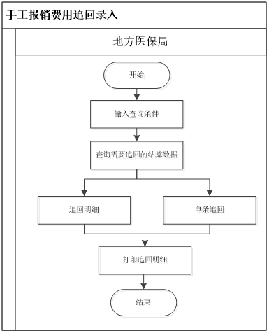

# med

手工报销初审(上传)

### 数据来源

1. 补录
2. 院端上传
3. 门诊实时结算未分解

注：院端上传

## 补支、追回

后期审核发现中心报销费用异常，需要追回已审核支付的数据。操作员可在已经结算支付的单位手工报销交易上增加现金追回记录功能。

(1) 经办人员根据条件查询需要追回的报销信息；
(2) 对结算信息进行追回处理。

### 1.1.1.15.3 界面设计

(1) 根据输入的查询条件查询并显示已经支付的手工报销费用交易。
(2) 选择需要记录现金追回的交易记录，系统自动提示最大可追回现金金额(报销总金额)。
(3) 输入需要追回的现金金额，其不能超过该交易的当前最大可追回现金金额，并录入追回原因。
(4) 保存该交易的现金追回信息，系统记录操作日志。
(5) 现金追回也应该记录历史，审核前可修改，审核后不可修改。发财务前可删除。对于职工和超转人员，能自动计算各基金项的追回金额
