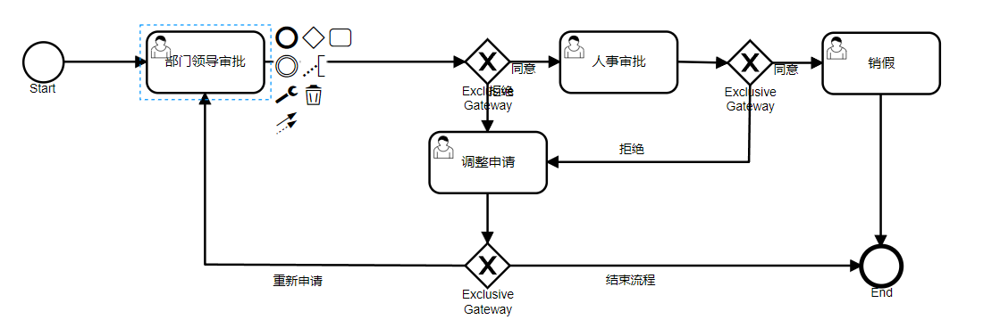

## 库表结构含义

### 一、通用数据表(act_ge_*)

1.act_ge_bytearray(资源表)

二进制资源表，用于存储通用的流程定义和流程资源，只要调用了`activiti`存储服务的API,涉及的资源均会被转换为byte数组保存到这个表中，一般情况用于保存字符串，流程文件 内容，流程图片内容。

| 字段             | 数据类型         | 描述                                             |
|----------------|--------------|------------------------------------------------|
| ID_            | varchar(64)	 | 主键ID                                           |
| REV_           | int(11)      | 数据版本，用于记录该数据被操作的次数                             |
| NAME_          | varchar(255) | 部署资源文件的名称                                      |
| DEPLOYMENT_ID_ | varchar（64）  | 一次可以添件多个资源，该字段与部署表act_re_deployment的主键关联       |
| BYTES_         | longblob     | 存储的资源内容（部署的文件）                                 |
| GENERATED_     | tinyint      | 该资源是否是activiti引擎自动生成（0表示用户生成，1表示由activiti引擎生成） |

2.act_get_property(属性数据表)

系统相关的属性，存储整个流程引擎级别的数据，初始化表结构时会默认，插入三条记录。

| 字段     | 数据类型         | 描述     |
|--------|--------------|--------|
| NAME_  | varchar(64)  | 属性的名称  | 
| VALUE_ | varchar(300) | 属性的值   |
| REV_   | int          | 数据的版本号 |

### 二、流程存储数数据表（act_re_*）

1.act_re_deployment(部署数据信息表)

部署流程定义时需要被持久化保留的信息


| 字段	              | 数据类型          | 	描述    |
|------------------|---------------|--------|
| ID_	             | varchar(64)   | 	      |主键ID|
| NAME_	           | varchar(255)  | 	部署名称  |
| CATEGORY_	       | varchar(255)  | 	类别    |
| KEY_	            | varchar(255)	 | 关键字    |
| TENANT_ID_       | 	varchar(255) | 	租户    |
| DEPLOY_TIME      | 	timestamp	   | 部署时间   |
| ENIGIN_VERSION_	 | varchar(255)  | 	引擎版本号 |

2.act_re_procdef(流程定义数据表)

activiti在资源部署时，将部署的流程文件进行解析，形成特定的流程定义数据，写入到流程定义表中。


| 字段	                     | 数据类型           | 	描述                                                                          |
|-------------------------|----------------|------------------------------------------------------------------------------|
| ID_                     | 	varchar(64)	  | 主键ID                                                                         |
 | REV_                    | 	int(11)       | 	数据版本，用于记录该数据被操作的次数                                                          |
 | CATEGORY_               | 	varchar(255)  | 	分类：流程定义的Namespace就是类别                                                       |
 | NAME_                   | 	varchar(255)  | 	流程名称                                                                        |
 | KEY_                    | 	varchar(255)  | 	流程编号（该编号就是流程文件process元素的id属性值）                                              |
 | VERSION_                | 	int(11)	      | 流程版本号（新建为1，随修改次数递增1）                                                         |
 | DEPLOYMENT_ID_          | 	varchar(64)   | 	部署表（act_re_deployment）ID                                                    |
 | RESOURCE_NAME_          | 	varchar(4000) | 	流程图bpmn的文件名称                                                                |
 | DGRM_RESOURCE_NAME_     | 	varchar(4000) | 	图片资源文件名称（一般为png）                                                            |
 | DESCRIPTION_            | 	varchar(4000) | 	流程定义的描述信息                                                                   |
 | HAS_START_FORM_KEY_     | 	tinyint(4)    | 	流程文件是否有开始表单（start节点是否存在formKey 0否 1是）                                       |
 | HAS_GRAPHICAL_NOTATION_ | 	tinyint(4)    |                                                                              |
 | SUSPENSION_STATE_       | 	int(11)	      | 是否挂起（1激活，2挂起）表示流程定义的状态是激活还是中止，激活状态时该字段值为1，中止时字段值为2，如果流程定义被设置为中止状态，那么将不能启动流程。 |  
 | TENANT_ID_              | 	varchar(255)	 | 租户ID                                                                         |
 | ENGINE_VERSION_         | 	varchar(255)	 | 引擎的版本号                                                                       |

3.act_re_model(流程设计模型部署表)

创建流程的设计模型是，保存在该数据表中

| 字段	                           | 数据类型           | 	描述                       |
|-------------------------------|----------------|---------------------------|
| ID_                           | 	varchar(64)   | 	主键ID                     |
| REV_                          | 	int(11)	      | 数据版本，用于记录该数据被操作的次数        |
| NAME_                         | 	varchar(255)  | 	模型名称                     |
| KEY_                          | 	varchar(255)  | 	模型关键字                    |
| CATEGORY_                     | 	varchar(255)  | 	类型，用户自己对流程模型的分类          |
| CREATE_TIME_                  | 	timestamp     | 	模型的创建时间                  |
| LAST_UPDATE_TIME	             | timestamp      | 	最后修改的时间                  |
| VERSION_                      | 	int(11)	      | 模型版本号（新建为1，随修改次数递增1）      |
| META_INFO_                    | 	varchar(4000) | 	数据源信息（以json的形式保存流程定义的信息） |
| DEPLOYMENT_ID_                | 	varchar(64)	  | 部署表（act_re_deployment）ID  |
| EDITOR_SOURCE_VALUE_ID_       | 	varchar(64)	  | 编辑源值 ID                   |
| EDITOR_SOURCE_EXTRA_VALUE_ID_ | 	varchar(64)	  | 编辑员扩展值ID                  |
| TENANT_ID_                    | 	varchar(255)  | 	租户ID                     |

### 三、用户数据表（act_id_*）

1.act_id_user(用户信息表)

流程引擎的用户信息被保存在act_id_user表中

| 字段	         | 数据类型	          | 描述                 |
|-------------|----------------|--------------------|
| ID_         | 	varchar(64)   | 主键ID               |
| REV_        | 	int(11)	      | 数据版本号              |
| FIRST_      | 	varchar(255)  | 	用户名称              |
| LAST_       | 	varchar(255)	 | 用户姓氏               |
| EMAIL_      | 	varchar(255)  | 	用户邮箱              |
| PWD_        | 	varchar(255)	 | 用户密码               |
| PICTURE_ID_ | 	varchar(64)   | 	用户头像图片，对应资源表的数据ID |

2.act_id_info（用户扩展信息表）

Activiti将用户、用户账号和用户信息分为三种数据，其中用户表保存用户的数据，而用户账号和用户信息，则被保存到act_id_info表中。

| 字段	        | 数据类型	          | 描述                                                |
|------------|----------------|---------------------------------------------------|
| ID_        | 	varchar(64)   | 	主键ID                                             |
 | REV_       | 	int(11)	      | 版本号                                               |
 | USER_ID_   | 	varchar(64)   | 	对应用户表的数据ID，但没有强制做外键关联。                           |
 | TYPE_      | 	varchar(64)   | 	信息类型，当前可以设置用户账号(account)、用户信息(userinfo)和NULL三种值。 |
 | KEY_       | 	varchar(255)  | 	数据的键，可以根据该键来查找用户信息的值。                            |
 | VALUE_     | 	varchar(255)  | 	数据的值                                             |
 | PASSWORD_  | 	longblob      | 	用户账号密码字段                                         |
 | PARENT_ID_ | 	varchar(255)	 | 该信息的父信息ID，如果一条数据设置了父信息ID，则表示该数据时用户账号（信息）的明细数据。    |


3.act_id_group(用户组信息表)

保存用户组的信息

| 字段	   | 数据类型	          | 描述    |
|-------|----------------|-------|
| ID_   | 	varchar(64)	  | 主键ID  |
| REV_  | 	int(11)	      | 版本号   |
| NAME_ | 	varchar(255)	 | 用户组名字 |
| TYPE_ | 	varchar(255)	 | 用户组类型 |

4.act_id_membership(用户与用户组关系表)

一个用户组下有多个用户，一个用户可以属于不同的用户组，那么这种多对多的关系，就使用关系表来进行描述，关系表为act_id_membership。

| 字段	       | 数据类型	        | 描述          |
|-----------|--------------|-------------|
| USER_ID_  | 	varchar(64) | 	用户表的主键ID   |
| GROUP_ID_ | 	varchar(64) | 	用户组信息表主键ID |

### 四、运行时数据表（act_ru_*）

1.act_ru_execution（流程实例表）

流程启动后，会产生一个流程实例，同时会产生相应的执行流，流程实例和执行流数据均被保存在act_ru_execution表中，如果一个流程实例只有一条执行流，那么该表中只产生一条数据，该数据既表示执行流，也表示流程实例。


| 字段	                   | 数据类型	          | 描述                                                        |
|-----------------------|----------------|-----------------------------------------------------------|
| ID_                   | 	varchar（64）   | 	主键ID                                                     |
 | REV_                  | 	int(11)       | 	版本号                                                      |
 | PROC_INST_ID_         | 	varchar(64)	  | 流程实例ID                                                    |
 | BUSINESS_KEY_         | 	varchar(255)  | 	一个流程实例有可能会产生多个执行流，该字段表示执行流所属的流程实例启动流程时指定的业务主键。(一般存业务表主键) |
 | PARENT_ID_            | 	varchar(64)   | 	父流程实例ID，一个流程实例有可能会产生执行流，新的执行流数据以该字段标识其所属的流程实例。           |
 | PROC_DEF_ID_          | 	varchar(64)   | 	流程定义的ID                                                  |
 | SUPER_EXEC_           | 	varchar(64)	  | 外部子流程                                                     |
 | ROOT_PROC_INST_ID_    | 	varchar(64)   ||
 | ACT_ID_               | 	varchar(255)  | 	当前执行流程ID，ID在流程文件中定义                                      |
 | IS_ACTIVE_            | 	tinyint(4)    | 	是否处于激活状态（0否，1是）                                          |
 | IS_CONCURRENT_        | 	tinyint(4)	   | 是否处于并发状态（0否，1是）                                           |
 | IS_SCOPE_             | 	tinyint(4)	   | 是否是主流程实例（0否，1是）                                           |
 | IS_EVENT_SCOPE_       | 	tinyint(4)    | 	是否是事件（0否，1是）                                             |
 | IS_MI_ROOT_           | 	tinyint(4)    ||
 | SUSPENSION_STATE_     | 	int(11)       | 	挂起状态（1正常,2挂起）                                            |
 | CACHED_ENT_STATE_     | 	int(11)       | 	流程实体的缓冲，取值为0~7                                           |
 | TENANT_ID_            | 	varchar(255)	 | 租户ID                                                      |
 | NAME_                 | 	varchar(255)	 | 名称                                                        |
 | START_TIME_           | 	datetime	     | 启动时间                                                      |
 | START_USER_ID_        | 	varchar(255)  | 	启动用户                                                     |
 | LOCK_TIME_            | 	timestamp     | 	锁定时间                                                     |
 | IS_COUNT_ENABLED_     | 	tinyint(4)    ||
 | EVT_SUBSCR_COUNT_     | 	int(11)       ||
 | TASK_COUNT_           | 	int(11)       ||
 | JOB_COUNT_            | 	int(11)       ||
 | TIMER_JOB_COUNT_      | 	int(11)       ||
 | SUSP_JOB_COUNT_       | 	int(11)       ||
 | DEADLETTER_JOB_COUNT_ | 	int(11)       ||
 | VAR_COUNT_            | 	int(11)       ||
 | ID_LINK_COUNT_        | 	int(11)       ||

2.act_ru_task（流程任务表）

流程在运行过程中所产生的任务数据保存在act_ru_task表中

| 字段	               | 数据类型	           | 描述                                      |
|-------------------|-----------------|-----------------------------------------|
| ID_               | 	varchar(64)	   | 主键ID                                    |
| REV_              | 	int(11)        | 	数据版本号                                  |
| EXECUTION_ID_     | 	varchar(64)	   | 执行实例ID                                  |
| PROC_INST_ID_     | 	varchar(64)	   | 流程实例ID                                  |
| PROC_DEF_ID_      | 	varchar(64)	   | 流程定义ID（act_re_procdef）                  |
| NAME_             | 	varchar(255)   | 	流程任务名称                                 |
| PARENT_TASK_ID_   | 	varchar(64)	   | 父节点任务ID                                 |
| DESCRIPTION_      | 	varchar(4000)	 | 任务描述                                    |
| TASK_DEF_KEY_     | 	varchar(255)	  | 任务定义的key（任务定义的ID）                       |
| OWNER_            | 	varchar(255)	  | 所属人（一般情况下为空，只有在委托时才有值）                  |
| ASSIGNEE_         | 	varchar(255)	  | 代理人员（签收人或委托人）                           |
| DELEGATION_       | 	varchar(64)	   | 代理团（委托类型，分为两种：PENDING，RESOLVED。如无委托则为空） |
| PRIORITY_         | 	int(11)	       | 优先权（优先级别，默认为：50）                        |
| CREATE_TIME_      | 	timestamp      | 	创建时间                                   |
| DUE_DATE_         | 	datetime	      | 任务预定日期                                  |
| CATEGORY_         | 	varchar(255)   | 	类型                                     |
| SUSPENSION_STATE_ | 	int(11)	       | 暂停状态（1代表激活，2代表挂起）                       |
| TENANT_ID_        | 	varchar(255)   | 	租户ID                                   |
| FORM_KEY_         | 	varchar(255)   | 表单ID                                    |
| CLAIM_TIME_       | 	datetime	      | 签收时间                                    |


3.act_ru_variable(流程参数表)

存放流程中的参数，这类参数包括流程实例参数、执行流参数和任务参数，参数有可能会有多种类型，因此该表使用多个字段来存放参数值。

| 字段	           | 数据类型	             | 描述                                                                                                                              |
|---------------|-------------------|---------------------------------------------------------------------------------------------------------------------------------|
| ID_           | 	varchar(64)	     | 主键ID                                                                                                                            |
| REV_          | 	int(11)	         | 数据版本                                                                                                                            |
| TYPE_         | 	varchar(255)	    | 参数类型,不为空可选值：boolean. bytes、serializable. date. double、 integer、jpa-entity、long、 null、 short 、string 以上字段值由Activiti 提供，也可自定义扩展类型 |
| NAME_         | 	varchar(255)	    | 参数名称                                                                                                                            |
| EXECUTION_ID_ | 	varchar(64)	     | 参数的执行ID                                                                                                                         |
| PROC_INST_ID_ | 	varchar(64)      | 	参数对应的流程实例ID                                                                                                                    |
| TASK_ID_      | 	varchar(64)	任务ID | （若是任务参数则需要设置）                                                                                                                   |
| BYTEARRAY_ID_ | 	varchar(64)	     | 资源表（act_ge_bytearray）ID(若参数值是序列化对象，可将该对象作为资源保存到资源表中）                                                                            |
| DOUBLE_       | 	double	          | 参数类型为double,则值会保存到该字段中                                                                                                          |
| LONG_         | 	bigint(20)	      | 参数类型为long, 则值会保存到该字段中。                                                                                                          |
| TEXT_         | 	varchar(4000)	   | 用于保存文本类型的参数值。                                                                                                                   |
| TEXT2_        | 	varchar(4000)	   | 与TEXT_字段一样，用于保存文本类型的参数值                                                                                                         |


4.act_ru_identitylink（流程与身份关系表）

用户或者用户组与流程数据之间的关系，使用act_ru_identitylink来保存。

| 字段	           | 数据类型	          | 描述                         |
|---------------|----------------|----------------------------|
| ID_           | 	varchar(64)	  | 主键ID                       |
| REV_          | 	int(11)	      | 数据版本号                      |
| GROUP_ID_     | 	varchar(255)	 | 该关系数据中的用户组ID               |
| TYPE_         | 	varchar(255)	 | 用户组类型（受让人,候选人,所有者,起动器,参与者） |            
| USER_ID_      | 	varchar(255)	 | 用户ID                       |
| TASK_ID_      | 	varchar(64)	  | 任务ID                       |
| PROC_INST_ID_ | 	varchar(64)	  | 流程实例ID                     |
| PROC_DEF_ID_  | 	varchar(64)	  | 流程定义ID                     |


5.act_ru_job(运行中的任务)

运行时定时任务数据表

| 字段	                  | 数据类型	           | 描述                 |
|----------------------|-----------------|--------------------|
| ID_                  | 	varchar(64)	   | 主键ID               |
| REV_                 | 	int(11)	       | 数据版本               |
| TYPE_                | 	varchar(255)	  | 类型，值为message或timer |
| LOCK_EXP_TIME_       | 	timestamp	     | 锁定的结束时间            |
| LOCK_OWNER_          | 	varchar(255)	  | 挂起者，锁定标识，默认为UUID   |
| EXCLUSIVE_           | 	tinyint（1）	    | 是否唯一               |
| EXECUTION_ID_        | 	varchar(64)	   | 执行实例ID             |
| PROCESS_INSTANCE_ID_ | 	varchar(64)	   | 流程实例ID             |
| PROC_DEF_ID_         | 	varchar(64)	   | 流程定义ID             |
| RETRIES_             | 	int(11)	       | 工作的剩余执行次数，默认值为3    |
| EXCEPTION_STACK_ID_  | 	varchar(64)	   | 异常堆栈（资源表ID  ）      |
| EXCEPTION_MSG_       | 	varchar(4000)	 | 异常信息               |
| DUEDATE_             | 	timestamp	     | 工作执行时间             |
| REPEAT_              | 	varchar(255)	  | 工作重复执行次数           |
| HANDLER_TYPE_        | 	varchar(255)	  | 处理器类型              |
| HANDLER_CFG_         | 	varchar(4000)	 | 处理器配置              |
| TENANT_ID_           | 	varchar(255)	  | 租户ID               |


6.act_rutimer_job(定时器工作表)

定时器工作表，用于存放定时器工作。

| 字段	                  | 数据类型	           | 描述                 |
|----------------------|-----------------|--------------------|
| ID_                  | 	varchar(64)	   | 主键ID               |
| REV_                 | 	int(11)        | 	数据版本              |
| TYPE_                | 	varchar(255)	  | 类型，值为message或timer |
| LOCK_EXP_TIME_       | 	timestamp      | 	锁定的结束时间           |
| LOCK_OWNER_          | 	varchar(255)	  | 挂起者，锁定标识，默认为UUID   |
| EXCLUSIVE_           | 	tinyint（1）	    | 是否唯一               |
| EXECUTION_ID_        | 	varchar(64)	   | 执行实例ID             |
| PROCESS_INSTANCE_ID_ | 	varchar(64)	   | 流程实例ID             |
| PROC_DEF_ID_         | 	varchar(64)	   | 流程定义ID             |
| RETRIES_             | 	int(11)	       | 工作的剩余执行次数，默认值为3    |
| EXCEPTION_STACK_ID_  | 	varchar(64)    | 	异常堆栈（资源表ID）       |
| EXCEPTION_MSG_       | 	varchar(4000)	 | 异常信息               |
| DUEDATE_             | 	timestamp	     | 工作执行时间             |
| REPEAT_              | 	varchar(255)	  | 工作重复执行次数           |
| HANDLER_TYPE_        | 	varchar(255)   | 	处理器类型             |
| HANDLER_CFG_         | 	varchar(4000)	 | 处理器配置              |
| TENANT_ID_           | 	varchar(255)	  | 租户ID               |


7.act_ru_suspended_job(中断工作表)

中断工作表，中断工作产生后，会将工作保存到该表中。

| 字段	                  | 数据类型	           | 描述                 |
|----------------------|-----------------|--------------------|
| ID_                  | 	varchar(64)	   | 主键ID               |
| REV_                 | 	int(11)	       | 数据版本               |
| TYPR_                | 	varchar(255)	  | 类型，值为message会timer |
| EXCLUSIVE_           | 	tinyint(1)	    | 是否唯一               |
| EXECUTION_ID_        | 	varchar(64)	   | 执行实例ID             |
| PROCESS_INSTANCE_ID_ | 	varchar(64)	   | 流程实例ID             |
| PROC_DEF_ID_         | 	varchar(64)	   | 流程定义ID             |
| RETRIES_             | 	int(11)        | 	工作的剩余执行次数，默认值为3   |
| EXCEPTION_STACK_ID_  | 	varchar(64)    | 	异常堆栈（资源表ID        |
| EXCEPTION_MSG_       | 	varchar(4000)	 | 异常信息               |
| DUEDATE_             | 	timestamp	     | 工作执行时间             |
| REPEAT_              | 	varchar(255)	  | 工作重复执行次数           |
| HANDLER_TYPE_        | 	varchar(255)	  | 处理器类型              |
| HANDLER_CFG_         | 	varchar(4000)	 | 处理器配置              |
| TENANT_ID_           | 	varcahr(255)	  | 租户ID               |

8.act_ru_deadletter_job(无法执行工作表)

无法执行工作表，用于存放无法执行的工作。

| 字段	                  | 数据类型	           | 描述                    |
|----------------------|-----------------|-----------------------|
| ID_                  | 	varchar(64)	   | 主键ID                  |
| REV_                 | 	int(11)	       | 数据版本                  |
| TYPR_                | 	varchar(255)	  | 类型，   值为message会timer |
| EXCLUSIVE_           | 	tinyint(1)	    | 是否唯一                  |
| EXECUTION_ID_        | 	varchar(64)	   | 执行实例ID                |
| PROCESS_INSTANCE_ID_ | 	varchar(64)	   | 流程实例ID                |
| PROC_DEF_ID_         | 	varchar(64)	   | 流程定义ID                |
| EXCEPTION_STACK_ID_  | 	varchar(64)    | 	异常堆栈（  资源表ID)        |
| EXCEPTION_MSG_       | 	varchar(4000)	 | 异常信息                  |
| DUEDATE_             | 	timestamp	     | 工作执行时间                |
| REPEAT_              | 	varchar(255)	  | 工作重复执行次数              |
| HANDLER_TYPE_        | 	varchar(255)	  | 处理器类型                 |
| HANDLER_CFG_         | 	varchar(4000)	 | 处理器配置                 |
| TENANT_ID_           | 	varcahr(255)	  | 租户ID                  |

9.act_ru_event_subscr(运行时事件表)

如果流程到达某类事件节点，Activiti会往act_ru_event_subscr表中加入事件描述数据，这些事件描述数据将会决定流程事件的触发。

| 字段	            | 数据类型	          | 描述                     |
|----------------|----------------|------------------------|
| ID_            | 	varchar(64)	  | 主键ID                   |
| REV_           | 	int(11)	      | 数据版本号                  |
| EVENT_TYPE_    | 	varchar(255)	 | 事件类型（message,signal  ） |
| EVENT_NAME_    | 	varchar(255)	 | 事件名称                   |
| EXECUTION_ID_  | 	varchar(64)	  | 流程执行ID                 |
| PROC_INST_ID_  | 	varchar(64)	  | 流程实例ID                 |
| ACTIVITY_ID_   | 	varchar(64)	  | 时间活动ID                 |
| CONFIGURATION_ | 	varchar(255)	 | 属性配置ID                 |
| CREATED_       | 	timestamp	    | 创建时间                   |
| PROC_DEF_ID_   | 	varchar(64)	  | 流程定义ID                 |
| TENANT_ID_     | 	varchar(255)	 | 租户ID                   |

### 五、历史数据表（act_hi_*）

1.act_hi_procinst(历史流程实例表)

流程实例的历史数据会保存在act_hi_procinst表中，只要流程被启动，就会将流程实例的数据写入act_hi_procinst表中。除了基本的流程字段外，与运行时数据表不同的是，历史流程实例表还会记录流程的开始活动ID、结束活动ID等信息。

| 字段	                         | 数据类型	          | 描述            |
|-----------------------------|----------------|---------------|
| ID_	                        | varchar（64）	   | 主键ID          |
| PROC_INST_ID_	              | varchar（64）	   | 流程实例ID        |
| BUSINESS_KEY_	              | varchar（255）	  | 业务主键， 业务表单的ID |
| PROC_DEF_ID_	               | varchar（64）	   | 流程定义ID        |
| START_TIME_	                | datetime	      | 开始时间          |
| END_TIME_	                  | datetime	      | 结束时间          |
| DURATION_	                  | bigtime	       | 时长            |
| START_USER_ID_	             | varchar（255	   | 发起人ID         |
| START_ACT_ID_	              | varchar（255）	  | 开始节点ID        |
| END_ACT_ID_	                | varchar（255）	  | 结束节点ID        |
| SUPER_PROCESS_INSTANCE_ID_	 | varchar（64）	   | 父流程实例ID       |
| DELETE_REASON_	             | varchar（4000）	 | 删除原因          |
| TENANT_ID_	                 | varchar（255）	  | 租户ID          |
| NAME_	                      | varchar（255）	  | 名称            |


2.act_hi_detail(流程明细表)

记录流程执行过程中的参数或者表单数据，由于在流程执行过程中，会产生大量这类数据，因此默认情况下，Activiti不会保存流程明细数据，除非将流程引擎的历史数据配置为null。

| 字段	           | 数据类型	           | 描述                   |
|---------------|-----------------|----------------------|
| ID_           | 	varchar(64)	   | 主键ID                 |
| TYPE_         | 	varchar(255)	  | 数据类型： 表单或参数          |
| PROC_INST_ID_ | 	varchar(64)	   | 流程实例ID               |
| EXECUTION_ID_ | 	varchar(64)	   | 执行流程ID               |
| TASK_ID_      | 	varchar(64)	   | 任务实例ID               |
| ACT_INST_ID_  | 	varchar(64)	   | act_hi_actinst表的ID   |
| NAME_         | 	varchar(255)	  | 名称                   |
| VAR_TYPE_     | 	varchar(255)	  | 变量类型                 |
| REV_          | 	int(11)	       | 数据版本                 |
| TIME_         | 	datetime	      | 创建时间                 |
| BYTEARRAY_ID_ | 	varchar(64)	   | act_ge_bytearray表的ID |
| DOUBLE_       | 	double	        | 存储double类型的变量        |
| LONG_         | 	bigint(20)	    | 存储long类型变量           |
| TEXT_         | 	varchar(4000)	 | 用于保存文本类型的参数          |
| TEXT2_        | 	varchar(4000)	 | 用于保存文本类型的参数          |


3.act_hi_taskinst（历史任务实例表）

当流程到达某个任务节点时，就会向历史任务表中写入历史任务数据，该表与运行时的任务表类似。

| 字段	             | 数据类型	           | 描述                            |
|-----------------|-----------------|-------------------------------|
| ID_             | 	varchar(64)	   | 主键ID                          |
| PROC_DEF_ID_    | 	varchar(64)	   | 流程定义ID                        |
| TASK_DEF_KEY_   | 	varchar(255)	  | 节点定义ID                        |
| PROC_INST_ID_   | 	varchar(64)	   | 流程实例ID                        |
| EXECUTION_ID_   | 	varchar(64)	   | 执行实例ID                        |
| NAME_           | 	varchar(255)	  | 名称                            |
| PARENT_TASK_ID_ | 	varchar(64)	   | 父节点实例ID                       |
| DESCRIPTION_    | 	varchar(4000)	 | 任务描述                          |
| OWNER_          | 	varchar(255)	  | 实际签收人（默认为空，只有在委托时才有值）  任务的拥有者 |
| ASSIGNEE_       | 	varchar(255)	  | 签收人或被委托（代理人            ）      |
| START_TIME_     | 	datetime	      | 开始时间                          |
| CLAIM_TIME_     | 	datetime	      | 提醒时间                          |
| END_TIME_       | 	datetime	      | 结束时间                          |
| DURATION_       | 	bingint(20)	   | 耗时时长                          |
| DELETE_REASON_  | 	varchar(4000)	 | 删除原因                          |
| PRIORITY_       | 	int(11)	       | 优先级别                          |
| DUE_DATE_       | 	datetime	过期时间， | 表明任务应在多长时间内完成                 |
| FORM_KEY_       | 	varchar(255)	  | desinger节点定义的form_key属性       |
| CATEGORY_       | 	varchar(255)	  | 分类                            |
| TENANT_ID_      | 	varchar(255)	  | 租户ID                          |

4.act_hi_actinst(历史节点表)

历史活动信息。这里记录流程流转过的所有节点，与HI_TASKINST不同的是，taskinst只记录usertask内容

| 字段	                | 数据类型	           | 描述                       |
|--------------------|-----------------|--------------------------|
| ID_                | 	varchar(64)	   | 主键ID                     |
| PROC_DEF_ID_       | 	varchar(64)	   | 流程定义ID                   |
| PROC_INST_ID_      | 	varchar(64)	   | 流程实例ID                   |
| EXECUTION_ID_      | 	varchar(64)	   | 流程执行ID                   |
| ACT_ID_            | 	varchar(255)   | 	活动ID（节点定义ID           ） |
| TASK_ID_           | 	varchar(64)	   | 任务ID                     |
| CALL_PROC_INST_ID_ | 	varchar(64)	   | 请求流程实例ID（调用外部流程的流程实例ID）  |
| ACT_NAME_          | 	varchar(255)	  | 活动名称                     |
| ACT_TYPE_          | 	varchar(255)	  | 活动类型                     |
| ASSIGNEE_          | 	varchar(255)	  | 活动指派人员                   |
| START_TIME_        | 	datetime	      | 开始时间                     |
| END_TIME_          | 	datetime	      | 结束时间                     |
| DURATION_          | 	bigint(20)	    | 时长                       |
| DELETE_REASON_     | 	varchar(4000)	 | 删除原因                     |
| TENANT_ID_         | 	varchar(255)	  | 租户ID                     |


5.act_hi_attachment（历史附件表）

使用任务何服务(TaskService)的API，可以添加附件，这些附件的数据将会被保存到act_hi_attachment表中。

| 字段	           | 数据类型	           | 描述                                  |
|---------------|-----------------|-------------------------------------|
| ID_           | 	varchar(64)	   | 主键ID                                |
| REV_          | 	int(11)	       | 数据版本                                |
| USER_ID_      | 	varchar(255)	  | 附件对应的用户ID，可以为NULL      。            |
| NAME_         | 	varchar(255)	  | 附件的名称                               |
| DESCRIPTION_  | 	varchar(4000)	 | 附件的描述                               |
| TYPE_         | 	varchar(255)	  | 附件的类型                               |
| TASK_ID_      | 	varchar(64)	   | 任务ID                                |
| PROC_INST_ID_ | 	varchar(64)	   | 流程实例ID                              |
| URL_          | 	varchar(4000)	 | 连接到该附件的URL                          |
| CONTENT_ID_   | 	varchar(64)    | 	附件内容ID附件的内容将会被保存到资源表中， 该字段记录资源数据ID |
| TIME_         | 	datetime	      | 时间                                  |

6.act_hi_comment（历史审批意见表）

存放各个节点审批人的信息及审批人给出的意见

| 字段	           | 数据类型	           | 描述                                                                                                                   |
|---------------|-----------------|----------------------------------------------------------------------------------------------------------------------|
| ID_           | 	varchar(64)	   | 主键ID                                                                                                                 |
| TYPE_         | 	varchar(255)	  | 类型：event（事件）comment（意见 ）                                                                                             |
| TIME_         | 	datetime	      | 填写时间                                                                                                                 |
| USER_ID_      | 	varchar(255)	  | 用户ID（填写人）                                                                                                            |
| TASK_ID_      | 	varchar(64)	   | 节点任务ID                                                                                                               |
| PROC_INST_ID_ | 	varchar(64)	   | 流程实例ID                                                                                                               |
| ACTION_       | 	varchar(255)	  | 行为类型（值为下列内容中的一种：AddUserLink、DeleteUserLink、AddGroupLink、DeleteGroupLink、AddComment、AddAttachment、DeleteAttachment  ） |
| MESSAGE_      | 	varchar(4000)	 | 处理意见，例如审批意见                                                                                                          |
| FULL_MSG_     | 	longblob	      | 全部消息                                                                                                                 |


7.act_hi_varinst(历史变量信息表)

存放流程实例中产生过的变量数据

| 字段	                | 数据类型	           | 描述                                       |
|--------------------|-----------------|------------------------------------------|
| ID_                | 	varchar(64)	   | 主键ID                                     |
| PROC_INST_ID_      | 	varchar(64)	   | 流程实例ID                                   |
| EXECUTION_ID_      | 	varchar(64)	   | 执行实例ID                                   |
| TASK_ID_           | 	varchar(64)	   | 任务实例ID                                   |
| NAME_              | 	varchar(255)	  | 参数名称                                     |
| VAR_TYPE_          | 	varchar(100)	  | 变量类型                                     |
| REV_               | 	int(11)	       | 数据版本号                                    |
| BYTEARRAY_ID_      | 	varchar(64)	   | 对应资源表（act_ge_bytearray）      的ID         |
| DOUBLE_            | 	double	        | 从存储double类型的参数                           |
| LONG_              | 	bigint(20)	    | 存储long类型参数                               |
| TEXT_              | 	varchar(4000)	 | 存储变量值类型为String 如此处存储持久化对象时， 值jpa对象的class |
| TEXT2_             | 	varchar(4000)  | 	此处存储的是JPA持久化对象时，才会有值。此值为对象ID            |
| CREATE_TIME_       | 	datetime	      | 创建时间                                     |
| LAST_UPDATED_TIME_ | 	datetime	      | 最后修改时间                                   |

8.act_hi_identitylink(历史流程人员表)

任务参与者数据表。主要存储历史节点参与者的信息

| 字段	           | 数据类型	          | 描述                                                      |
|---------------|----------------|---------------------------------------------------------|
| ID_           | 	varchar(64)	  | 主键ID                                                    |
| GROUP_ID_     | 	varchar(255)	 | 用户组ID（用户组表主键）                                           |
| TYPE_         | 	varchar(255)	 | 用户组类型主要分为：assignee、candidate、owner、starter 、participant |
| USER_ID_      | 	varchar(255)	 | 用户ID                                                    |
| TASK_ID_      | 	varchar(64)	  | 任务ID                                                    |
| PROC_INST_ID_ | 	varchar(64)	  | 流程实例ID                                                  |

## 常用api


## 普通请假全流程演示

1. 请假列表
2. 添加（启动流程）
3. 编辑
4. 删除
5. 提交申请
6. 我的待办
7. 申请详情
8. 审批历史
9. 进度查看
10. 审批
11. 委托
12. 我的已办
13. 挂起
14. 激活
15. 撤销

## 手写流程和activiti对比

### 手写流程代码


### `activiti`框架

流程模型Model



-》部署

xml文件

流程定义 Process Definition

=》启动流程 startProcessByKey

activiti引擎：ProcessEngine 流程自动化 -> 调用`XXXService API`-> 查询流程实例、我的待办、我的已办、历史备注......


## 若依

基于springboot的权限管理系统 易读易懂、界面简洁美观。和新技术采用spring、mybatis、shiro没有任何其他重度依赖。直接运行即可用。

它帮我们实现了管理系统需要的基础功能

1. 用户管理； 

### 2、任务撤回

已执行任务的撤回操作相对来说复杂些，这里先分步骤说下总体思路：

1. 选择一条已办理任务，根据该任务查询出`任务ID=myTaskId`和`流程实例ID=processInstanceId`;
2. 根据`processInstanceId`判断当前流程是否已结束或已挂起，流程结束或挂起则无法执行撤回操作；
3. 根据`myTaskId`查询选择任务的历史任务实例`historicTaskInstance`，进而查询出对应历史活动实例`historicActivityInstance`，最终得到活动标识`myActivityId`；
4. 根据活动标识`myActivityId`获取该任务对应的`FlowNode`对象`myFlowNode`；
5. 查询出该任务节点的所有下一任务节点flowElementList，此处是任务节点Task，排查其它类型活动节点；
6. 判断flowElementList中是否有代办事项，如果有则可以执行撤回操作，否则表示该任务的所有下一任务都执行完毕，此时不允许再执行撤回操作；
7. 对下一节点代办任务，同样查询出对应的FlowNode对象flowNode；
8. 借助`FlowNode`对象myFlowNode和flowNode，反方向执行一次任务，即从代办任务节点反方向流转到当前任务节点，从而完成了任务撤回操作。


```java
package com.famousPro.process.service.impl;
 
import java.util.ArrayList;
import java.util.HashMap;
import java.util.List;
import java.util.Map;
 
import org.activiti.engine.FormService;
import org.activiti.engine.HistoryService;
import org.activiti.engine.RepositoryService;
import org.activiti.engine.RuntimeService;
import org.activiti.engine.TaskService;
import org.activiti.engine.history.HistoricActivityInstance;
import org.activiti.engine.impl.RepositoryServiceImpl;
import org.activiti.engine.impl.persistence.entity.ProcessDefinitionEntity;
import org.activiti.engine.impl.persistence.entity.TaskEntity;
import org.activiti.engine.impl.pvm.PvmTransition;
import org.activiti.engine.impl.pvm.process.ActivityImpl;
import org.activiti.engine.impl.pvm.process.ProcessDefinitionImpl;
import org.activiti.engine.impl.pvm.process.TransitionImpl;
import org.activiti.engine.runtime.ProcessInstance;
import org.activiti.engine.task.Task;
 
import com.famousPro.common.service.impl.BaseServiceImp;
import com.famousPro.common.util.IDGenerator;
import com.famousPro.common.util.StringUtil;
import com.famousPro.process.service.ProcessCoreService;
import com.famousPro.process.service.ProcessOtherService;
 
/**
 * 流程操作核心类<br>
 * 此核心类主要处理：流程通过、驳回、会签、转办、中止、挂起等核心操作<br>
 * 
 * @author wangfuwei
 * 
 */
public class ProcessCoreServiceImpl extends BaseServiceImp implements
		ProcessCoreService {
	protected RepositoryService repositoryService;
 
	protected RuntimeService runtimeService;
 
	protected TaskService taskService;
 
	protected FormService formService;
 
	protected HistoryService historyService;
 
	protected ProcessOtherService processOtherService;
 
	/**
	 * 根据当前任务ID，查询可以驳回的任务节点
	 * 
	 * @param taskId
	 *            当前任务ID
	 */
	public List<ActivityImpl> findBackAvtivity(String taskId) throws Exception {
		List<ActivityImpl> rtnList = null;
		if (processOtherService.isJointTask(taskId)) {// 会签任务节点，不允许驳回
			rtnList = new ArrayList<ActivityImpl>();
		} else {
			rtnList = iteratorBackActivity(taskId, findActivitiImpl(taskId,
					null), new ArrayList<ActivityImpl>(),
					new ArrayList<ActivityImpl>());
		}
		return reverList(rtnList);
	}
 
	/**
	 * 审批通过(驳回直接跳回功能需后续扩展)
	 * 
	 * @param taskId
	 *            当前任务ID
	 * @param variables
	 *            流程存储参数
	 * @throws Exception
	 */
	public void passProcess(String taskId, Map<String, Object> variables)
			throws Exception {
		List<Task> tasks = taskService.createTaskQuery().parentTaskId(taskId)
				.taskDescription("jointProcess").list();
		for (Task task : tasks) {// 级联结束本节点发起的会签任务
			commitProcess(task.getId(), null, null);
		}
		commitProcess(taskId, variables, null);
	}
 
	/**
	 * 驳回流程
	 * 
	 * @param taskId
	 *            当前任务ID
	 * @param activityId
	 *            驳回节点ID
	 * @param variables
	 *            流程存储参数
	 * @throws Exception
	 */
	public void backProcess(String taskId, String activityId,
			Map<String, Object> variables) throws Exception {
		if (StringUtil.isNull(activityId)) {
			throw new Exception("驳回目标节点ID为空！");
		}
 
		// 查询本节点发起的会签任务，并结束
		List<Task> tasks = taskService.createTaskQuery().parentTaskId(taskId)
				.taskDescription("jointProcess").list();
		for (Task task : tasks) {
			commitProcess(task.getId(), null, null);
		}
 
		// 查找所有并行任务节点，同时驳回
		List<Task> taskList = findTaskListByKey(findProcessInstanceByTaskId(
				taskId).getId(), findTaskById(taskId).getTaskDefinitionKey());
		for (Task task : taskList) {
			commitProcess(task.getId(), variables, activityId);
		}
	}
 
	/**
	 * 取回流程
	 * 
	 * @param taskId
	 *            当前任务ID
	 * @param activityId
	 *            取回节点ID
	 * @throws Exception
	 */
	public void callBackProcess(String taskId, String activityId)
			throws Exception {
		if (StringUtil.isNull(activityId)) {
			throw new Exception("目标节点ID为空！");
		}
 
		// 查找所有并行任务节点，同时取回
		List<Task> taskList = findTaskListByKey(findProcessInstanceByTaskId(
				taskId).getId(), findTaskById(taskId).getTaskDefinitionKey());
		for (Task task : taskList) {
			commitProcess(task.getId(), null, activityId);
		}
	}
 
	/**
	 * 中止流程(特权人直接审批通过等)
	 * 
	 * @param taskId
	 */
	public void endProcess(String taskId) throws Exception {
		ActivityImpl endActivity = findActivitiImpl(taskId, "end");
		commitProcess(taskId, null, endActivity.getId());
	}
 
	/**
	 * 会签操作
	 * 
	 * @param taskId
	 *            当前任务ID
	 * @param userCodes
	 *            会签人账号集合
	 * @throws Exception
	 */
	public void jointProcess(String taskId, List<String> userCodes)
			throws Exception {
		for (String userCode : userCodes) {
			TaskEntity task = (TaskEntity) taskService.newTask(IDGenerator
					.generateID());
			task.setAssignee(userCode);
			task.setName(findTaskById(taskId).getName() + "-会签");
			task.setProcessDefinitionId(findProcessDefinitionEntityByTaskId(
					taskId).getId());
			task.setProcessInstanceId(findProcessInstanceByTaskId(taskId)
					.getId());
			task.setParentTaskId(taskId);
			task.setDescription("jointProcess");
			taskService.saveTask(task);
		}
	}
 
	/**
	 * 转办流程
	 * 
	 * @param taskId
	 *            当前任务节点ID
	 * @param userCode
	 *            被转办人Code
	 */
	public void transferAssignee(String taskId, String userCode) {
		taskService.setAssignee(taskId, userCode);
	}
 
	/**
	 * ***************************************************************************************************************************************************<br>
	 * ************************************************以下为流程会签操作核心逻辑******************************************************************************<br>
	 * ***************************************************************************************************************************************************<br>
	 */
 
	/**
	 * ***************************************************************************************************************************************************<br>
	 * ************************************************以上为流程会签操作核心逻辑******************************************************************************<br>
	 * ***************************************************************************************************************************************************<br>
	 */
 
	/**
	 * ***************************************************************************************************************************************************<br>
	 * ************************************************以下为流程转向操作核心逻辑******************************************************************************<br>
	 * ***************************************************************************************************************************************************<br>
	 */
 
	/**
	 * @param taskId
	 *            当前任务ID
	 * @param variables
	 *            流程变量
	 * @param activityId
	 *            流程转向执行任务节点ID<br>
	 *            此参数为空，默认为提交操作
	 * @throws Exception
	 */
	private void commitProcess(String taskId, Map<String, Object> variables,
			String activityId) throws Exception {
		if (variables == null) {
			variables = new HashMap<String, Object>();
		}
		// 跳转节点为空，默认提交操作
		if (StringUtil.isNull(activityId)) {
			taskService.complete(taskId, variables);
		} else {// 流程转向操作
			turnTransition(taskId, activityId, variables);
		}
	}
 
	/**
	 * 清空指定活动节点流向
	 * 
	 * @param activityImpl
	 *            活动节点
	 * @return 节点流向集合
	 */
	private List<PvmTransition> clearTransition(ActivityImpl activityImpl) {
		// 存储当前节点所有流向临时变量
		List<PvmTransition> oriPvmTransitionList = new ArrayList<PvmTransition>();
		// 获取当前节点所有流向，存储到临时变量，然后清空
		List<PvmTransition> pvmTransitionList = activityImpl
				.getOutgoingTransitions();
		for (PvmTransition pvmTransition : pvmTransitionList) {
			oriPvmTransitionList.add(pvmTransition);
		}
		pvmTransitionList.clear();
 
		return oriPvmTransitionList;
	}
 
	/**
	 * 还原指定活动节点流向
	 * 
	 * @param activityImpl
	 *            活动节点
	 * @param oriPvmTransitionList
	 *            原有节点流向集合
	 */
	private void restoreTransition(ActivityImpl activityImpl,
			List<PvmTransition> oriPvmTransitionList) {
		// 清空现有流向
		List<PvmTransition> pvmTransitionList = activityImpl
				.getOutgoingTransitions();
		pvmTransitionList.clear();
		// 还原以前流向
		for (PvmTransition pvmTransition : oriPvmTransitionList) {
			pvmTransitionList.add(pvmTransition);
		}
	}
 
	/**
	 * 流程转向操作
	 * 
	 * @param taskId
	 *            当前任务ID
	 * @param activityId
	 *            目标节点任务ID
	 * @param variables
	 *            流程变量
	 * @throws Exception
	 */
	private void turnTransition(String taskId, String activityId,
			Map<String, Object> variables) throws Exception {
		// 当前节点
		ActivityImpl currActivity = findActivitiImpl(taskId, null);
		// 清空当前流向
		List<PvmTransition> oriPvmTransitionList = clearTransition(currActivity);
 
		// 创建新流向
		TransitionImpl newTransition = currActivity.createOutgoingTransition();
		// 目标节点
		ActivityImpl pointActivity = findActivitiImpl(taskId, activityId);
		// 设置新流向的目标节点
		newTransition.setDestination(pointActivity);
 
		// 执行转向任务
		taskService.complete(taskId, variables);
		// 删除目标节点新流入
		pointActivity.getIncomingTransitions().remove(newTransition);
 
		// 还原以前流向
		restoreTransition(currActivity, oriPvmTransitionList);
	}
 
	/**
	 * ***************************************************************************************************************************************************<br>
	 * ************************************************以上为流程转向操作核心逻辑******************************************************************************<br>
	 * ***************************************************************************************************************************************************<br>
	 */
 
	/**
	 * ***************************************************************************************************************************************************<br>
	 * ************************************************以下为查询流程驳回节点核心逻辑***************************************************************************<br>
	 * ***************************************************************************************************************************************************<br>
	 */
 
	/**
	 * 迭代循环流程树结构，查询当前节点可驳回的任务节点
	 * 
	 * @param taskId
	 *            当前任务ID
	 * @param currActivity
	 *            当前活动节点
	 * @param rtnList
	 *            存储回退节点集合
	 * @param tempList
	 *            临时存储节点集合（存储一次迭代过程中的同级userTask节点）
	 * @return 回退节点集合
	 */
	private List<ActivityImpl> iteratorBackActivity(String taskId,
			ActivityImpl currActivity, List<ActivityImpl> rtnList,
			List<ActivityImpl> tempList) throws Exception {
		// 查询流程定义，生成流程树结构
		ProcessInstance processInstance = findProcessInstanceByTaskId(taskId);
 
		// 当前节点的流入来源
		List<PvmTransition> incomingTransitions = currActivity
				.getIncomingTransitions();
		// 条件分支节点集合，userTask节点遍历完毕，迭代遍历此集合，查询条件分支对应的userTask节点
		List<ActivityImpl> exclusiveGateways = new ArrayList<ActivityImpl>();
		// 并行节点集合，userTask节点遍历完毕，迭代遍历此集合，查询并行节点对应的userTask节点
		List<ActivityImpl> parallelGateways = new ArrayList<ActivityImpl>();
		// 遍历当前节点所有流入路径
		for (PvmTransition pvmTransition : incomingTransitions) {
			TransitionImpl transitionImpl = (TransitionImpl) pvmTransition;
			ActivityImpl activityImpl = transitionImpl.getSource();
			String type = (String) activityImpl.getProperty("type");
			/**
			 * 并行节点配置要求：<br>
			 * 必须成对出现，且要求分别配置节点ID为:XXX_start(开始)，XXX_end(结束)
			 */
			if ("parallelGateway".equals(type)) {// 并行路线
				String gatewayId = activityImpl.getId();
				String gatewayType = gatewayId.substring(gatewayId
						.lastIndexOf("_") + 1);
				if ("START".equals(gatewayType.toUpperCase())) {// 并行起点，停止递归
					return rtnList;
				} else {// 并行终点，临时存储此节点，本次循环结束，迭代集合，查询对应的userTask节点
					parallelGateways.add(activityImpl);
				}
			} else if ("startEvent".equals(type)) {// 开始节点，停止递归
				return rtnList;
			} else if ("userTask".equals(type)) {// 用户任务
				tempList.add(activityImpl);
			} else if ("exclusiveGateway".equals(type)) {// 分支路线，临时存储此节点，本次循环结束，迭代集合，查询对应的userTask节点
				currActivity = transitionImpl.getSource();
				exclusiveGateways.add(currActivity);
			}
		}
 
		/**
		 * 迭代条件分支集合，查询对应的userTask节点
		 */
		for (ActivityImpl activityImpl : exclusiveGateways) {
			iteratorBackActivity(taskId, activityImpl, rtnList, tempList);
		}
 
		/**
		 * 迭代并行集合，查询对应的userTask节点
		 */
		for (ActivityImpl activityImpl : parallelGateways) {
			iteratorBackActivity(taskId, activityImpl, rtnList, tempList);
		}
 
		/**
		 * 根据同级userTask集合，过滤最近发生的节点
		 */
		currActivity = filterNewestActivity(processInstance, tempList);
		if (currActivity != null) {
			// 查询当前节点的流向是否为并行终点，并获取并行起点ID
			String id = findParallelGatewayId(currActivity);
			if (StringUtil.isNull(id)) {// 并行起点ID为空，此节点流向不是并行终点，符合驳回条件，存储此节点
				rtnList.add(currActivity);
			} else {// 根据并行起点ID查询当前节点，然后迭代查询其对应的userTask任务节点
				currActivity = findActivitiImpl(taskId, id);
			}
 
			// 清空本次迭代临时集合
			tempList.clear();
			// 执行下次迭代
			iteratorBackActivity(taskId, currActivity, rtnList, tempList);
		}
		return rtnList;
	}
 
	/**
	 * 反向排序list集合，便于驳回节点按顺序显示
	 * 
	 * @param list
	 * @return
	 */
	private List<ActivityImpl> reverList(List<ActivityImpl> list) {
		List<ActivityImpl> rtnList = new ArrayList<ActivityImpl>();
		// 由于迭代出现重复数据，排除重复
		for (int i = list.size(); i > 0; i--) {
			if (!rtnList.contains(list.get(i - 1)))
				rtnList.add(list.get(i - 1));
		}
		return rtnList;
	}
 
	/**
	 * 根据当前节点，查询输出流向是否为并行终点，如果为并行终点，则拼装对应的并行起点ID
	 * 
	 * @param activityImpl
	 *            当前节点
	 * @return
	 */
	private String findParallelGatewayId(ActivityImpl activityImpl) {
		List<PvmTransition> incomingTransitions = activityImpl
				.getOutgoingTransitions();
		for (PvmTransition pvmTransition : incomingTransitions) {
			TransitionImpl transitionImpl = (TransitionImpl) pvmTransition;
			activityImpl = transitionImpl.getDestination();
			String type = (String) activityImpl.getProperty("type");
			if ("parallelGateway".equals(type)) {// 并行路线
				String gatewayId = activityImpl.getId();
				String gatewayType = gatewayId.substring(gatewayId
						.lastIndexOf("_") + 1);
				if ("END".equals(gatewayType.toUpperCase())) {
					return gatewayId.substring(0, gatewayId.lastIndexOf("_"))
							+ "_start";
				}
			}
		}
		return null;
	}
 
	/**
	 * 根据流入任务集合，查询最近一次的流入任务节点
	 * 
	 * @param processInstance
	 *            流程实例
	 * @param tempList
	 *            流入任务集合
	 * @return
	 */
	private ActivityImpl filterNewestActivity(ProcessInstance processInstance,
			List<ActivityImpl> tempList) {
		while (tempList.size() > 0) {
			ActivityImpl activity_1 = tempList.get(0);
			HistoricActivityInstance activityInstance_1 = findHistoricUserTask(
					processInstance, activity_1.getId());
			if (activityInstance_1 == null) {
				tempList.remove(activity_1);
				continue;
			}
 
			if (tempList.size() > 1) {
				ActivityImpl activity_2 = tempList.get(1);
				HistoricActivityInstance activityInstance_2 = findHistoricUserTask(
						processInstance, activity_2.getId());
				if (activityInstance_2 == null) {
					tempList.remove(activity_2);
					continue;
				}
 
				if (activityInstance_1.getEndTime().before(
						activityInstance_2.getEndTime())) {
					tempList.remove(activity_1);
				} else {
					tempList.remove(activity_2);
				}
			} else {
				break;
			}
		}
		if (tempList.size() > 0) {
			return tempList.get(0);
		}
		return null;
	}
 
	/**
	 * 查询指定任务节点的最新记录
	 * 
	 * @param processInstance
	 *            流程实例
	 * @param activityId
	 * @return
	 */
	private HistoricActivityInstance findHistoricUserTask(
			ProcessInstance processInstance, String activityId) {
		HistoricActivityInstance rtnVal = null;
		// 查询当前流程实例审批结束的历史节点
		List<HistoricActivityInstance> historicActivityInstances = historyService
				.createHistoricActivityInstanceQuery().activityType("userTask")
				.processInstanceId(processInstance.getId()).activityId(
						activityId).finished()
				.orderByHistoricActivityInstanceEndTime().desc().list();
		if (historicActivityInstances.size() > 0) {
			rtnVal = historicActivityInstances.get(0);
		}
 
		return rtnVal;
	}
 
	/**
	 * *******************************************************************************************************<br>
	 * ********************************以上为查询流程驳回节点核心逻辑***********************************************<br>
	 * ********************************************************************************************************<br>
	 */
 
	/**
	 * ********************************************************************************<br>
	 * **********************以下为activiti 核心service
	 * set方法***************************<br>
	 * *********************************************************************************<br>
	 */
	public void setFormService(FormService formService) {
		this.formService = formService;
	}
 
	public void setHistoryService(HistoryService historyService) {
		this.historyService = historyService;
	}
 
	public void setRepositoryService(RepositoryService repositoryService) {
		this.repositoryService = repositoryService;
	}
 
	public void setRuntimeService(RuntimeService runtimeService) {
		this.runtimeService = runtimeService;
	}
 
	public void setTaskService(TaskService taskService) {
		this.taskService = taskService;
	}
 
	/**
	 * ********************************************************************************<br>
	 * **********************以上为activiti 核心service
	 * set方法***************************<br>
	 * *********************************************************************************<br>
	 */
 
	/**
	 * ********************************************************************************<br>
	 * **********************以下为根据 任务节点ID 获取流程各对象查询方法**********************<br>
	 * *********************************************************************************<br>
	 */
 
	public void setProcessOtherService(ProcessOtherService processOtherService) {
		this.processOtherService = processOtherService;
	}
 
	/**
	 * 根据任务ID获得任务实例
	 * 
	 * @param taskId
	 *            任务ID
	 * @return
	 * @throws Exception
	 */
	private TaskEntity findTaskById(String taskId) throws Exception {
		TaskEntity task = (TaskEntity) taskService.createTaskQuery().taskId(
				taskId).singleResult();
		if (task == null) {
			throw new Exception("任务实例未找到!");
		}
		return task;
	}
 
	/**
	 * 根据流程实例ID和任务key值查询所有同级任务集合
	 * 
	 * @param processInstanceId
	 * @param key
	 * @return
	 */
	private List<Task> findTaskListByKey(String processInstanceId, String key) {
		return taskService.createTaskQuery().processInstanceId(
				processInstanceId).taskDefinitionKey(key).list();
	}
 
	/**
	 * 根据任务ID获取对应的流程实例
	 * 
	 * @param taskId
	 *            任务ID
	 * @return
	 * @throws Exception
	 */
	private ProcessInstance findProcessInstanceByTaskId(String taskId)
			throws Exception {
		// 找到流程实例
		ProcessInstance processInstance = runtimeService
				.createProcessInstanceQuery().processInstanceId(
						findTaskById(taskId).getProcessInstanceId())
				.singleResult();
		if (processInstance == null) {
			throw new Exception("流程实例未找到!");
		}
		return processInstance;
	}
 
	/**
	 * 根据任务ID获取流程定义
	 * 
	 * @param taskId
	 *            任务ID
	 * @return
	 * @throws Exception
	 */
	private ProcessDefinitionEntity findProcessDefinitionEntityByTaskId(
			String taskId) throws Exception {
		// 取得流程定义
		ProcessDefinitionEntity processDefinition = (ProcessDefinitionEntity) ((RepositoryServiceImpl) repositoryService)
				.getDeployedProcessDefinition(findTaskById(taskId)
						.getProcessDefinitionId());
 
		if (processDefinition == null) {
			throw new Exception("流程定义未找到!");
		}
 
		return processDefinition;
	}
 
	/**
	 * 根据任务ID和节点ID获取活动节点 <br>
	 * 
	 * @param taskId
	 *            任务ID
	 * @param activityId
	 *            活动节点ID <br>
	 *            如果为null或""，则默认查询当前活动节点 <br>
	 *            如果为"end"，则查询结束节点 <br>
	 * 
	 * @return
	 * @throws Exception
	 */
	private ActivityImpl findActivitiImpl(String taskId, String activityId)
			throws Exception {
		// 取得流程定义
		ProcessDefinitionEntity processDefinition = findProcessDefinitionEntityByTaskId(taskId);
 
		// 获取当前活动节点ID
		if (StringUtil.isNull(activityId)) {
			activityId = findTaskById(taskId).getTaskDefinitionKey();
		}
 
		// 根据流程定义，获取该流程实例的结束节点
		if (activityId.toUpperCase().equals("END")) {
			for (ActivityImpl activityImpl : processDefinition.getActivities()) {
				List<PvmTransition> pvmTransitionList = activityImpl
						.getOutgoingTransitions();
				if (pvmTransitionList.isEmpty()) {
					return activityImpl;
				}
			}
		}
 
		// 根据节点ID，获取对应的活动节点
		ActivityImpl activityImpl = ((ProcessDefinitionImpl) processDefinition)
				.findActivity(activityId);
 
		return activityImpl;
	}
 
	/**
	 * ********************************************************************************<br>
	 * **********************以上为根据 任务节点ID 获取流程各对象查询方法**********************<br>
	 * *********************************************************************************<br>
	 */
}
```
