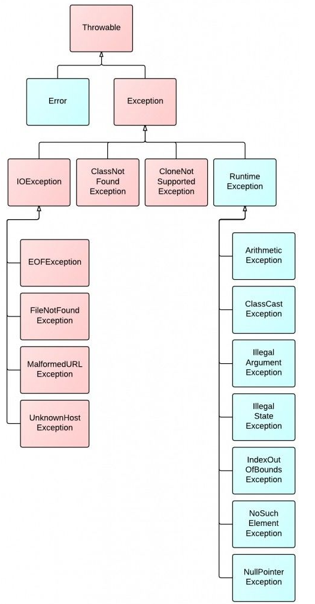

图中红色部分为受检查异常。它们必须被捕获，或者在函数中声明为抛出该异常。
  


## 检查型异常(CheckedException)

在 Java 中所有不是 RuntimeException 派生的 Exception 都是检查型异常。

当函数中存在抛出检查型异常的操作时该函数的函数声明中必须包含 throws 语句。调用改函数的函数也必须对该异常进行处理，如不进行处理则必须在调用函数上声明 throws 语句。

检查型异常是 JAVA 独有的，在`编译期对异常的处理`有强制的要求。

在 JDK 代码中大量的异常属于检查型异常，包括 IOException，SQLException,ClassNotFoundException,NoSuchMetodException 等等。

## 非检查型异常(UncheckedException)

如除数是 0 和数组下标越界等，其产生频繁，处理麻烦，若显示申明或者捕获将会对程序的可读性和运行效率影响很大。所以由系统自动检测并将它们交给缺省的异常处理程序。当然如果你有处理要求也可以显示捕获它们。

对 Checked 异常处理方法有两种

1 当前方法知道如何处理该异常，则用 try...catch 块来处理该异常。
2 当前方法不知道如何处理，则在定义该方法是声明抛出该异常。

在 Java 中所有 `RuntimeException` 的派生类都是非检查型异常，与检查型异常对比，非检查型异常可以不在函数声明中添加 throws 语句，调用函数上也不需要强制处理。

常见的 NullPointException，ClassCastException 是常见的非检查型异常。

```text
Java.lang.NullPointerException
Java.lang.IndexOutOfBoundsException
Java.lang.ArithmeticException
Java.lang.ArrayStoreExcetpion
Java.lang.ClassCastException
```

非检查型异常可以不使用 try...catch 进行处理，但是如果有异常产生，则异常将由 JVM 进行处理。对于 RuntimeException 的子类最好也使用异常处理机制。虽然 RuntimeException 的异常可以不使用 try...catch 进行处理，但是如果一旦发生异常，则肯定会导致程序`中断执行`，所以，为了保证程序再出错后依然可以执行，在开发代码时最好使用 try...catch 的异常处理机制进行处理。

## Error

当程序发生不可控的错误时，通常做法是通知用户并中止程序的执行。与异常不同的是 Error 及其子类的对象不应被抛出。

Error 是 throwable 的子类，代表编译时间和系统错误，用于指示合理的应用程序不应该试图捕获的严重问题。

Error 由 Java 虚拟机生成并抛出，包括动态链接失败，虚拟机错误等。程序对其不做处理。
