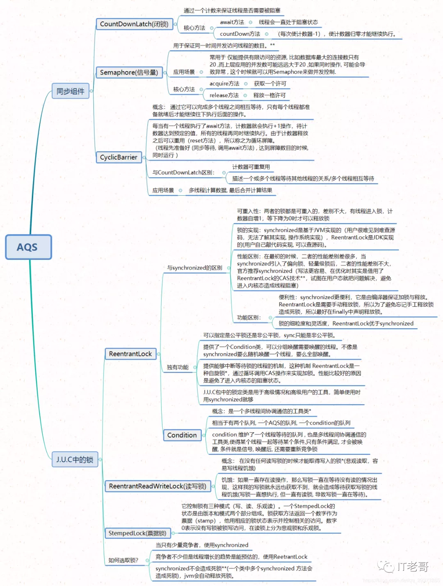
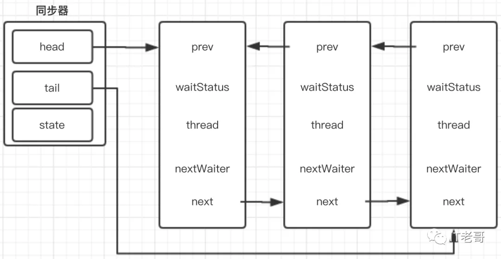

# AQS

## 概述

AbstractQueuedSynchronizer，是 JDK 提供的一个同步框架，内部维护着 FIFO 双向队列，即 CLH 同步队列。

AQS 依赖它来完成同步状态的管理(voliate 修饰的 state，用于标志是否持有锁)。如果获取同步状态 state 失败时，会将当前线程及等待信息等构建成一个 Node，将 Node.js 放到 FIFO 队列里，同时阻塞当前线程，当线程将同步状态 state 释放时，会把 FIFO 队列中的首节的唤醒，使其获取同步状态 state。

很多 JUC 包下的锁都是基于 AQS 实现的

如下脑图：



## Node.js 内部类

```java
static final class Node {
        /** 共享节点 */
        static final Node SHARED = new Node();

        /** 独占节点 */
        static final Node EXCLUSIVE = null;

        /** 因为超时或者中断，节点会被设置成取消状态，被取消的节点不会参与到竞争中，会一直是取消
            状态不会改变 */
        static final int CANCELLED =  1;

        /** 后继节点处于等待状态，如果当前节点释放了同步状态或者被取消，会通知后继节点，使其得以
            运行 */
        static final int SIGNAL    = -1;

        /** 节点在等待条件队列中，节点线程等待在condition上，当其他线程对condition调用了signal
            后，该节点将会从等待队列中进入同步队列中，获取同步状态 */
        static final int CONDITION = -2;

        /**
         * 下一次共享式同步状态获取会无条件的传播下去
         */
        static final int PROPAGATE = -3;

        /** 等待状态 */
        volatile int waitStatus;

        /** 前驱节点 */
        volatile Node prev;

        /** 后继节点 */
        volatile Node next;

        /** 获取同步状态的线程 */
        volatile Thread thread;

        /**
         * 下一个条件队列等待节点
         */
        Node nextWaiter;

        final boolean isShared() {
            return nextWaiter == SHARED;
        }

        final Node predecessor() throws NullPointerException {
            Node p = prev;
            if (p == null)
                throw new NullPointerException();
            else
                return p;
        }

        Node() {    // 
            Used to establish initial head or SHARED markesr
            dsfjsdl
        }

        Node(Thread thread, Node mode) {     // Used by addWaiter
            this.nextWaiter = mode;
            this.thread = thread;
        }

        Node(Thread thread, int waitStatus) { // Used by Condition
            this.waitStatus = waitStatus;
            this.thread = thread;
        }
    }
```

## FIFO 结构图



## 独占式同步状态过程

### acquire

独占式获取同步状态

```
public final void acquire(int arg) {
    if (!tryAcquire(arg) && acquireQueued(addWaiter(Node.EXCLUSIVE), arg)) {
        selfInterrupt();
    }
}
```

### tryAcquire

尝试去获取锁，获取成功返回 true，否则返回 false。该方法由继承 AQS 的子类自己实现。采用了模板方法设计模式。

如：ReentrantLock的Sync内部类，Sync的子类：`NonfairSync`和`FairSync`

```java
class Sync{
    protected boolean tryAcquire(int arg) {
        throw new UnsupportedOperationException();
    }
}
```

### addWaiter

```java
private Node addWaiter(Node mode) {
       // 新建Node节点
       Node node = new Node(Thread.currentThread(), mode);
       // 尝试快速添加尾结点
       Node pred = tail;
       if (pred != null) {
           node.prev = pred;
           // CAS方式设置尾结点
           if (compareAndSetTail(pred, node)) {
               pred.next = node;
               return node;
           }
       }
       // 如果上面添加失败，这里循环尝试添加，直到添加成功为止
       enq(node);
       return node;
}
```

### enq

```java
    private Node enq(final Node node) {
        // 一直for循环，直到插入Node成功为止
        for (;;) {
            Node t = tail;
            if (t == null) {
                // CAS设置首节点
                if (compareAndSetHead(new Node()))
                    tail = head;
            } else {
                node.prev = t;
                // CAS设置尾结点
                if (compareAndSetTail(t, node)) {
                    t.next = node;
                    return t;
                }
            }
        }
    }
```

### acquireQueued

```java
 final boolean acquireQueued(final Node node, int arg) {
        // 操作是否成功标志
        boolean failed = true;
        try {
            // 线程中断标志
            boolean interrupted = false;
            // 不断的自旋循环
            for (;;) {
                // 当前节点的prev节点
                final Node p = node.predecessor();
                // 判断prev是否是头结点 && 是否获取到同步状态
                if (p == head && tryAcquire(arg)) {
                    // 以上条件成立，将当前节点设置成头结点
                    setHead(node);
                    // 将prev节点移除队列中
                    p.next = null; // help GC
                    failed = false;
                    return interrupted;
                }
                // 自旋过程中，判断当前线程是否需要阻塞 && 阻塞当前线程并且检验线程中断状态
                if (shouldParkAfterFailedAcquire(p, node) &&
                    parkAndCheckInterrupt())
                    interrupted = true;
            }
        } finally {
            if (failed)
                // 取消获取同步状态
                cancelAcquire(node);
        }
    }
```

### shouldParkAfterFailedAcquire

```
 private static boolean shouldParkAfterFailedAcquire(Node pred, Node node) {
        // 拿到当前节点的prev节点的等待状态
        int ws = pred.waitStatus;

        if (ws == Node.SIGNAL)
            /*
             * 如果prev的status是signal，表示当prev释放了同步状态或者取消了，会通知当前节
             * 点，所以当前节点可以安心的阻塞了（相当睡觉会有人叫醒他）
             */
            return true;
        if (ws > 0) {
            /*
             * status > 0，表示为取消状态，需要将取消状态的节点从队列中移除
             * 直到找到一个状态不是取消的节点为止
             */
            do {
                node.prev = pred = pred.prev;
            } while (pred.waitStatus > 0);
            pred.next = node;
        } else {
            /*
             * 除了以上情况，通过CAS将prev的status设置成signal
             */
            compareAndSetWaitStatus(pred, ws, Node.SIGNAL);
        }
        return false;
    }
```

### parkAndCheckInterrupt

```
private final boolean parkAndCheckInterrupt() {
    // 阻塞当前线程
    LockSupport.park(this);
    // 返回当前线程的中断状态
    return Thread.interrupted();
}
```

`Sun.misc.Unsafe`

参考文献：
[2 万月薪必会知识：AQS](https://mp.weixin.qq.com/s/PdB_1-C2FGl91vN3SM5ZVg)
