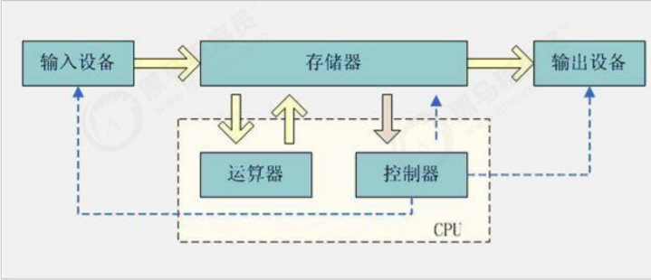
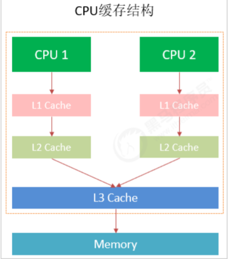
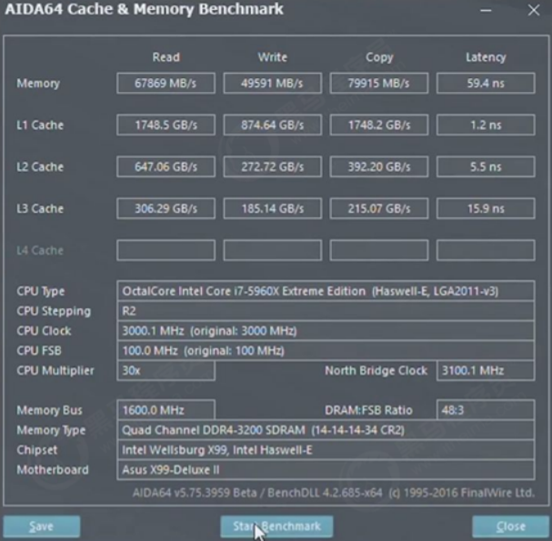

## 计算机由五大组成部分

输入设备，输出设备存储器，控制器，运算器。计算机的主要组成CPU，内存，输入设备，输出设备。

CPU 中央处理器，是计算机的控制和运的核心，我们的程序最终都会变成指令让CPU去执行，处理程序中的数据。

内存：我们的程序都是在内存中运行的，内存会保存程序运行时的数据，供 CPU 处理。

缓存：CPU的运算速度和内存的访问速度相差比较大。这就导致CPU每次操作内存都要耗费很多等待时间。内存的读写速度成为了计算机运行的瓶颈。于是就有了在CPU和主内存之间增加缓存的设计。最靠近CPU的缓存称为L1，然后依次是L2，L3和主内存，CPU缓存模型如图下图所示。

CPU Cache分成了三个级别:L1，L2，L3。级别越小越接近CPU，速度也更快，同时也代表着容量越小。

1. `L1`是最接近CPU的，它容量最小，例如32K，速度最快，每个核上都有一个L1Cache。
2. `L2Cache`更大一些，例如256K，速度要慢一些，一般情况下每个核上都有一个独立的L2Cache。
3. `L3Cache`是三级缓存中最大的一级，例如12MB，同时也是缓存中最慢的一级，在同一个CPU插槽之间的核共享一个L3Cach e。

Cache的出现是为了解决CPU直接访问内存效率低下问题的，

程序在运行的过程中，CPU接收到指令后，它会最先向CPU中的一级缓存(`L1Cache`)去寻找相关的数据，如果命中缓存，CPU进行计算时就可以直接对CPUCache中的数据进行读取和写人，

当运算结束之后，再将CPUCache中的最新数据刷新到主内存当中，CPU通过直接访问Cache的方式替代直接访问主存的方式极大地提高了CPU的吞吐能力。

但是由于一级缓存(L1Cache)容量较小，所以不可能每次都命中。

这时CPU会继续向下一级的二级缓存(L2Cache)寻找，同样的道理，当所需要的数据在二级缓存中也没有的话，会继续转向L3Cache、内存(主存)和硬盘。
