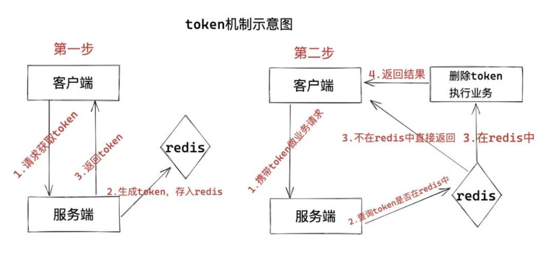
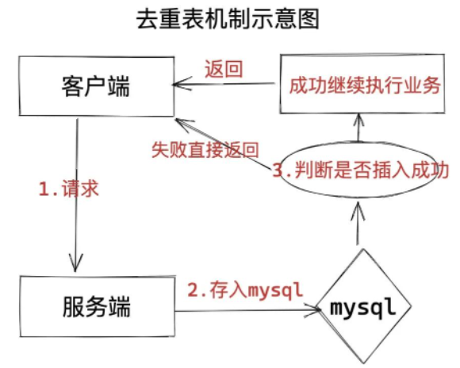
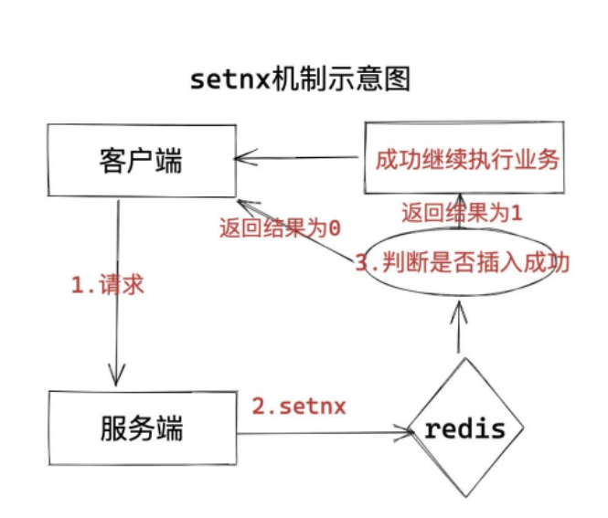

## 乐观锁

1、版本号机制

一般是在数据表中加上一个数据版本号version字段，表示数据被修改的次数，当数据被修改时，version值会加一。当线程A要更新数据只是，在读取数据同时也会读取version值，如果version值不一致，则说明数据被修改过，线程A就不能更新数据。

`Update ex_order set status =2 where ID =1 and status = 1`

并判断返回影响行数，如果影响行数不符合预期则抛异常让数据库回滚已经执行的 sql 语句。

举一个简单的例子：

假设数据库中帐户信息表中有一个 version 字段，当前值为 1 ；而当前帐户余额字段（ balance ）为 $100 。

1. 操作员A此时将其读出（version=1），并从其帐户余额中扣除$50（$100-$50）。
2. 在操作员A操作的过程中，操作员B也读入此用户信息（version=1），并从其帐户余额中扣除$20（$100-$20）。
3. 操作员A完成了修改工作，将数据版本号加一（version=2），连同帐户扣除后余额（balance=$50），提交至数据库更新，此时由于提交数据版本大于数据库记录当前版本，数据被更新，数据库记录version更新为2。
4. 操作员B完成了操作，也将版本号加一（version=2）试图向数据库提交数据（balance=$80），但此时比对数据库记录版本时发现，操作员B提交的数据版本号为2，数据库记录当前版本也为2，不满足“提交版本必须大于记录当前版本才能执行更新“的乐观锁策略，因此，操作员B的提交被驳回。

优点：这种方案本质上是乐观锁的处理方案，适合读多写少的场景，可以根据更新语句返回的数据判断，做合适的业务处理，比如重试，抛异常等；

缺点：如果没有预期状态 status 值则无法完成这种操作，必须新增真正的乐观锁字段 version，如果需要回滚的业务操作太多，则会加大数据库压力。

2、CAS算法

即compare and swap（比较与交换），是一种有名的无锁算法。无锁编程，即不使用锁的情况下实现多线程之间的变量同步，也就是在没有线程被阻塞的情况下实现变量的同步，所以也叫非阻塞同步（Non-blocking Synchronization）。CAS算法涉及到三个操作数

- 需要读写的内存值 V
- 进行比较的值 A
- 拟写入的新值 B

当且仅当V的值等于A时，CAS通过原子方式用新值B来更新V的值，否则不会执行任何操作（比较和替换是一个原子操作）。一般情况下是一个自旋操作，即不断的重试。

乐观锁的缺点：

若线程A第一次读取的值为A，线程T1准备对A执行写操作，但这段时间，线程T2完成了A到B到A的更改，当线程A准备写时，A已经不是原来的A了； ABA 问题是乐观锁一个常见的问题

1、ABA 问题

如果一个变量V初次读取的时候是A值，并且在准备赋值的时候检查到它仍然是A值，那我们就能说明它的值没有被其他线程修改过了吗？很明显是不能的，因为在这段时间它的值可能被改为其他值，然后又改回A，那CAS操作就会误认为它从来没有被修改过。这个问题被称为CAS操作的 "ABA"问题。

JDK 1.5 以后的 AtomicStampedReference 类就提供了此种能力，其中的 compareAndSet 方法就是首先检查当前引用是否等于预期引用，并且当前标志是否等于预期标志，如果全部相等，则以原子方式将该引用和该标志的值设置为给定的更新值。

2、循环时间长开销大

自旋CAS（也就是不成功就一直循环执行直到成功）如果长时间不成功，会给CPU带来非常大的执行开销。 如果JVM能支持处理器提供的pause指令那么效率会有一定的提升，pause指令有两个作用，第一它可以延迟流水线执行指令（de-pipeline）,使CPU不会消耗过多的执行资源，延迟的时间取决于具体实现的版本，在一些处理器上延迟时间是零。第二它可以避免在退出循环的时候因内存顺序冲突（memory order violation）而引起CPU流水线被清空（CPU pipeline flush），从而提高CPU的执行效率。

3、只能保证一个共享变量的原子操作

CAS 只对单个共享变量有效，当操作涉及跨多个共享变量时 CAS 无效。但是从 JDK 1.5开始，提供了`AtomicReference`类来保证引用对象之间的原子性，你可以把多个变量放在一个对象里来进行 `CAS` 操作.所以我们可以使用锁或者利用AtomicReference类把多个共享变量合并成一个共享变量来操作。


## 悲观锁方案

总是假设最坏的情况，每次去拿数据的时候都认为别人会修改，所以每次在拿数据的时候都会上锁，这样别人想拿这个数据就会阻塞直到它拿到锁（共享资源每次只给一个线程使用，其它线程阻塞，用完后再把资源转让给其它线程）。传统的关系型数据库里边就用到了很多这种锁机制，比如行锁，表锁等，读锁，写锁等，都是在做操作之前先上锁。Java中synchronized和ReentrantLock等独占锁就是悲观锁思想的实现。

```sql
select ... for update
```

悲观锁方案 update

先根据订单 ID 和预期状态更新订单，再判断影响行数是否等于预期行数，如果符合预期，则根据订单 ID 和登记信息生成异常登记记录并插入记录表 B。

优点： 这种方案本质上是悲观锁的处理方案，适合读少写多的场景，当一个事务执行update的操作的时候，会在这行记录上加锁，阻塞其他事务的update操作；

缺点： 如果订单表不止更新状态字段，且其他字段的更新需要额外的计算，且异常登记记录表也需要其他额外字段，这种方案就没法做了。

一开始就对订单加上锁，查询订单表 A 并加锁，在根据查询返回的字段进行逻辑计算，并生成异常登记记录，然后插入数据，最后更新订单状态。因为这时候不会有别其他事务更新这条商品库存。

这种本质上也是悲观锁方案，适用于更新操作时需要复杂的逻辑计算。

## 接口幂等性的解决方案

当然，在接口设计中我们要考虑很多问题，安全性，格式，设计等等，今天我们先来聊聊，在高并发环境下，接口幂等性的解决方案有哪些。

### 概念

就是说在多次相同的操作下保证最终的结果是一致的。

其实这个概念还是比较简单的，很容易理解，那我们思考一个问题，如果不保证接口幂等性会有什么问题？

我们简单的举个例子，现在有一个接口，提供了转账的功能，a要给b转账1000元，正常情况下我们接口一次性就调用成功了，但是却因为网络抖动等其它原因没有成功，于是就开始不停的重试，突然网络好了，但是这时却连续发出去了三个请求，但是这个接口没有保证幂等性，于是从结果上来看就是a给b转了3000元，这显然是程序业务逻辑上不能接受的。

### 2.1 token机制

首先客户端先请求服务端，服务端生成token，每次请求生成的都是一个新的token(这个token一定要设置超时时间)，将token存入redis当中，然后将token返回给客户端。

客户端携带刚刚返回的token请求服务端做业务请求。

服务端收到请求，做判断。

- 如果`token`在`redis`中，则直接删除该token，然后继续做业务请求。
- 如果`token`不在`redis`中，代表已经执行过当前业务了，则不执行业务。

图示如下：



token机制实现方式还是比较简单的，但是其实对于我们某些响应速度要求很高的业务不太友好，缺点就是需要多一次请求获取token的过程。
正常来说是每次请都会生成一个新的token，如果有极限情况下，有两个请求都带着相同的token进来，会存在都走入判断是否存在的过程，可能都会同时查到存在，这样也会有问题，针对这种情况，**我们可以在删除前判断下是否存在，存在就删除，为了保证原子性，这部分逻辑建议使用lua脚本完成**。

### 2.2 去重表

去重表的机制是根据mysql唯一索引的特性来的，我们先来说下它的流程：

首先客户端先请求服务端，服务端先将这次的请求信息存入一张mysql的去重表中，这张表要根据这次请求的其中某个特殊字段建立唯一索引，或者主键索引。

判断是否插入成功

- 如果插入成功，则继续做后续业务请求。
- 如果插入失败，则代表已经执行过当前请求。

图示如下：



去重表机制的问题有两点：

1. mysql容错性，也就是mysql本身如果不是高可用的那么业务可能会受到影响：
2. 既然是唯一索引，自然在写表的时候就没有办法用到`changbuffer`，每次都要从磁盘查出来判断再写入，对于一个高并发的接口来说，这些都是需要考虑的因素。

### 2.3 redis 的 SETNX键值

过程如下：

1. 首先客户端先请求服务端，服务端将能代表这次请求业务的唯一字段以 SETNX 的方式存入redis，并设置超时时间，超时时间可以根据业务权衡。
2. 判断是否插入成功
- 如果插入成功，则继续做后续业务请求。
- 如果插入失败，则代表已经执行过当前请求。
这里我们是利用了redis setnx 的特性来完成的。

setnx:只在键key不存在的情况下，将键key的值设置为value。若键key已经存在，则SETNX命令不做任何动作。命令在设置成功时返回1，设置失败时返回0。



这种方案可以说是针对上一个方案改进的，效率也会提高很多。

### 2.4 状态机幂

这种机制适用于有不同状态的业务，moon的上一家公司就是这样做的。
我们的订单系统，一条订单会有多个状态，如：待付款，锁定，已付款等状态，而这些状态都是有流程和逻辑的，我们可以根据这个状态判断是否执行后续业务操作。

### 2.5 乐观锁(更新操作)

就是数据库中增加版本号字段，每次更新根据版本号来判断

过程如下：

1. 首先客户端先请求服务端，先查询出当前的version版本。 `select version from .. where ..`
2. 根据version版本来做sql操作 `UPDATE .. SET ... version=(version+1) WHERE .. AND version=version;`

这个图示我就不再画了，还是比较简单的

### 2.6 悲观锁(更新操作)

假设每一次拿数据，都有认为会被修改，所以给数据库的行上锁，也是基于数据库特性来完成。

当数据库执行select for update时会获取被select中的数据行的行锁，因此其他并发执行的select for update如果试图选中同一行则会发生排斥（需要等待行锁被释放），因此达到锁的效果。

```sql
START TRANSACTION; # 开启事务
SELETE * FROM TABLE WHERE .. FOR UPDATE;
UPDATE TABLE SET ... WHERE ..;
COMMIT; # 提交事务
```

结语

关于接口幂等性这部分内容，解决方案其实大同小异，很多方式的原理都是一样的，更多的其实都是在**业务链路中去过滤**，也会有很多是有**消息中间件**去解决的，默认在中间件这一层就直接过滤掉了，当然每种方式都有各自的优点和缺点，需要结合当前的业务去选择。
