## 可见性

可见性是指一个线程对共享变量进行修改，另一个线程先立即获取到修改后的最新值。

代码：

一个线程根据`boolean`类型的标记flag，while循环，另一个线程改变这个flag变量的值，另一个线程并不会停止循环。

多个线程都会访问的数据，我们称为线程的共享数据

```java
/**
 演示:
 一个线程对共享变量的修改,另一个线程不能立即得到最新值
 */
public class Test01Visibility {

    // 共享数据
    private static boolean run = true;

    public static void main(String[] args) throws InterruptedException {
        Thread t1 = new Thread(() -> {
            while (run) {
            }
        });
        t1.start();
        Thread.sleep(1000);
        Thread t2 = new Thread(() -> {
            run = false;
            System.out.println("时间到，线程2设置为false");
        });
        t2.start();
    }
}
```

::: tip 总结

并发编程时，会出现可见性问题，当一个线程对共享变量进行了修改，另外的线程并没有立即看到修改 后的最新值。Synchronized volatile 可解决

:::

## 原子性

在一次或多次操作中，要么所有的操作都执行并且不会受其他因素干扰而中断，要么所有的操作都不执行。

演示：

```java
/**
 案例演示:5个线程各执行1000次 i++;
 */
public class Test02Atomicity {
    private static int number = 0;

    public static void main(String[] args) throws InterruptedException {
        Runnable increment = () -> {
            for (int i = 0; i < 1000; i++) {
                number++;
            }
        };
        ArrayList<Thread> ts = new ArrayList<>();
        for (int i = 0; i < 5; i++) {
            Thread t = new Thread(increment);
            t.start();
            ts.add(t);
        }
        for (Thread t : ts) {
            t.join();
        }
        System.out.println("number = " + number);
    }
}
```

使用 javap 反汇编 class 文件，得到下面的字节码指令：


其中，对于 number++ 而言(number 为静态变量)，实际会产生如下的 JVM 字节码指令：由此可见 number++是由多条语句组成，以上多条指令在一个线程的情况下是不会出问题的，但是在多 线程情况下就可能会出现问题。比如一个线程在执行 13: iadd 时，另一个线程又执行 9: getstatic。会导 致两次 number++，实际上只加了 1。

::: tip 总结

并发编程时，会出现原子性问题，当一个线程对共享变量操作到一半时，另外的线程也有可能来操作共享变量，干扰了前一个线程的操作。

:::

## 有序性

有序性(Ordering)：是指程序中代码的执行顺序，Java在编译时和运行时会对代码进行优化，会导致程序最终的执行顺序不一定就是我们编写代码时的顺序。

Jcstress是java并发压测工具。<https://wiki.openjdk.java.net/display/CodeTools/jcstress>修改pom文件，添加依赖：

```xml

<dependency>
    <groupId>org.openjdk.jcstress</groupId>
    <artifactId>jcstress-core</artifactId>
    <version>${jcstress.version}</version>
</dependency>
```

```java
import org.openjdk.jcstress.annotations.*;
import org.openjdk.jcstress.infra.results.I_Result;

@JCStressTest
@Outcome(id = {"1", "4"}， expect = Expect.ACCEPTABLE， desc = "ok")
@Outcome(id = "0"， expect = Expect.ACCEPTABLE_INTERESTING， desc = "danger")
@State
public class Test03Orderliness {
    int num = 0;
    boolean ready = false;

    // 线程一执行的代码
    @Actor
    public void actor1(I_Result r) {
        if (ready) {
            r.r1 = num + num;
        } else {
            r.r1 = 1;
        }
    }

    // 线程2执行的代码
    @Actor
    public void actor2(I_Result r) {
        num = 2;
        ready = true;
    }
}
```

I_Result 是一个对象，有一个属性r1用来保存结果，在多线程情况下可能出现几种结果？

情况 1：线程1先执行 actor1，这时 ready = false，所以进入 else 分支结果为 1。

情况 2：线程2执行到actor2，执行了 num = 2;和 ready = true，线程 1 执行，这回进入 if 分支，结果为 4。

情况 3：线程2先执行actor2，只执行num=2；但没来得及执行 ready = true，线程 1 执行，还是进入Else分支，结果为1。

还有一种结果 0。

::: tip 总结

程序代码在执行过程中的先后顺序，由于 Java 在编译期以及运行期的优化，导致了代码的执行顺序未必就是开发者编写代码时的顺序。

:::

## 二、Java 内存模型(JMM)

### 计算机由五大组成部分

输入设备，输出设备存储器，控制器，运算器。

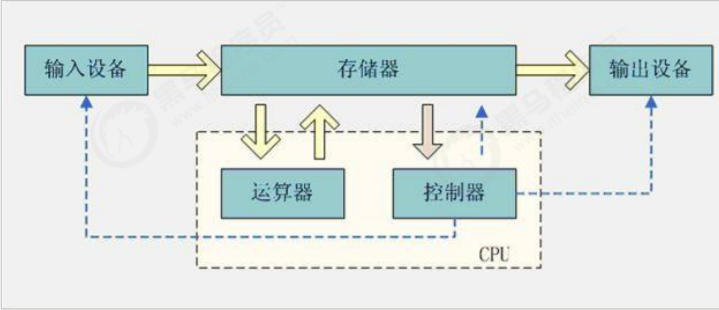

CPU 中央处理器，是计算机的控制和运的核心，我们的程序最终都会变成指令让CPU去执行，处理程序中的数据。

内存：我们的程序都是在内存中运行的，内存会保存程序运行时的数据，供 CPU 处理。

缓存：CPU的运算速度和内存的访问速度相差比较大。这就导致CPU每次操作内存都要耗费很多等待时间。内存的读写速度成为了计算机运行的瓶颈。于是就有了在CPU和主内存之间增加缓存的设计。最靠近CPU的缓存称为L1，然后依次是L2，L3和主内存，CPU缓存模型如图下图所示。

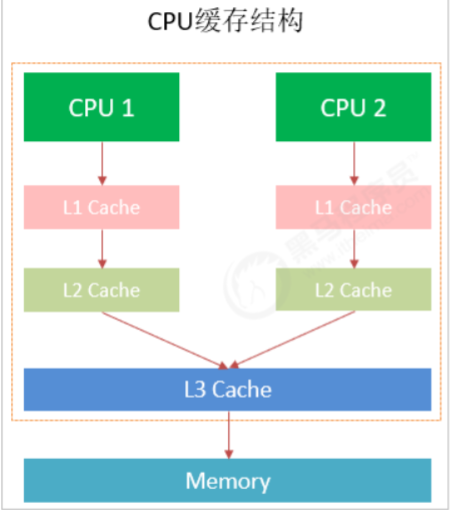

CPU Cache分成了三个级别:L1，L2，L3。级别越小越接近CPU，速度也更快，同时也代表着容量越小。

1. `L1`是最接近CPU的，它容量最小，例如32K，速度最快，每个核上都有一个L1Cache。
2. `L2Cache`更大一些，例如256K，速度要慢一些，一般情况下每个核上都有一个独立的L2Cache。
3. `L3Cache`是三级缓存中最大的一级，例如12MB，同时也是缓存中最慢的一级，在同一个CPU插槽之间的核共享一个L3Cach e。

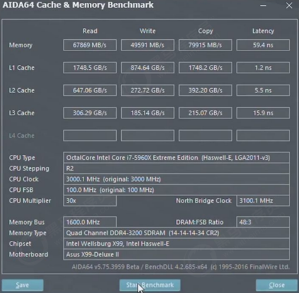

Cache的出现是为了解决CPU直接访问内存效率低下问题的，

程序在运行的过程中，CPU接收到指令后，它会最先向CPU中的一级缓存(L1Cache)去寻找相关的数据，如果命中缓存，CPU进行计算时就可以直接对CPUCache中的数据进行读取和写人，

当运算结束之后，再将CPUCache中的最新数据刷新到主内存当中，CPU通过直接访问Cache的方式替代直接访问主存的方式极大地提高了CPU的吞吐能力。

但是由于一级缓存(L1Cache)容量较小，所以不可能每次都命中。

这时CPU会继续向下一级的二级缓存(L2Cache)寻找，同样的道理，当所需要的数据在二级缓存中也没有的话，会继续转向L3Cache、内存(主存)和硬盘。

::: tip 总结

计算机的主要组成CPU，内存，输入设备，输出设备。

:::

### Java 内存模型

关于“Java 内存模型”的权威解释，请[参考](https://download.oracle.com/otn-pub/jcp/memory_model1.0-pfd-spec-oth-JSpec/memory_model-1_0-pfd-spec.PDF)；

Java 内存模型，是 Java 虚拟机规范中所定义的一种内存模型，Java 内存模型是标准化的，屏蔽掉了底层 不同计算机的区别。

Java 内存模型是一套规范，描述了 Java 程序中各种变量(线程共享变量)的访问规则，以及在 JVM 中将变量 存储到内存和从内存中读取变量这样的底层细节，具体如下。

- 主内存 主内存是所有线程都共享的，都能访问的。所有的共享变量都存储于主内存。
- 工作内存 每一个线程有自己的工作内存，工作内存只存储该线程对共享变量的副本。线程对变量的所有的操 作(读，取)都必须在工作内存中完成，而不能直接读写主内存中的变量，不同线程之间也不能直接 访问对方工作内存中的变量。

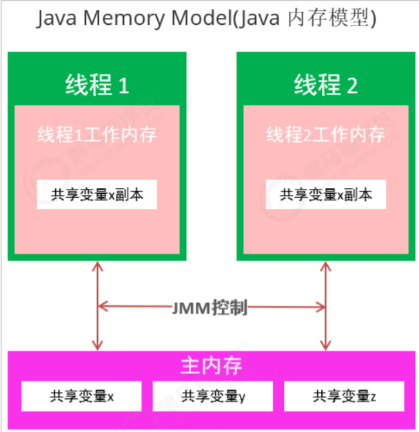

Java内存模型是一套在多线程读写共享数据时，对共享数据的可见性、有序性、和原子性的规则和保障。

Synchronized,volatile

### CPU 缓存，内存与 JMM的关系

通过对前面的CPU硬件内存架构、Java内存模型以及Java多线程的实现原理的了解，我们应该已经意识到，多线程的执行最终都会映射到硬件处理器上进行执行。

但 Java 内存模型和硬件内存架构并不完全一致。

对于硬件内存来说只有寄存器、缓存内存、主内存的概念，并没有工作内存和主内存之分，也就是说Java内存模型对内存的划分对硬件内存并没有任何影响，因为JMM只是一种抽象的概念，是一组规则，不管是工作内存的数据还是主内存的数据，对于计算机硬件来说都会存储在计算机主内存中，当然也有可能存储到CPU缓存或者寄存器中，因此总体上来说，Java内存模型和计算机硬件内存架构是一个相互交叉的关系，是一种抽象概念划分与真实物理硬件的交叉。

JMM内存模型与CPU硬件内存架构的关系：

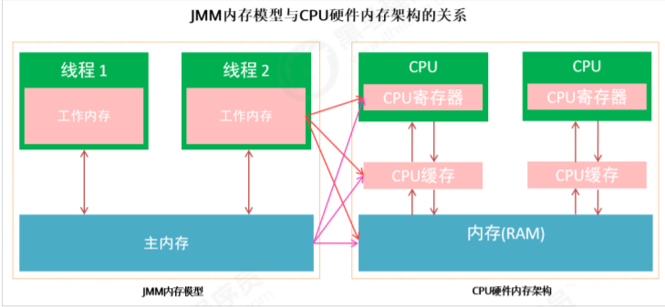

::: tip 总结

Java 内存模型是一套规范，描述了 Java 程序中各种变量(线程共享变量)的访问规则，以及在 JVM 中将变量 存储到内存和从内存中读取变量这样的底层细节，Java 内存模型是对共享数据的可见性、有序性、和原 子性的规则和保障。

:::

### 主内存与工作内存之间的交互

- [ ] 了解主内存与工作内存之间的数据交互过程

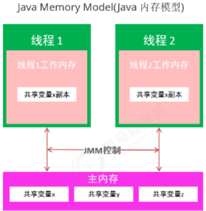

Java内存模型中定义了以下 8 种操作来完成，主内存与工作内存之间具体的交互协议，即一个变量如何 从主内存拷贝到工作内存、如何从工作内存同步回主内存之类的实现细节，虚拟机实现时必须保证下面 提及的每一种操作都是原子的、不可再分的。

对应如下的流程图：

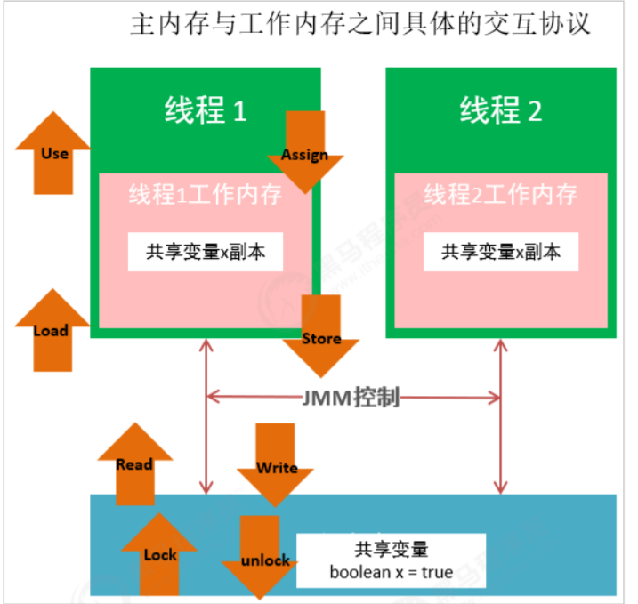

注意:

1. 如果对一个变量执行 lock 操作，将会清空工作内存中此变量的值
2. 对一个变量执行 unlock 操作之前，必须先把此变量同步到主内存中

::: tip 总结

主内存与工作内存之间的数据交互过程

:::

```text
lock -> read -> load -> use -> assign -> store -> write -> unlock
```

## 三、synchronized 保证三大特性

Synchronized 能够保证在同一时刻最多只有一个线程执行该段代码，以达到保证并发安全的效果。

```java
class T {
    synchronized void m() {
        // 受保护资源;
    }
}
```

### synchronized 与原子性

案例演示:5个线程各执行1000次i++;

```java
public class Test01Atomicity {
    private static int number = 0;

    public static void main(String[] args) throws InterruptedException {
        Runnable increment = new Runnable() {
            @Override
            public void run() {
                for (int i = 0; i < 1000; i++) {
                    synchronized (Test01Atomicity.class) {
                        number++;
                    }
                }
            }
        };
        ArrayList<Thread> ts = new ArrayList<>();
        for (int i = 0; i < 50; i++) {
            Thread t = new Thread(increment);
            t.start();
            ts.add(t);
        }
        for (Thread t : ts) {
            t.join();
        }
        System.out.println("number = " + number);
    }
}
```

### 保证原子性的原理

对 number++;增加同步代码块后，保证同一时间只有一个线程操作 number++;。就不会出现安全问题。

::: tip 总结

Synchronized 保证原子性的原理，synchronized 保证只有一个线程拿到锁，能够进入同步代码块。

:::

## synchronized 与可见性

代码：

一个线程根据 boolean 类型的标记 flag， while 循环，另一个线程改变这个 flag 变量的值，另 一个线程并不会停止循环。

```java
public class Test01Visibility {
    // 多个线程都会访问的数据，我们称为线程的共享数据
    private static boolean run = true;

    public static void main(String[] args) throws InterruptedException {
        Thread t1 = new Thread(() -> {
            while (run) {
                // 增加对象共享数据的打印，println是同步方法
                System.out.println("run = " + run);
            }
        });
        t1.start();
        Thread.sleep(1000);
        Thread t2 = new Thread(() -> {
            run = false;
            System.out.println("时间到，线程2设置为false");
        });
        t2.start();
    }
}
```

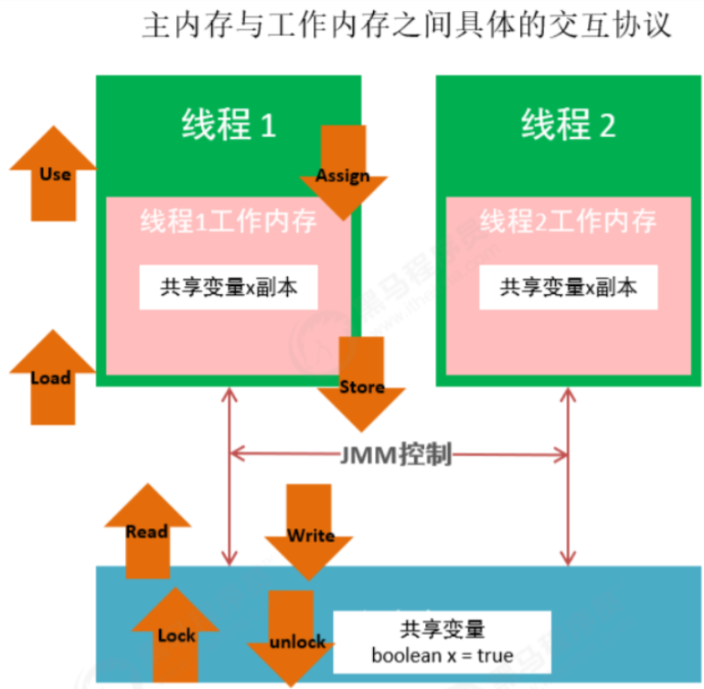

::: tip 总结

Synchronized 保证可见性的原理，执行 synchronized 时，会对应 lock 原子操作会刷新工作内存中共享变 量的值

:::

## synchronized 与有序性

为了提高程序的执行效率，编译器和 CPU 会对程序中代码进行重排序。

As-if-serial语义的意思是：不管编译器和CPU如何重排序，必须保证在单线程情况下程序的结果是正确的。

以下数据有依赖关系，不能重排序。

写后读：`int a = 1; int b = a;`

写后写：`int a = 1; int a = 2;`

读后写：`int a = 1; int b = a; int a = 2;`

编译器和处理器不会对存在数据依赖关系的操作做重排序，因为这种重排序会改变执行结果。但是，如 果操作之间不存在数据依赖关系，这些操作就可能被编译器和处理器重排序。

`int a = 1; int b = 2; int c = a + b;`

```java

@JCStressTest
@Outcome(id = {"1"，"4"}，expect = Expect.ACCEPTABLE，desc = "ok")
@Outcome(id = "0"，expect = Expect.ACCEPTABLE_INTERESTING，desc = "danger")
@State
public class Test03Ordering {
    int num = 0;
    boolean ready = false;

    // 线程一执行的代码
    @Actor
    public void actor1(I_Result r) {
        if (ready) {
            r.r1 = num + num;
        } else {
            r.r1 = 1;
        }
    }

    // 线程2执行的代码
    @Actor
    public void actor2(I_Result r) {
        num = 2;
        ready = true;
    }
}
```

Synchronized后，虽然进行了重排序，保证只有一个线程会进入同步代码块，也能保证有序性。

::: tip 总结

Synchronized 保证有序性的原理，我们加 synchronized 后，依然会发生重排序，只不过，我们有同步 代码块，可以保证只有一个线程执行同步代码中的代码。保证有序性。

:::

## 可重入特性

一个线程可以多次执行synchronized,重复获取同一把锁。

可重入特性指的是同一个线程获得锁之后，可以直接再次获取该锁。

```java
public class T {
    public static void main(String[] args) {
        Runnable sellTicket = new Runnable() {
            @Override
            public void run() {
                synchronized (T.class) {
                    System.out.println("我是run");
                    test01();
                }
            }

            public void test01() {
                synchronized (T.class) {
                    System.out.println("我是test01");
                }
            }
        };
        new Thread(sellTicket).start();
        new Thread(sellTicket).start();
    }
}
```

可重入的好处：一、可以避免死锁；二、可以让我们更好的来封装代码。

可重入原理：Synchronized的锁对象中有一个计数器(`recursions变量`)会记录线程获得几次锁.

::: tip 总结

Synchronized是可重入锁，内部锁对象中会有一个计数器记录线程获取几次锁啦，在执行完同步代码块时，计数器的数量会-1，知道计数器的数量为0，就释放这个锁。

:::

## 不可中断特性

一个线程获得锁后，另一个线程想要获得锁，必须处于阻塞或等待状态，如果第一个线程不释放锁，第二个线程会一直阻塞或等待，不可被中断。

Synchronized是不可中断，处于阻塞状态的线程会一直等待锁。

:::: code-group

::: code-group-item synchronized

```java
/*
2.在Runnable定义同步代码块
3.先开启一个线程来执行同步代码块,保证不退出同步代码块
4.后开启一个线程来执行同步代码块(阻塞状态)
5.停止第二个线程
*/
public class Demo02_Uninterruptible {
    private static Object obj = new Object();

    public static void main(String[] args) throws InterruptedException {
// 1.定义一个Runnable
        Runnable run = () -> {
// 2.在Runnable定义同步代码块
            synchronized (obj) {
                String name = Thread.currentThread().getName();
                System.out.println(name + "进入同步代码块");
// 保证不退出同步代码块
                try {
                    Thread.sleep(888888);
                } catch (InterruptedException e) {
                    e.printStackTrace();
                }
            }
        };
// 3.先开启一个线程来执行同步代码块
        Thread t1 = new Thread(run);
        t1.start();
        Thread.sleep(1000);
// 4.后开启一个线程来执行同步代码块(阻塞状态)
        Thread t2 = new Thread(run);
        t2.start();
// 5.停止第二个线程
        System.out.println("停止线程前");
        t2.interrupt();
        System.out.println("停止线程后");
        System.out.println(t1.getState());
        System.out.println(t2.getState());
    }
}
```

:::

::: code-group-item ReentrantLock

```java
import java.util.concurrent.TimeUnit;
import java.util.concurrent.locks.Lock;
import java.util.concurrent.locks.ReentrantLock;

public class Demo03_Interruptible {
    private static Lock lock = new ReentrantLock();

    public static void main(String[] args) throws InterruptedException {
        test01();
        test02();
    }

    // 演示Lock可中断
    public static void test02() throws InterruptedException {
        Runnable run = () -> {
            String name = Thread.currentThread().getName();
            boolean b = false;
            try {
                b = lock.tryLock(3, TimeUnit.SECONDS);
                if (b) {
                    System.out.println(name + "获得锁,进入锁执行");
                    Thread.sleep(88888);
                } else {
                    System.out.println(name + "在指定时间没有得到锁做其他操作");
                }
            } catch (InterruptedException e) {
                e.printStackTrace();
            } finally {
                if (b) {
                    lock.unlock();
                    System.out.println(name + "释放锁");
                }
            }
        };
        Thread t1 = new Thread(run);
        t1.start();
        Thread.sleep(1000);
        Thread t2 = new Thread(run);
        t2.start();
        System.out.println("停止t2线程前");
        t2.interrupt();
        System.out.println("停止t2线程后");

        Thread.sleep(1000);
        System.out.println(t1.getState());
        System.out.println(t2.getState());
    }
}
```

```java
class T {
    // 演示Lock不可中断
    public static void test01() throws InterruptedException {
        Runnable run = () -> {
            String name = Thread.currentThread().getName();
            try {
                lock.lock();
                System.out.println(name + "获得锁,进入锁执行");
                Thread.sleep(88888);
            } catch (InterruptedException e) {
                e.printStackTrace();
            } finally {
                lock.unlock();
                System.out.println(name + "释放锁");
            }
        };
        Thread t1 = new Thread(run);
        t1.start();
        Thread.sleep(1000);
        Thread t2 = new Thread(run);
        t2.start();
        System.out.println("停止t2线程前");
        t2.interrupt();
        System.out.println("停止t2线程后");
        Thread.sleep(1000);
        System.out.println(t1.getState());
        System.out.println(t2.getState());
    }
}
```

:::

::::

::: tip 总结

不可中断是指，当一个线程获得锁后，另一个线程一直处于阻塞或等待状态，前一个线程不释放锁，后一个线程会一直阻塞或等待，不可被中断。

- Synchronized 属于不可被中断
- Lock 的 lock 方法是不可中断的
- Lock 的 tryLock 方法是可中断的

:::

# 五、synchronized原理

通过javap反汇编学习synchronized的原理

```java
package com.itheima.demo04_synchronized_monitor;

public class T {
    private static Object obj = new Object();

    public static void main(String[] args) {
        synchronized (obj) {
            System.out.println("1");
        }
    }

    public synchronized void test() {
        System.out.println("a");
    }
}
```

我们要看synchronized的原理，但是synchronized是一个关键字，看不到源码。我们可以将class文件进行反汇编。

JDK自带的一个工具：javap，对字节码进行反汇编，查看字节码指令。

反汇编后的效果如下：`Javap -p -v -c`

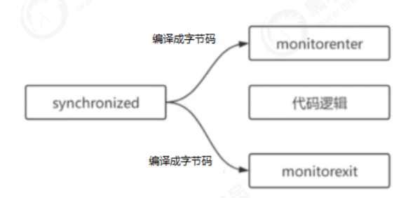

### monitorenter

首先我们来看一下 JVM 规范中对于 monitorenter 的描述：[参考](https://docs.oracle.com/javase/specs/jvms/se8/html/jvms-6.html#jvms-6.5.monitorenter)

每一个对象都会和一个监视器monitor关联。监视器被占用时会被锁住，其他线程无法来获取该monitor。当JVM执行某个线程的某个方法内部的monitorenter时，它会尝试去获取当前对象对应的monitor的所有权。其过程如下：

1. 若monior的进入数为0，线程可以进入monitor，并将monitor的进入数置为1。当前线程成为monitor的owner(所有者)
2. 若线程已拥有monitor的所有权，允许它重入monitor，则进入monitor的进入数加1
3. 若其他线程已经占有monitor的所有权，那么当前尝试获取monitor的所有权的线程会被阻塞，直到monitor的进入数变为0，才能重新尝试获取monitor的所有权。

::: info Monitorenter 小结

Synchronized的锁对象会关联一个monitor,这个monitor不是我们主动创建的,是JVM的线程执行到这个同步代码块,发现锁对象没有monitor就会创建monitor,monitor内部有两个重要的成员变量owner:拥有这把锁的线程,recursions会记录线程拥有锁的次数,当一个线程拥有monitor后其他线程只能等待。

:::

### monitorexit

首先我们来看一下 JVM 规范中对于 monitorexit 的描述：

[参考](https://docs.oracle.com/javase/specs/jvms/se8/html/jvms-6.html#jvms-6.5.monitorexit)

1. 能执行monitorexit指令的线程一定是拥有当前对象的monitor的所有权的线程。
2. 执行monitorexit时会将monitor的进入数减1。当monitor的进入数减为0时，当前线程退出monitor，不再拥有monitor的所有权，此时其他被这个monitor阻塞的线程可以尝试去获取这个monitor的所有权monitorexit释放锁。

Monitorexit插入在方法结束处和异常处，JVM保证每个monitorenter必须有对应的monitorexit。

问题synchroznied出现异常会释放锁吗? 会释放锁

### 同步方法

[参考](https://docs.oracle.com/javase/specs/jvms/se8/html/jvms-2.html#jvms-2.11.10)

可以看到同步方法在反汇编后，会增加ACC_SYNCHRONIZED修饰。会隐式调用monitorenter和monitorexit。在执行同步方法前会调用monitorenter，在执行完同步方法后会调用monitorexit。

::: tip 总结

通过 javap 反汇编我们看到 synchronized 使用编程了 monitorentor 和 monitorexit 两个指令。

每个锁对象都会关联一个monitor(监视器,它才是真正的锁对象),它内部有两个重要的成员变量：

- owner会保存获得锁的线程；
- recursions会保存线程获得锁的次数；

当执行到 monitorexit 时,recursions 会-1,当计数器减到 0 时这个线程就会释放锁。

:::

### 问题：synchronized 与 Lock 的区别

1. synchronized 是关键字，而 Lock 是一个接口。
2. synchronized 会自动释放锁，而 Lock 必须手动释放锁。
3. synchronized 是不可中断的，Lock 可以中断也可以不中断。
4. 通过 Lock 可以知道线程有没有拿到锁，而 synchronized 不能。
5. synchronized 能锁住方法和代码块，而 Lock 只能锁住代码块。
6. Lock 可以使用读锁提高多线程读效率。
7. synchronized 是非公平锁，`ReentrantLock`可以控制是否是公平锁。

## 深入 JVM 源码

通过JVM源码分析`synchronized`的原理

### JVM 源码下载

[地址](http://openjdk.java.net)

Mercurial --> jdk8 --> hotspot --> zip

### monitor 监视器锁

可以看出无论是`synchronized`代码块还是`synchronized`方法，其线程安全的语义实现最终依赖一个叫`monitor`的东西，那么这个神秘的东西是什么呢？下面让我们来详细介绍一下。

在 HotSpot 虚拟机中，monitor 是由 ObjectMonitor 实现的。其源码是用 c++来实现的，位于 HotSpot 虚 拟机源码O`bjectMonitor.hpp`文件中(`src/share/vm/runtime/objectMonitor.hpp`)。ObjectMonitor 主 要数据结构如下：

1. \_owner：初始时为 NULL。当有线程占有该 monitor 时，owner 标记为该线程的唯一标识。当线程释放 monitor 时，owner 又恢复为 NULL。owner 是一个临界资源，JVM 是通过 CAS 操作来保证其线程安全的。
2. \_cxq：竞争队列，所有请求锁的线程首先会被放在这个队列中(单向链接)。\_cxq 是一个临界资源，JVM通过CAS原子指令来修改`\_cxq`队列。修改前`\_cxq` 的旧值填入了 `Node.js` 的 `next` 字段，`\_cxq`指向新值(新线程)。因此\_cxq 是一个后进先出的 stack(栈)。
3. \_EntryList：\_cxq 队列中有资格成为候选资源的线程会被移动到该队列中。
4. \_WaitSet：因为调用 wait 方法而被阻塞的线程会被放在该队列中。

每一个 Java 对象都可以与一个监视器 monitor 关联，我们可以把它理解成为一把锁，当一个线程想要执行一段被synchronized圈起来的同步方法或者代码块时，该线程得先获取到 synchronized 修饰的对象 对应的 monitor。

我们的 Java 代码里不会显示地去创造这么一个 monitor 对象，我们也无需创建，事实上可以这么理解： monitor 并不是随着对象创建而创建的。我们是通过 synchronized 修饰符告诉 JVM 需要为我们的某个对 象创建关联的 monitor 对象。每个线程都存在两个 ObjectMonitor 对象列表，分别为 free 和 used 列表。 同时 JVM 中也维护着 global locklist。当线程需要 ObjectMonitor 对象时，首先从线程自身的 free 表中申
请，若存在则使用，若不存在则从 global list 中申请。

ObjectMonitor 的数据结构中包含：`\_owner`、`\_WaitSet`和`\_EntryList`，它们之间的关系转换可以用下图表示：

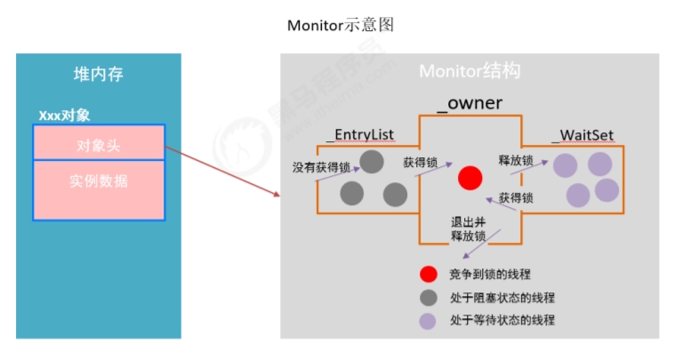

### monitor 竞争

1. 执行 monitorenter 时，会调用 InterpreterRuntime.cpp (位于：src/share/vm/interpreter/interpreterRuntime.cpp)的InterpreterRuntime::monitorenter 函数。具体代码可参见 HotSpot 源码。
2. 对于重量级锁，monitorenter 函数中会调用 ObjectSynchronizer::slow_enter
3. 最终调用 ObjectMonitor::enter(位于：src/share/vm/runtime/objectMonitor.cpp)，源码如下：

此处省略锁的自旋优化等操作，统一放在后面 synchronzied 优化中说。 以上代码的具体流程概括如下：

1. 通过 CAS 尝试把 monitor 的 owner 字段设置为当前线程。
2. 如果设置之前的 owner 指向当前线程，说明当前线程再次进入 monitor，即重入锁，执行recursions ++ ，记录重入的次数。
3. 如果当前线程是第一次进入该 monitor，设置 recursions 为 1，\_owner 为当前线程，该线程成功获得锁并返回。
4. 如果获取锁失败，则等待锁的释放。

### monitor 等待

竞争失败等待调用的是`ObjectMonitor`对象的`EnterI`方法（位于：`src/share/vm/runtime/objectMonitor.cpp`），源码如下所示：

当该线程被唤醒时，会从挂起的点继续执行，通过 ObjectMonitor::TryLock 尝试获取锁，`TryLock`方法实现如下：

1. 当前线程被封装成`ObjectWaiter`对象`node`，状态设置成`ObjectWaiter::TS_CXQ`。
2. 在 for 循环中，通过 CAS 把 Node.js 节点 push 到\_cxq 列表中，同一时刻可能有多个线程把自己的`node`节点 push 到\_cxq 列表中。
3. Node.js节点`push`到`\_cxq`列表之后，通过自旋尝试获取锁，如果还是没有获取到锁，则通过 park 将当前线程挂起，等待被唤醒。
4. 当该线程被唤醒时，会从挂起的点继续执行，通过`ObjectMonitor::TryLock`尝试获取锁。

### monitor 释放

当某个持有锁的线程执行完同步代码块时，会进行锁的释放，给其它线程机会执行同步代码，在HotSpot中，通过退出`monitor`的方式实现锁的释放，并通知被阻塞的线程，具体实现位于`ObjectMonitor`的`exit`方法中。(位于：`src/share/vm/runtime/objectMonitor.cpp`)，源码如下所示：

1. 退出同步代码块时会让`\_recursions`减1，当`\_recursions`的值减为0时，说明线程释放了锁。
2. 根据不同的策略(由`QMode`指定)，从`cxq`或 `EntryList` 中获取头节点，通过`ObjectMonitor::ExitEpilog`方法唤醒该节点封装的线程，唤醒操作最终由`unpark`完成，实现如下： 被唤醒的线程，会回到`void ATTR ObjectMonitor::EnterI (TRAPS)`的第600行，继续执行`monitor`的竞争。

### monitor是重量级锁

可以看到 ObjectMonitor 的函数调用中会涉及到 `Atomic::cmpxchg_ptr`，`Atomic::inc_ptr`等内核函数， 执行同步代码块，没有竞争到锁的对象会`park()`被挂起，竞争到锁的线程会`unpark()`唤醒。

这个时候就会存在操作系统用户态和内核态的转换，这种切换会消耗大量的系统资源。 所以synchronized是 Java 语 言中是一个重量级(Heavyweight)的操作。

#### 用户态和和内核态

用户态和和内核态是什么东西呢？要想了解用户态和内核态还需要先了解一下 Linux 系统的体系架构：

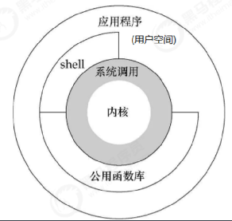

从上图可以看出，Linux操作系统的体系架构分为：用户空间(应用程序的活动空间)和内核。内核：本质上可以理解为一种软件，控制计算机的硬件资源，并提供上层应用程序运行的环境。

用户空间：上层应用程序活动的空间。应用程序的执行必须依托于内核提供的资源，包括CPU资源、存储资源、I/O资源等。

系统调用：为了使上层应用能够访问到这些资源，内核必须为上层应用提供访问的接口：即系统调用。

所有进程初始都运行于用户空间，此时即为用户运行状态(简称：用户态)；但是当它调用系统调用执行某些操作时，例如I/O调用，此时需要陷入内核中运行，我们就称进程处于内核运行态（或简称为内核态）。系统调用的过程可以简单理解为：

1. 用户态程序将一些数据值放在寄存器中，或者使用参数创建一个堆栈，以此表明需要操作系统提供的服务。
2. 用户态程序执行系统调用。
3. CPU切换到内核态，并跳到位于内存指定位置的指令。
4. 系统调用处理器(`systemcallhandler`)会读取程序放入内存的数据参数，并执行程序请求的服务。
5. 系统调用完成后，操作系统会重置`CPU`为用户态并返回系统调用的结果。

由此可见用户态切换至内核态需要传递许多变量，同时内核还需要保护好用户态在切换时的一些寄存器值、变量等，以备内核态切换回用户态。这种切换就带来了大量的系统资源消耗，这就是在 `synchronized`未优化之前，效率低的原因。

## 六、JDK6 synchronized优化

CAS的全成是：CompareAndSwap(比较相同再交换)。是现代CPU广泛支持的一种对内存中的共享数据进行操作的一种特殊指令。

CAS的作用：CAS可以将比较和交换转换为原子操作，这个原子操作直接由CPU保证。CAS可以保证共享变量赋值时的原子操作。

CAS操作依赖3个值：内存中的值V，旧的预估值X，要修改的新值B，如果旧的预估值X等于内存中的值V，就将新的值B保存到内存中。

### CAS和volatile实现无锁并发

```java
import java.util.ArrayList;
import java.util.concurrent.atomic.AtomicInteger;

public class T {
    public static void main(String[] args) throws InterruptedException {
        AtomicInteger atomicInteger = new AtomicInteger();
        Runnable mr = () -> {
            for (int i = 0; i < 1000; i++) {
                atomicInteger.incrementAndGet();
            }
        };
        ArrayList<Thread> ts = new ArrayList<>();
        for (int i = 0; i < 5; i++) {
            Thread t = new Thread(mr);
            t.start();
            ts.add(t);
        }
        for (Thread t : ts) {
            t.join();
        }
        System.out.println("number = " + atomicInteger.get());
    }
}
```

### CAS原理

通过刚才`AtomicInteger`的源码我们可以看到，`Unsafe`类提供了原子操作。

Unsafe 类使`Java`拥有了像C语言的指针一样操作内存空间的能力，同时也带来了指针的问题。过度的使用`Unsafe`类会使得出错的几率变大，因此Java官方并不建议使用的，官方文档也几乎没有。Unsafe 对象不能直接调用，只能通过反射获得。

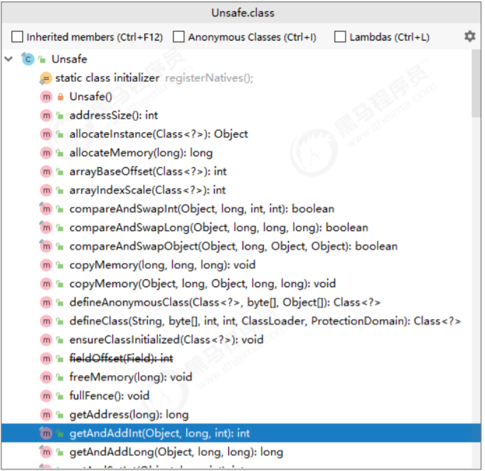

#### Unsafe实现CAS

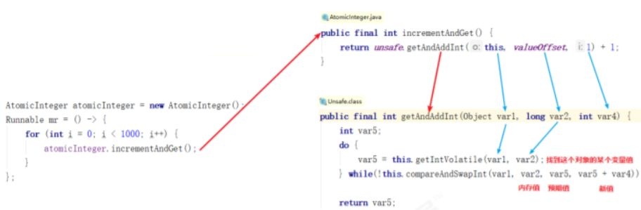

#### 乐观锁和悲观锁

总是假设最坏的情况，每次去拿数据的时候都认为别人会修改，所以每次在拿数据的时候都会上锁，这样别人想拿这个数据就会阻塞。因此`synchronized`我们也将其称之为悲观锁。JDK中的 `ReentrantLock`也是一种悲观锁。性能较差！

乐观锁从乐观的角度出发: 总是假设最好的情况，每次去拿数据的时候都认为别人不会修改，就算改了也没关系，再重试即可。所以不会上锁，但是在更新的时候会判断一下在此期间别人有没有去修改这个数据，如何没有人修改则更新，如果有人修改则重试。CAS这种机制我们也可以将其称之为乐观锁。综合性能较好！

CAS获取共享变量时，为了保证该变量的可见性，需要使用`volatile`修饰。结合CAS和volatile可以实现无锁并发，适用于竞争不激烈、多核CPU的场景下。

1. 因为没有使用 synchronized，所以线程不会陷入阻塞，这是效率提升的因素之一。
2. 但如果竞争激烈，可以想到重试必然频繁发生，反而效率会受影响。

::: tip 总结 CAS 可以将比较和交换转换为原子操作，这个原子操作直接由处理器保证。

CAS需要3个值:内存地址V，旧的预期值A，要修改的新值B，如果内存地址V和旧的预期值A相等就修改内存地址值为B
:::

## synchronized 锁升级过程

高效并发是从 JDK 5 到 JDK 6 的一个重要改进，`HotSpot`虛拟机开发团队在这个版本上花费了大量的精力 去实现各种锁优化技术，包括偏向锁( Biased Locking )、轻量级锁(`Lightweight Locking`)和如适应性 自旋(`Adaptive Spinning`)、锁消除(`Lock Elimination`)、锁粗化(`Lock Coarsening`)等，这些技术都是为 了在线程之间更高效地共享数据，以及解决竞争问题，从而提高程序的执行效率。

```flow
noLock=>operation: 无锁
biasLock=>operation: 偏向锁
lightweightLock=>operation: 轻量级锁
heavyweightLock=>operation: 重量级锁

noLock(right)->biasLock(right)->lightweightLock(right)->heavyweightLock
```

## Java对象的布局

在 JVM 中，对象在内存中的布局分为三块区域：对象头、实例数据和对齐填充。如下图所示：

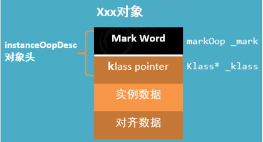

### 对象头

当一个线程尝试访问`synchronized`修饰的代码块时，它首先要获得锁，那么这个锁到底存在哪里呢？ 是存在锁对象的对象头中的。

HotSpot采用`instanceOopDesc`和`arrayOopDesc`来描述对象头，`arrayOopDesc`对象用来描述数组类型。`InstanceOopDesc`的定义的在`Hotspot`源码的`instanceOop.hpp`文件中，另外，`arrayOopDesc`的定义对应`arrayOop.hpp`。

从`instanceOopDesc`代码中可以看到`instanceOopDesc`继承自`oopDesc`，`oopDesc`的定义载`Hotspot`源码中的`oop.hpp`文件中。

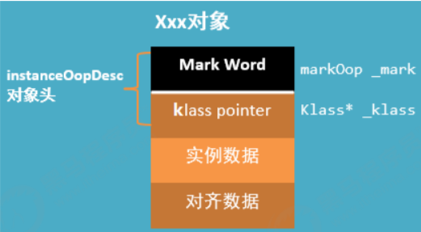

`_mark`表示对象标记、属于`markOop`类型，也就是接下来要讲解的`Mark World`，它记录了对象和锁有关的信息

`_metadata`表示类元信息，类元信息存储的是对象指向它的类元数据(Klass)的首地址，其中 Klass 表示 普通指针、`_compressed_klass`表示压缩类指针。

::: info 小结

对象头由两部分组成，一部分用于存储自身的运行时数据，称之为`Mark Word`，另外一部分是类型指针，及对象指向它的类元数据的指针。

:::

### Mark Word

`Mark Word`用于存储对象自身的运行时数据，如哈希码(`HashCode`)、GC 分代年龄、锁状态标志、 线程持有的锁、偏向线程 ID、偏向时间戳等等，占用内存大小与虚拟机位长一致。Mark Word 对应的类型是`markOop`。源码位于`markOop.hpp`中。

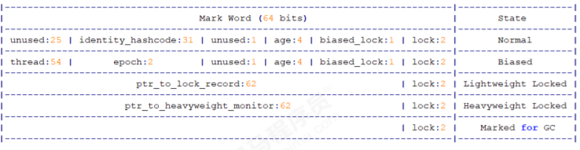

在64位虚拟机下，`Mark Word`是`64bit`大小的，其存储结构如下：

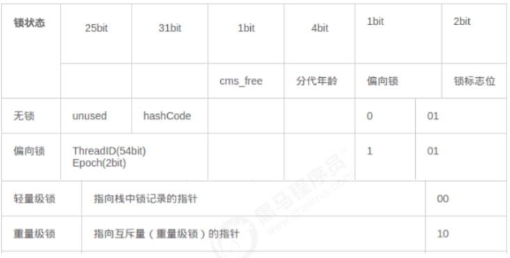

在 32位虚拟机下，`Mark Word`是`32bit`大小的，其存储结构如下：


### klass pointer

这一部分用于存储对象的类型指针，该指针指向它的类元数据，JVM 通过这个指针确定对象是哪个类的 实例。

该指针的位长度为JVM 的一个字大小，即32位的 JVM为32位，64位的JVM为64位。

如果应用的对 象过多，使用 64 位的指针将浪费大量内存，统计而言，64位的JVM将会比32 位的 JVM 多耗费 50%的内 存。为了节约内存可以使用选项 -XX:+UseCompressedOops 开启指针压缩，其中，oop 即 ordinary object pointer 普通对象指针。开启该选项后，下列指针将压缩至 32 位：

1. 每个 Class 的属性指针(即静态变量)
2. 每个对象的属性指针(即对象变量)
3. 普通对象数组的每个元素指针

当然，也不是所有的指针都会压缩，一些特殊类型的指针 `JVM` 不会优化，比如指向 `PermGen` 的 `Class`对象指针(JDK8中指向元空间的`Class`对象指针)、本地变量、堆栈元素、入参、返回值和 NULL 指针等。`对象头=Mark Word+类型指针`(未开启指针压缩的情况下)

- 在32位系统中，Mark Word = 4 bytes，类型指针 = 4bytes，对象头 = 8 bytes = 64 bits；
- 在64位系统中，Mark Word = 8 bytes，类型指针 = 8bytes，对象头 = 16 bytes = 128bits；

- 实例数据：类中定义的成员变量；
- 对齐填充：对齐填充并不是必然存在的，也没有什么特别的意义，他仅仅起着占位符的作用；

由于`HotSpot-VM`的自动内存管理系统要求对象起始地址必须是8字节的整数倍，换句话说，就是对象的大小必须是8字节的整数倍。而对象头正好是8字节的倍数，因此，当对象实例数据部分没有对齐时，就需要通过对齐填充来补全。

### 查看 Java 对象布局

```xml

<dependency>
    <groupId>org.openjdk.jol</groupId>
    <artifactId>jol-core</artifactId>
    <version>0.9</version>
</dependency>
```

Java对象由3部分组成：对象头，实例数据，对齐数据。对象头分成两部分：`Mark World` + `Klass pointer`

### 什么是偏向锁

偏向锁是JDK6中的重要引进，因为HotSpot作者经过研究实践发现，在大多数情况下，锁不仅不存在多线程竞争，而且总是由同一线程多次获得，为了让线程获得锁的代价更低，引进了偏向锁。

偏向锁的“偏”，就是偏心的“偏”、偏袒的“偏”，它的意思是这个锁会偏向于第一个获得它的线程，会在对象头存储锁偏向的线程ID，以后该线程进入和退出同步块时只需要检查是否为偏向锁、锁标志位以及ThreadID即可。

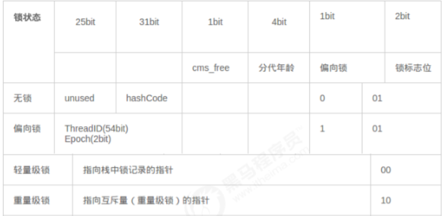

不过一旦出现多个线程竞争时必须撤销偏向锁，所以撤销偏向锁消耗的性能必须小于之前节省下来的`CAS`原子操作的性能消耗，不然就得不偿失了。

### 偏向锁原理

当线程第一次访问同步块并获取锁时，偏向锁处理流程如下：

1. 虚拟机将会把对象头中的标志位设为“01”，即偏向模式。
2. 同时使用`CAS`操作把获取到这个锁的线程的ID记录在对象的`Mark Word`之中 ，如果`CAS`操作成功，持有偏向锁的线程以后每次进入这个锁相关的同步块时，虚拟机都可以不再进行任何同步操作，偏向锁的效率高。

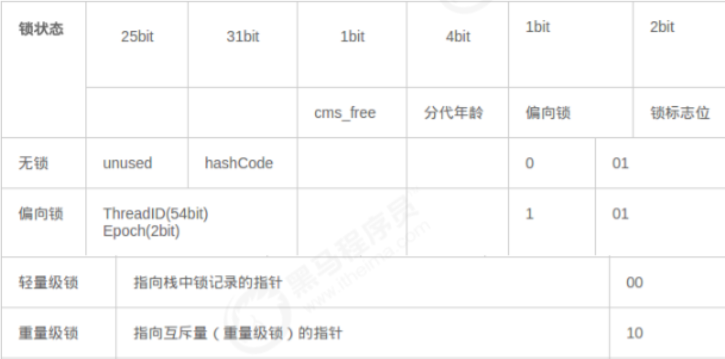

持有偏向锁的线程以后每次进入这个锁相关的同步块时，虚拟机都可以不再进行任何同步操作，偏向锁的效率高。

### 偏向锁的撤销

1. 偏向锁的撤销动作必须等待全局安全点
2. 暂停拥有偏向锁的线程，判断锁对象是否处于被锁定状态
3. 撤销偏向锁，恢复到无锁(标志位为01)或轻量级锁(标志位为00)的状态

偏向锁在 Java6之后是默认启用的，但在应用程序启动几秒钟之后才激活，可以使用 -

`XX:BiasedLockingStartupDelay=0`参数关闭延迟，如果确定应用程序中所有锁通常情况下处于竞争 状态，可以通过 `XX:-UseBiasedLocking=false` 参数关闭偏向锁。

### 偏向锁好处

偏向锁是在只有一个线程执行同步块时进一步提高性能，适用于一个线程反复获得同一锁的情况。偏向锁可以提高带有同步但无竞争的程序性能。 它同样是一个带有效益权衡性质的优化，也就是说，它并不一定总是对程序运行有利，如果程序中大多数的锁总是被多个不同的线程访问比如线程池，那偏向模式就是多余的。

在JDK5中偏向锁默认是关闭的，而到了`JDK6`中偏向锁已经默认开启。

但在应用程序启动几秒钟之后才激活，可以使用 `-XX:BiasedLockingStartupDelay=0`参数关闭延迟，如果确定应用程序中所有锁通常 情况下处于竞争状态，可以通过`XX:-UseBiasedLocking=false`参数关闭偏向锁。

### 什么是轻量级锁

轻量级锁是JDK6之中加入的新型锁机制，它名字中的“轻量级”是相对于使用`monitor`的传统锁而言的， 因此传统的锁机制就称为“重量级”锁。

首先需要强调一点的是，轻量级锁并不是用来代替重量级锁的。

引入轻量级锁的目的：在多线程交替执行同步块的情况下，尽量避免重量级锁引起的性能消耗，但是如果多个线程在同一时刻进入临界区，会导致轻量级锁膨胀升级重量级锁，所以轻量级锁的出现并非是要替代重量级锁。

### 轻量级锁原理

当关闭偏向锁功能或者多个线程竞争偏向锁导致偏向锁升级为轻量级锁，则会尝试获取轻量级锁，其步骤如下：

获取锁当锁对象第一次被线程获取的时候，虚拟机将会把对象头中的标志位设为“01”，即偏向模式。同时使用CAS操作把获取到这个锁的线程的ID记录在对象的`Mark Word`之中，如果CAS操作成功，持有偏向锁的线程以后每次进入这个锁相关的同步块时，虚拟机都可以不再进行任何同步操作，偏向锁的效率高。

偏向锁是在只有一个线程执行同步块时进一步提高性能，适用于一个线程反复获得同一锁的情况。

偏向锁可以提高带有同步但无竞争的程序性能。

1. 判断当前对象是否处于无锁状态(hashcode、0、01)，如果是，则JVM首先将在当前线程的栈帧中建立一个名为锁记录(`Lock Record`)的空间，用于存储锁对象目前的Mark Word的拷贝（官方 把这份拷贝加了一个`Displaced`前缀，即`Displaced Mark Word`），将对象的`Mark Word`复制到栈帧中的`Lock Record`中，将`Lock Reocrd`中的owner指向当前对象。
2. JVM利用CAS操作尝试将对象的`Mark Word`更新为指向`Lock Record`的指针，如果成功表示竞争到锁，则将锁标志位变成`00`，执行同步操作。
3. 如果失败则判断当前对象的`Mark Word`是否指向当前线程的栈帧，如果是则表示当前线程已经持有当前对象的锁，则直接执行同步代码块；否则只能说明该锁对象已经被其他线程抢占了，这时轻 量级锁需要膨胀为重量级锁，锁标志位变成10，后面等待的线程将会进入阻塞状态。

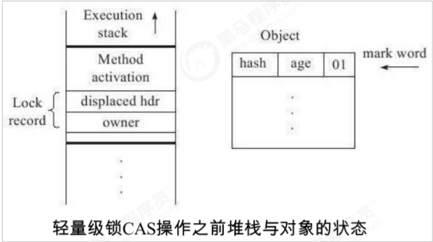

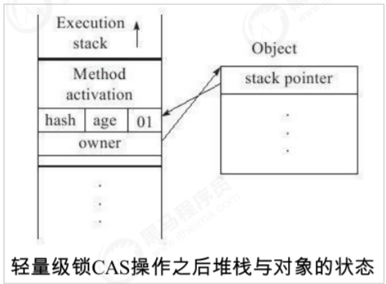

### 轻量级锁的释放

轻量级锁的释放也是通过CAS操作来进行的，主要步骤如下：

1. 取出在获取轻量级锁保存在`Displaced Mark Word`中的数据。
2. 用CAS操作将取出的数据替换当前对象的`Mark Word`中，如果成功，则说明释放锁成功。
3. 如果CAS操作替换失败，说明有其他线程尝试获取该锁，则需要将轻量级锁需要膨胀升级为重量级 锁。

对于轻量级锁，其性能提升的依据是“对于绝大部分的锁，在整个生命周期内都是不会存在竞争的”，如果打破这个依据则除了互斥的开销外，还有额外的`CAS`操作，因此在有多线程竞争的情况下，轻量级锁比重量级锁更慢。

### 轻量级锁好处

在多线程交替执行同步块的情况下，可以避免重量级锁引起的性能消耗。将对象的`Mark Word`复制到栈帧中的`Lock Recod`中。`Mark Word`更新为指向`Lock Record`的指针。在多线程交替执行同步块的情况下，可以避免重量级锁引起的性能消耗。

## 自旋锁

`monitor`实现锁的时候，知道`monitor`会阻塞和唤醒线程，线程的阻塞和唤醒需要`CPU`从用户态转为核心态，频繁的阻塞和唤醒对`CPU`来说是一件负担很重的工作，这些操作给系统的并发性能带来了很大的压力。

同时，虚拟机的开发团队也注意到在许多应用上，共享数据的锁定状态只会持续很短的一段时间，为了这段时间阻塞和唤醒线程并不值得。如果物理机器有一个以上的处理器，能让两个或以上的线程同时并行执行，我们就可以让后面请求锁的那个线程“稍等一下”，但不放弃处理器的执行时间，看看持有锁的线程是否很快就会释放锁。

为了让线程等待，这个线程会在原地循环等待，这项技术就是所谓的自旋锁。自旋锁在`JDK1.4.2`中就已经引入，只不过默认是关闭的，可以使用`-XX:+UseSpinning`参数来开启，在`JDK6`中就已经改为默认开启了。

自旋等待不能代替阻塞，且先不说对处理器数量的要求，自旋等待本身虽然避免了线程切换的开销，但它是要占用处理器时间的，因此，如果锁被占用的时间很短，自旋等待的效果就会非常好，反之，如果锁被占用的时间很长。

那么自旋的线程只会白白消耗处理器资源，而不会做任何有用的工作，反而会带来性能上的浪费。因此，自旋等待的时间必须要有一定的限度，如果自旋超过了限定的次数仍然没有成功获得锁，就应当使用传统的方式去挂起线程了。

自旋次数的默认值是10次，用户可以使用参数`-XX:PreBlockSpin`来更改。

### 适应性自旋锁

在`JDK6`中引入了自适应的自旋锁。自适应意味着自旋的时间不再固定了，而是由前一次在同一个锁上的自旋时间及锁的拥有者的状态来决定。如果在同一个锁对象上，自旋等待刚刚成功获得过锁，并且持有锁的线程正在运行中，那么虚拟机就会认为这次自旋也很有可能再次成功，进而它将允许自旋等待持 续相对更长的时间，比如100次循环。另外，如果对于某个锁，自旋很少成功获得过，那在以后要获取 这个锁时将可能省略掉自旋过程，以避免浪费处理器资源。有了自适应自旋，随着程序运行和性能监控
信息的不断完善，虚拟机对程序锁的状况预测就会越来越准确，虛拟机就会变得越来越“聪明”了。

## 锁消除

锁消除是指虚拟机即时编译器(`JIT`)在运行时，对一些代码上要求同步，但是检测到不可能存在共享数据竞争的锁进行消除。

锁消除的主要判定依据来源于逃逸分析的数据支持，如果判断在一段代码中， 堆上的所有数据都不会逃逸出去从而被其他线程访问到，那就可以把它们当做栈上数据对待，认为它们 是线程私有的，同步加锁自然就无须进行。变量是否逃逸，对于虚拟机来说需要使用数据流分析来确定，但是程序员自己应该是很清楚的，怎么会在明知道不存在数据争用的情况下要求同步呢?

实际上有许多同步措施并不是程序员自己加入的，同步的代码在Java程序中的普遍程度也许超过了大部分读者的 想象。下面这段非常简单的代码仅仅是输出3个字符串相加的结果，无论是源码字面上还是程序语义上都没有同步。

```java
public class T {
    public static void main(String[] args) {
        contactString("aa", "bb", "cc");
    }

    public static String contactString(String s1, String s2, String s3) {
        return new StringBuffer().append(s1).append(s2).append(s3).toString();
    }
}
```

`StringBuffer`的`append ()` 是一个同步方法，锁就是`this`也就是`new StringBuilder()`。

虚拟机发现它的 动态作用域被限制在`concatString()`方法内部。

也就是说, `new StringBuilder()`对象的引用永远不会“逃逸”到`concatString()`方法之外，其他线程无法访问到它，因此，虽然这里有锁，但是可以被安全地消除5掉，在即时编译之后，这段代码就会忽略掉所有的同步而直接执行了。

## 锁粗化

将同步块的作用范围限制得尽量小，只在共享数据的实际作用域中才进行同步，这样是为了使得需要同步的操作数量尽可能变小，如果存在锁竞争，那等待锁的线程也能尽快拿到锁。

大部分情况下，上面的原则都是正确的，但是如果一系列的连续操作都对同一个对象反复加锁和解锁，甚至加锁操作是出现在循环体中的，那即使没有线程竞争，频繁地进行互斥同步操作也会导致不必要的性能损耗。

```java
public class T {
    public static void main(String[] args) {
        StringBuffer sb = new StringBuffer();
        for (int i = 0; i < 100; i++) {
            sb.append("aa");
        }
        System.out.println(sb.toString());
    }
}
```

`JVM`会探测到一连串细小的操作都使用同一个对象加锁，将同步代码块的范围放大，放到这串操作的外面，这样只需要加一次锁即可。

## 平时写代码如何对 synchronized 优化

减少synchronized的范围：同步代码块中尽量短，减少同步代码块中代码的执行时间，减少锁的竞争；

降低synchronized锁的粒度：将一个锁拆分为多个锁提高并发度；

```java
class T {
    void m() {
        Hashtable hs = new Hashtable();
        hs.put("aa", "bb");
        hs.put("xx", "yy");
    }
}
```

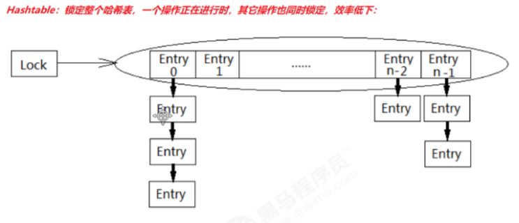

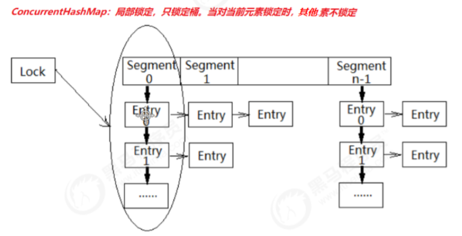


`LinkedBlockingQueue` 入队和出队使用不同的锁，相对于读写只有一个锁效率要高


### 读写分离

读取时不加锁，写入和删除时加锁：`ConcurrentHashMap`，`CopyOnWriteArrayList` 和 `ConyOnWriteSet`
