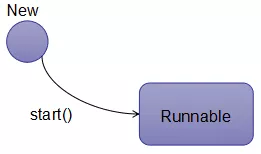

# thread

# 线程生命周期，五大状态转换分析

## 前言

本章学习完成，你将会对线程的生命周期有清楚的认识，并且明白不同状态之间是如何转换的，以及对 java 线程状态枚举类解读。

## 一、线程生命周期

一个完整的线程生命周期，要经过 新建(new)、就绪(Runnable)、运行(Running)、阻塞(Blocked)和死亡(Dead)5 种状态。


### 1.new 阶段

New 阶段就是你 new Thread()创建线程对象时候的阶段。

是创建了一个 Therad 对象

只有当我们真正把线程启动起来的时候，此时才会在 JVM 进程

我们 new 了一个 Thread 对象之后就需要调用 Thread.start()来启动线程，此时线程会从 new 阶段转换到 Runnable 阶段。

线程流程图-new_to_runnable：



### 2. Runnable 阶段

只有调用 Thread.start()方法才能使线程从 new 阶段转换到 Runnable 阶段。

当然我们从字面意思也可以知道此时线程是处于可执行转状态而不是真正的执行中状态了，此时的线程只能等 CPU 翻牌子，翻到了他才能真正的跑起来。

Java.lang.Thread.start

Java.lang.Thread.State

```
    public enum State {
        /**
         * Thread state for a thread which has not yet started.
         * 还没有start的线程状态
         */
        NEW,

        /**
         * Thread state for a runnable thread.  A thread in the runnable
         * state is executing in the Java virtual machine but it may
         * be waiting for other resources from the operating system
         * such as processor.
         */
        RUNNABLE,

        /**
         * Thread state for a thread blocked waiting for a monitor lock.
         * A thread in the blocked state is waiting for a monitor lock
         * to enter a synchronized block/method or
         * reenter a synchronized block/method after calling
         * {@link Object#wait() Object.wait}.
         */
        BLOCKED,

        /**
         * Thread state for a waiting thread.
         * A thread is in the waiting state due to calling one of the
         * following methods:
         * <ul>
         *   <li>{@link Object#wait() Object.wait} with no timeout</li>
         *   <li>{@link #join() Thread.join} with no timeout</li>
         *   <li>{@link LockSupport#park() LockSupport.park}</li>
         * </ul>
         *
         * <p>A thread in the waiting state is waiting for another thread to
         * perform a particular action.
         *
         * For example, a thread that has called <tt>Object.wait()</tt>
         * on an object is waiting for another thread to call
         * <tt>Object.notify()</tt> or <tt>Object.notifyAll()</tt> on
         * that object. A thread that has called <tt>Thread.join()</tt>
         * is waiting for a specified thread to terminate.
         */
        WAITING,

        /**
         * Thread state for a waiting thread with a specified waiting time.
         * A thread is in the timed waiting state due to calling one of
         * the following methods with a specified positive waiting time:
         * <ul>
         *   <li>{@link #sleep Thread.sleep}</li>
         *   <li>{@link Object#wait(long) Object.wait} with timeout</li>
         *   <li>{@link #join(long) Thread.join} with timeout</li>
         *   <li>{@link LockSupport#parkNanos LockSupport.parkNanos}</li>
         *   <li>{@link LockSupport#parkUntil LockSupport.parkUntil}</li>
         * </ul>
         */
        TIMED_WAITING,

        /**
         * Thread state for a terminated thread.
         * The thread has completed execution.
         */
        TERMINATED;
    }
```

### 3.Running 阶段

这个阶段的线程已经获取到了**CPU 调度执行权**，也就是说处于运行中状态了。

在该阶段中，线程可以向前或者向后发生转换：

- 由于 CPU 的调度器轮询导致该线程放弃执行，就会进入 Runnable 阶段。
- 线程主动调用 yield，放弃 CPU 执行权，就会进入 Runnable 阶段(这种方式并不是百分百生效的，在 CPU 资源不紧张的时候不会生效)。
- 调用 sleep、wait 方法，进入 Blocked 阶段(这里讲的 Blocked 阶段和线程的 Blocked 状态需要区分开，这边讲的是一个比较广义的 Blocked 的阶段)
- 进行某个阻塞的 IO 操作而进入 Blocked 阶段
- 为了获取某个锁资源而加入到该锁到阻塞队列中而进入 Blocked 阶段
- 线程执行完成或者调用 stop 方法或者判断某个逻辑标识，直接进入 Terminated 阶段

### wait
