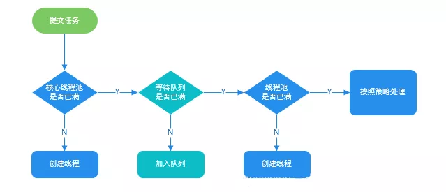

## 线程池 ThreadPoolExecutor 源码分析

## 1、构造方法

构造方法中有 4 个方法，本质上都是调用的下面这个构造方法：

```java
public class ThreadPoolExecutor extends AbstractExecutorService {
    public ThreadPoolExecutor(int corePoolSize,
                              int maximumPoolSize,
                              long keepAliveTime,
                              TimeUnit unit,
                              BlockingQueue<Runnable> workQueue,
                              ThreadFactory threadFactory,
                              RejectedExecutionHandler handler) {
        if (corePoolSize < 0 ||
                maximumPoolSize <= 0 ||
                maximumPoolSize < corePoolSize ||
                keepAliveTime < 0)
            throw new IllegalArgumentException();
        if (workQueue == null || threadFactory == null || handler == null)
            throw new NullPointerException();
        this.acc = System.getSecurityManager() == null ?
                null :
                AccessController.getContext();
        this.corePoolSize = corePoolSize;
        this.maximumPoolSize = maximumPoolSize;
        this.workQueue = workQueue;
        this.keepAliveTime = unit.toNanos(keepAliveTime);
        this.threadFactory = threadFactory;
        this.handler = handler;
    }
}
```

## 线程池中定义了四种饱和策略 (拒绝策略)

### 1、CallerRunsPolicy

绕过线程池，直接执行线程的 run 方法

```java
public static class CallerRunsPolicy implements RejectedExecutionHandler {
    public CallerRunsPolicy() {
    }

    //使用主线程执行新任务
    public void rejectedExecution(Runnable r, ThreadPoolExecutor e) {
        if (!e.isShutdown()) {
            //此方法相同于同步方法
            r.run();
        }
    }
}
```

### 2、 AbortPolicy(线程池默认的策略)

抛出 RejectedExecutionException 来拒绝新任务的处理

```java

public static class AbortPolicy implements RejectedExecutionHandler {
    public AbortPolicy() {
    }

    public void rejectedExecution(Runnable r, ThreadPoolExecutor e) {
        throw new RejectedExecutionException("Task " + r.toString() + " rejected from " + e.toString());
    }
}
```

### 3、DiscardPolicy

不执行任何操作，丢弃新任务

```java

public static class DiscardPolicy implements RejectedExecutionHandler {
    public DiscardPolicy() {
    }

    public void rejectedExecution(Runnable r, ThreadPoolExecutor e) {
    }
}
```

### 4、DiscardOldestPolicy

此策略将丢弃最早的未处理的任务

```java
public static class DiscardOldestPolicy implements RejectedExecutionHandler {
    public DiscardOldestPolicy() {
    }

    public void rejectedExecution(Runnable r, ThreadPoolExecutor e) {
        if (!e.isShutdown()) {
            e.getQueue().poll();
            e.execute(r);
        }
    }
}
```

## 3、阻塞队列

咱们看下`ThreadPoolExecutor`的源码：

```
public static ExecutorService newFixedThreadPool(int nThreads) {
 return new ThreadPoolExecutor(nThreads, nThreads,0L, TimeUnit.MILLISECONDS,
  new LinkedBlockingQueue<Runnable>());
}
```

使用的是 LinkedBlockingQueue 作为阻塞队列，LinkedBlockingQueue 的默认构造函数允许的队列长度是 Integer.MAX_VALUE，若堆积大量的请求，可能会造成 OOM。

此处就是为什么《阿里巴巴 Java 开发手册》中不推荐使用 Executors 工具类创建线程池的原因，要求使用 ThreadPoolExecutor 构造函数的方式，让写的同学更加明确线程池的运行规则，规避资源耗尽的风险。

## 4、execute 方法

下面是执行流程图：



Java.util.concurrent.ThreadPoolExecutor.execute

```java
public class ThreadPoolExecutor extends AbstractExecutorService {
    private final AtomicInteger ctl = new AtomicInteger(ctlOf(RUNNING, 0));

    private static int workerCountOf(int c) {
        return c & CAPACITY;
    }

    //任务队列
    private final BlockingQueue<Runnable> workQueue;

    public void execute(Runnable command) {
        //如果任务为null,则抛出异常
        if (command == null)
            throw new NullPointerException();
        //获取线程池状态和有效线程数
        int c = ctl.get();
        //以下有3步：
        //步骤1：
        //如果线程池工作的线程小于核心线程数
        if (workerCountOf(c) < corePoolSize) {
            //则增加一个线程，并把该任务交给它去执行
            if (addWorker(command, true))
                //成功则返回
                return;
            //这里说明创建核心线程失败，需要再次获取临时变量c
            c = ctl.get();
        }
//步骤2：
        // 走到这里说明创建新的核心线程失败，也就是当前工作线程数大于等于corePoolSize
        // 线程池的运行状态是RUNNING，并且尝试将新任务加入到阻塞队列，成功返回true
        if (isRunning(c) && workQueue.offer(command)) {
            //进入到这里，是已经向任务队列投放任务成功
            //再次获取线程池状态和有效线程数
            int recheck = ctl.get();
            //如果线程池状态不是RUNNING（线程池异常终止了）,将线程从工作队列中移除
            if (!isRunning(recheck) && remove(command))
                //执行饱和策略
                reject(command);
                // 走到这里说明线程池状态可能是RUNNING
                // 也可能是移除线程任务失败了（失败的最大的可能是已经执行完毕了）
                //因为所有存活的工作线程有可能在最后一次检查之后已经终结,所以需要二次检查线程池工作线程的状态
                //这里博主也是看了半天，大家好好体会下
            else if (workerCountOf(recheck) == 0)
                //若当前线程池工作线程数为0，则新建一个线程并执行
                addWorker(null, false);
        }
        //步骤3：
        // 如果任务队列已满，就需要创建非核心线程
        // 如果新建非核心线程失败，则执行饱和策略
        else if (!addWorker(command, false))
            reject(command);

    }

}

```
