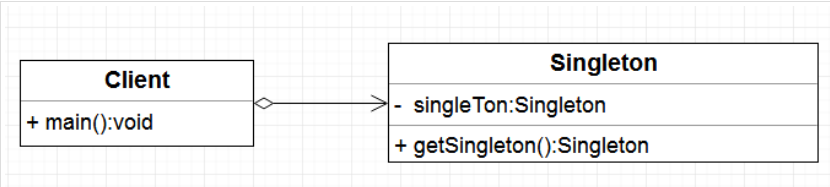

在介绍单例模式之前，我们先了解一下，什么是设计模式？

## 一、设计模式（Design Pattern）

是一套被反复使用，多数人知晓的，经过分类编目的，代码设计经验的总结。

目的：使用设计模式是为了可重用性代码，让代码更容易被他人理解，保证代码可靠性。

本文将会用到的关键词：

- 单例：Singleton
- 实例：instance
- 同步：synchronized
- 类装载器：ClassLoader

## 单例模式：

单例，顾名思义就是只能有一个、不能再出现第二个。就如同地球上没有两片一模一样的树叶一样。

在这里就是说：一个类只能有一个实例，并且整个项目系统都能访问该实例。

单例模式共分为两大类：

- 懒汉模式：实例在第一次使用时创建
- 饿汉模式：实例在类装载时创建

单例模式UML图：



## 饿汉模式：

按照定义我们可以写出一个基本代码：

```java
public class Singleton {
    private Singleton() {}
    // 由于不能使用构造方法创建实力，所以需要在类的内部创建该类的唯一实力，使用STATIC修饰singleton，在外界可以通过类名调用该实例子， 类名.成员变量
    private static Singleton singleton = new Singleton(); // 1
    
    // 如果使用private修饰，则不能在外部访问，只能在类内部访问
    private static Singleton instance = new Singleton(); // 2
    public static Singleton getInstance() {
        return instance;
    }
}
```

对于饿汉模式来说，这种写法已经很‘perfect’了，唯一的缺点就是，由于instance的初始化是在类加载时进行的，类加载是由ClassLoader来实现的，如果初始化太早，就会造成资源浪费。

当然，如果所需的单例占用的资源很少，并且也不依赖于其他数据，那么这种实现方式也是很好的。

类装载的时机：

- new一个对象时
- 使用反射创建它的实例时
- 子类被加载时，如果父类还没有加载，就先加载父类
- JVM启动时执行主类 会先被加载

## 懒汉模式：

懒汉模式的代码如下：

```java
public class LazySingleton{
    private static LazySingleton singleton;
    
    public static String VARIABLE = "hello world"; 
    
    private LazySingleton(){
        System.out.println("LazySingleton is created");
    }
    
    public static LazySingleton getInstance(){
        if(singleton == null){
            singleton = new LazySingleton();
        }
        return singleton;
    }
    
    public static void main(String[] args){
        for (int i = 0; i < 10; i++) {
            System.out.printf(LazySingleton.VARIABLE);
        }
    }
}
```

可以看出，只要我们不调用getInstance()方法，就不会常见instance，就可以很好的保证了第一次调用的时候创建对象。

## 双重检查（Double-Check）

```java
class Singleton {
    private volatile Singleton singleton;
    
    private Singleton(){}

    public Singleton getSingleton() {
        if (singleton = null){
            synchronized (singleton.class){
                if (singleton = null){
                    singleton = new Singleton();
                }
            }
        }
        return singleton;
    }
}
```

怎么说哪？代码量确实比较多，并且难以理解，为什么使用`volatile` ，以及为什么是两次判空，这些都很难理解，并且在一些低版本的JDK还不能够保证执行的正确性，所以代码中也不推荐大家用，但作为一种思想还是有必要研究一下！


这段代码看起来已经完美无瑕了。当然，只是『看起来』，还是有小概率出现问题的。想要充分理解需要先弄清楚以下几个概念：原子操作、指令重排。

原子操作：

简单来说，原子操作（atomic）就是不可分割的操作，在计算机中，就是指不会因为线程调度被打断的操作。比如，简单的赋值是一个原子操作：

了解了原子操作和指令重排的概念之后，我们再继续看代码三的问题。

主要在于singleton = new Singleton()这句，这并非是一个原子操作，事实上在 JVM 中这句话大概做了下面 3 件事情。
1. 给 singleton 分配内存
2. 调用 Singleton 的构造函数来初始化成员变量，形成实例
3. 将singleton对象指向分配的内存空间（执行完这步 singleton才是非 null了）

在JVM的即时编译器中存在指令重排序的优化

volatile关键字的一个作用是禁止指令重排，把instance声明为volatile之后，对它的写操作就会有一个内存屏障，这样，在它的赋值完成之前，就不用会调用读操作。

注意：volatile阻止的不是singleton = new Singleton()这句话内部[1-2-3]的指令重排，而是保证了在一个写操作（[1-2-3]）完成之前，不会调用读操作（if (instance == null)）。

其它方法

## 静态内部类

```java
public class Singleton {
    private static class SingletonHolder {
        private static final Singleton INSTANCE = new Singleton();
    }

    private Singleton() {}

    public static final Singleton getInstance() {
        return SingletonHolder.INSTANCE;
    }
}

```
这种写法的巧妙之处在于：对于内部类SingletonHolder，它是一个饿汉式的单例实现，在SingletonHolder初始化的时候会由ClassLoader来保证同步，使INSTANCE是一个真单例。

同时，由于SingletonHolder是一个内部类，只在外部类的Singleton的getInstance()中被使用，所以它被加载的时机也就是在getInstance()方法第一次被调用的时候。

它利用了ClassLoader来保证了同步，同时又能让开发者控制类加载的时机。从内部看是一个饿汉式的单例，但是从外部看来，又的确是懒汉式的实现

## 枚举：

```java
public enum Singleton {
    INSTANCE;
    public void whateverMethod() {
        // ...
    }
} // 使用Singleton.INSTANCE.whateverMethod()调用方法

```
是不是很简单？而且因为自动序列化机制，保证了线程的绝对安全。三个词概括该方式：简单、高效、安全

这种写法在功能上与共有域方法相近，但是它更简洁，无偿地提供了序列化机制，绝对防止对此实例化，即使是在面对复杂的序列化或者反射攻击的时候。虽然这中方法还没有广泛采用，但是单元素的枚举类型已经成为实现Singleton的最佳方法。
