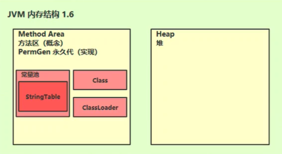
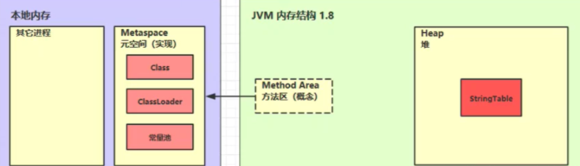
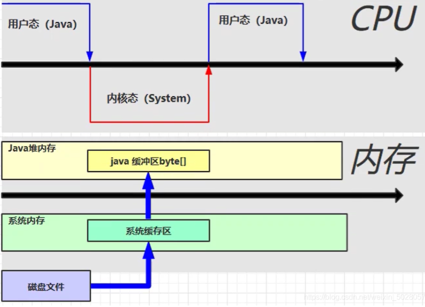
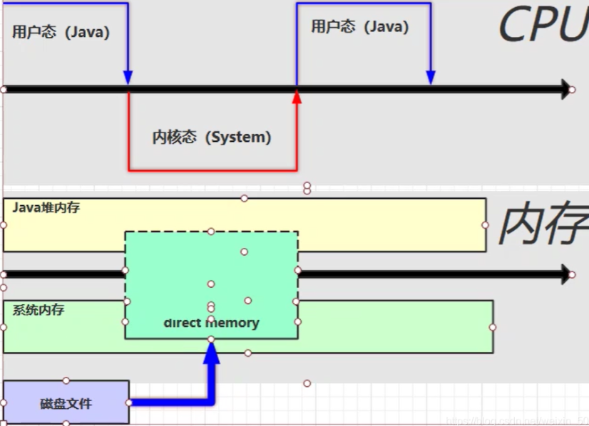

## JVM内存结构

::: info

Java Virtual Machine ，Java 程序的运行环境(Java 二进制字节码的运行环境)。

:::

- 一次编译，处处执行
- 自动的内存管理，垃圾回收机制
- 数组下标越界检查

3）比较

JVM、JRE、JDK 的关系如下图所示

操作系统(Windows+Linux)

```flow
st=>start: 开始


```

Jvm

~jre(jvm+基本类库)

~jdk(jvm+基本类库+编译工具)

~开发 javaSE 程序(JDK+IDE 工具)

~开发 JavaEE 程序(JDK+应用服务器+IDE 工具)

2、学习 JVM 有什么用？

面试必备

中高级程序员必备

想走的长远，就需要懂原理，比如：自动装箱、自动拆箱是怎么实现的，反射是怎么实现的，垃圾回收机制是怎么回事等待，JVM 是必须掌握的。

3、常见的 JVM

[](./img/1-1.png)

4、学习路线

[](./img/1-2.png)

ClassLoader：Java 代码编译成二进制后，会经过类加载器，这样才能加载到 JVM 中运行。

Method Area：类是放在方法区中

Heap：类的实例对象。

当类调用方法时，会用到 JVM Stack、PC Register、本地方法栈。

方法执行时的每行代码是有执行引擎中的解释器逐行执行，方法中的热点代码频繁调用的方法，由 JIT 编译器优化后执行，GC 会对堆中不用的对象进行回收。需要和操作系统打交道就需要使用到本地方法接口。

## 二、内存结构

### 1、程序计数器

1）定义

Program Counter Register 程序计数器(寄存器)

作用：是记录下一条 jvm 指令的执行地址行号。

特点：

是线程私有的

不会存在内存溢出

2）作用

```text
0: getstatic #20 // PrintStream out = System.out;
3: astore_1 // --
4: aload_1 // out.println(1);
5: iconst_1 // --
6: invokevirtual #26 // --
9: aload_1 // out.println(2);
10: iconst_2 // --
11: invokevirtual #26 // --
14: aload_1 // out.println(3);
15: iconst_3 // --
16: invokevirtual #26 // --
19: aload_1 // out.println(4);
20: iconst_4 // --
21: invokevirtual #26 // --
24: aload_1 // out.println(5);
25: iconst_5 // --
26: invokevirtual #26 // --
29: return
```

解释器会解释指令为机器码交给 cpu 执行，程序计数器会记录下一条指令的地址行号，这样下一次解释器会从程序计数器拿到指令然后进行解释执行。

多线程的环境下，如果两个线程发生了上下文切换，那么程序计数器会记录线程下一行指令的地址行号，以便于接着往下执行。

### 2、虚拟机栈

1）定义

每个线程运行需要的内存空间，称为虚拟机栈 每个栈由多个栈帧(Frame)组成，对应着每次调用方法时所占用的内存 每个线程只能有一个活动栈帧，对应着当前正在执行的方法

问题辨析：

1、垃圾回收是否涉及栈内存？

不会。栈内存是方法调用产生的，方法调用结束后会弹出栈。

2、栈内存分配越大越好吗？

不是。因为物理内存是一定的，栈内存越大，可以支持更多的递归调用，但是可执行的线程数就会越少。

3、方法内的局部变量是否线程安全

如果方法内部的变量没有逃离方法的作用访问，它是线程安全的

如果是局部变量引用了对象，并逃离了方法的访问，那就要考虑线程安全问题。

2）栈内存溢出

栈帧过大、过多、或者第三方类库操作，都有可能造成栈内存溢出 java.lang.stackOverflowError ，使用 -Xss256k 指定栈内存大小！

3）线程运行诊断

案例一：cpu 占用过多

解决方法：Linux 环境下运行某些程序的时候，可能导致 CPU 的占用过高，这时需要定位占用 CPU 过高的线程

Top 命令，查看是哪个进程占用 CPU 过高

`ps H -eo pid, tid（线程id）`, %cpu | grep

刚才通过 top 查到的进程号 通过 ps 命令进一步查看是哪个线程占用 CPU 过高

### 3、本地方法栈

一些带有`native`关键字的方法就是需要`JAVA`去调用本地的C或者C++方法，因为`JAVA`有时候没法直接和操作系统底层交互，所以需要用到本地方法栈，服务于带 native 关键字(unsafe)的方法

### 4、堆

1）定义

`Heap` 堆

通过 `new` 关键字创建的对象都会被放在堆内存

特点

它是线程共享，堆内存中的对象都需要考虑线程安全问题

有垃圾回收机制

2）堆内存溢出

Java.lang.OutofMemoryError ：java heap space. 堆内存溢出 可以使用 -Xmx8m 来指定堆内存大小。

3）堆内存诊断

Jps 工具

查看当前系统中有哪些 java 进程

Jmap 工具

查看堆内存占用情况 `jmap -heap` 进程 ID

Jconsole 工具

图形界面的，多功能的监测工具，可以连续监测

Jvisualvm 工具

### 5、方法区

#### 1）定义

Java 虚拟机有一个在所有 Java 虚拟机线程之间共享的方法区域。方法区域类似于用于传统语言的编译代码的存储区域，或者类似于操作系统进程中的“文本”段。

它存储每个类的结构，例如运行时常量池、字段和方法数据，以及方法和构造函数的代码，包括特殊方法，用于类和实例初始化以及接口初始化方法区域是在虚拟机启动时创建的。

尽管方法区域在逻辑上是堆的一部分，但简单的实现可能不会选择垃圾收集或压缩它。

此规范不强制指定方法区的位置或用于管理已编译代码的策略。

方法区域可以具有固定的大小，或者可以根据计算的需要进行扩展，并且如果不需要更大的方法区域，则可以收缩。方法区域的内存不需要是连续的！

#### 2）组成

Hotspot 虚拟机 jdk1.6 1.7 1.8 内存结构图





#### 3）方法区内存溢出

1.8 之前会导致永久代内存溢出

使用 -XX:MaxPermSize=8m 指定永久代内存大小

1.8 之后会导致元空间内存溢出

使用 -XX:MaxMetaspaceSize=8m 指定元空间大小

#### 4）运行时常量池

二进制字节码包含(类的基本信息，常量池，类方法定义，包含了虚拟机的指令)

首先看看常量池是什么，编译如下代码：

```java
public class T {
    public static void main(String[] args) {
        System.out.println("Hello World!");
    }
}
```

然后使用 javap -v Test.class 命令反编译查看结果。

每条指令都会对应常量池表中一个地址，常量池表中的地址可能对应着一个类名、方法名、参数类型等信息。

**常量池：**

就是一张表，虚拟机指令根据这张常量表找到要执行的类名、方法名、参数类型、字面量信息

**运行时常量池：**

常量池是 \*.class 文件中的，当该类被加载以后，它的常量池信息就会放入运行时常量池，并把里面的符号地址变为真实地址

每条指令都会对应常量池表中一个地址，常量池表中的地址可能对应着一个类名、方法名、参数类型等信息。

5）`StringTable`

常量池中的字符串仅是符号，只有在被用到时才会转化为对象

利用串池的机制，来避免重复创建字符串对象

字符串变量拼接的原理是 StringBuilder

字符串常量拼接的原理是编译器优化

可以使用 intern 方法，主动将串池中还没有的字符串对象放入串池中

- 如果串池中没有该字符串对象，则放入成功
- 如果有该字符串对象，则放入失败，无论放入是否成功，都会返回串池中的字符串对象

注意：此时如果调用 intern 方法成功，堆内存与串池中的字符串对象是同一个对象；如果失败，则不是同一个对象

例 1：

```java
public class T {
    public static void main(String[] args) {
        // "a" "b" 被放入串池中，str 则存在于堆内存之中
        String str = new String("a") + new String("b");
        // 调用 str 的 intern 方法，这时串池中没有 "ab" ，则会将该字符串对象放入到串池中，此时堆内存与串池中的 "ab" 是同一个对象
        String st2 = str.intern();
        // 给 str3 赋值，因为此时串池中已有 "ab" ，则直接将串池中的内容返回
        String str3 = "ab";
        // 因为堆内存与串池中的 "ab" 是同一个对象，所以以下两条语句打印的都为 true
        System.out.println(str == st2);
        System.out.println(str == str3);
    }
}

```

例 2：

```java
public class Main {
    public static void main(String[] args) {
        // 此处创建字符串对象 "ab" ，因为串池中还没有 "ab" ，所以将其放入串池中
        String str3 = "ab";
        // "a" "b" 被放入串池中，str 则存在于堆内存之中
        String str = new String("a") + new String("b");
        // 此时因为在创建 str3 时，"ab" 已存在与串池中，所以放入失败，但是会返回串池中的 "ab"
        String str2 = str.intern();
        // false
        System.out.println(str == str2);
        // false
        System.out.println(str == str3);
        // true
        System.out.println(str2 == str3);
    }
}
```

6）StringTable 的位置

Jdk1.6 StringTable 位置是在永久代中，1.8 StringTable 位置是在堆中。

7）StringTable 垃圾回收

-Xmx10m 指定堆内存大小

-XX:+PrintStringTableStatistics 打印字符串常量池信息

-XX:+PrintGCDetails

-verbose:gc 打印 gc 的次数，耗费时间等信息

8）StringTable 性能调优

- 因为 StringTable 是由 HashTable 实现的，所以可以适当增加 HashTable 桶的个数，来减少字符串放入串池所需要的时间

-XX:StringTableSize=桶个数(最少设置为 1009 以上)

考虑是否需要将字符串对象入池

可以通过 intern 方法减少重复入池

### 6、直接内存

直接内存（Direct Memory）并不是虚拟机运行时数据区的一部分，也不是Java虚拟机规范中定义的内存区域，但是这部分内存也被频繁地使用，而且也可能导致频繁地使用，而且也可能导致OutOfMemoryError异常出现，常见于NIO操作时，用于数据缓冲区

在JDK1.4中新加入NIO（New Input、output）

分配回收成本较高，但读写性能高

不受 JVM 内存回收管理

文件读写流程：



因为 java 不能直接操作文件管理，需要切换到内核态，使用本地方法进行操作，然后读取磁盘文件，会在系统内存中创建一个缓冲区，将数据读到系统缓冲区， 然后在将系统缓冲区数据，复制到 java 堆内存中。缺点是数据存储了两份，在系统内存中有一份，java 堆中有一份，造成了不必要的复制。

使用了 DirectBuffer 文件读取流程



直接内存是操作系统和 Java 代码都可以访问的一块区域，无需将代码从系统内存复制到 Java 堆内存，从而提高了效率。

#### 3）直接内存回收原理

```java
public class Code_06_DirectMemoryTest {

    public static int _1GB = 1024 * 1024 * 1024;

    public static void main(String[] args) throws IOException, NoSuchFieldException, IllegalAccessException {
//        method();
        method1();
    }

    // 演示 直接内存 是被 unsafe 创建与回收
    private static void method1() throws IOException, NoSuchFieldException, IllegalAccessException {
        Field field = Unsafe.class.getDeclaredField("theUnsafe");
        field.setAccessible(true);
        Unsafe unsafe = (Unsafe) field.get(Unsafe.class);

        long base = unsafe.allocateMemory(_1GB);
        unsafe.setMemory(base, _1GB, (byte) 0);
        System.in.read();

        unsafe.freeMemory(base);
        System.in.read();
    }

    // 演示 直接内存被 释放
    private static void method() throws IOException {
        ByteBuffer byteBuffer = ByteBuffer.allocateDirect(_1GB);
        System.out.println("分配完毕");
        System.in.read();
        System.out.println("开始释放");
        byteBuffer = null;
        System.gc(); // 手动 gc
        System.in.read();
    }

}

```

直接内存的回收不是通过 JVM 的垃圾回收来释放的，而是通过 unsafe.freeMemory 来手动释放。

第一步：`allocateDirect`的实现

```java
public static ByteBuffer allocateDirect(int capacity){
        return new DirectByteBuffer(capacity);
        }
```

底层是创建了一个`DirectByteBuffer`对象。

第二步：DirectByteBuffer类

```java
DirectByteBuffer(int cap){   // package-private

        super(-1,0,cap,cap);
        boolean pa=VM.isDirectMemoryPageAligned();
        int ps=Bits.pageSize();
        long size=Math.max(1L,(long)cap+(pa?ps:0));
        Bits.reserveMemory(size,cap);

        long base=0;
        try{
        base=unsafe.allocateMemory(size); // 申请内存
        }catch(OutOfMemoryError x){
        Bits.unreserveMemory(size,cap);
        throw x;
        }
        unsafe.setMemory(base,size,(byte)0);
        if(pa&&(base%ps!=0)){
        // Round up to page boundary
        address=base+ps-(base&(ps-1));
        }else{
        address=base;
        }
        cleaner=Cleaner.create(this,new Deallocator(base,size,cap)); // 通过虚引用，来实现直接内存的释放，this为虚引用的实际对象, 第二个参数是一个回调，实现了 runnable 接口，run 方法中通过 unsafe 释放内存。
        att=null;
        }
```

社区报备 这里调用了一个 Cleaner 的 create 方法，且后台线程还会对虚引用的对象监测，如果虚引用的实际对象(这里是 DirectByteBuffer )被回收以后，就会调用 Cleaner 的 clean 方法，来清除直接内存中占用的内存。

```java
class A {
    public void clean() {
        if (remove(this)) {
            try {
                // 都用函数的 run 方法, 释放内存
                this.thunk.run();
            } catch (final Throwable var2) {
                AccessController.doPrivileged(new PrivilegedAction<Void>() {
                    public Void run() {
                        if (System.err != null) {
                            (new Error("Cleaner terminated abnormally", var2)).printStackTrace();
                        }
                        System.exit(1);
                        return null;
                    }
                });
            }
        }
    }
}

```

可以看到关键的一行代码， this.thunk.run()，thunk 是 Runnable 对象。Run 方法就是回调 Deallocator 中的 run 方法，

```java
 public class T {
    public void run() {
        if (address == 0) {
            // Paranoia
            return;
        }
        // 释放内存
        unsafe.freeMemory(address);
        address = 0;
        Bits.unreserveMemory(size, capacity);
    }
}
```

::: tip 总结直接内存的回收机制

使用了 Unsafe 类来完成直接内存的分配回收，回收需要主动调用 freeMemory 方法 ByteBuffer 的实现内部使用了 Cleaner(虚引用)来检测 ByteBuffer 。一旦 ByteBuffer 被垃圾回收，那么会由 ReferenceHandler(守护线程) 来调用 Cleaner 的 clean 方法调用 freeMemory 来释放内存

:::

```java
public class T {
    /**
     * -XX:+DisableExplicitGC 显示的
     */
    private static void method() throws IOException {
        ByteBuffer byteBuffer = ByteBuffer.allocateDirect(_1GB);
        System.out.println("分配完毕");
        System.in.read();
        System.out.println("开始释放");
        byteBuffer = null;
        System.gc(); // 手动 gc 失效
        System.in.read();
    }
}
```

一般用 jvm 调优时，会加上下面的参数：

```bash
-XX:+DisableExplicitGC  // 静止显示的 GC
```

意思就是禁止我们手动的 GC，比如手动 System.gc() 无效，它是一种 full gc，会回收新生代、老年代，会造成程序执行的时间比较长。所以我们就通过 unsafe 对象调用 freeMemory 的方式释放内存。

[csdn](https://blog.csdn.net/weixin_50280576/article/details/113742011)

[bilibili](https://www.bilibili.com/video/BV1yE411Z7AP?from=search&seid=14402867104835325411&spm_id_from=333.337.0.0)

## JVM堆内存详解

在jvm的堆内存中有三个区域：

1. 年轻代：用于存放新产生的对象。
2. 老年代：用于存放被长期引用的对象。
3. 持久代：用于存放Class，method 元信息（1 .8之后改为元空间）。

### 年轻代

年轻代中包含两个区：Eden 和survivor，并且用于存储新产生的对象，其中有两个survivor区

### 老年代

年轻代在垃圾回收多次都没有被GC回收的时候就会被放到老年代，以及一些大的对象（比如缓存，这里的缓存是弱引用），这些大对象可以不进入年轻代就直接进入老年代

### 持久代

持久代用来存储class，method元信息，大小配置和项目规模，类和方法的数量有关。

### 元空间

JDK1.8之后，取消perm永久代，转而用元空间代替

元空间的本质和永久代类似，都是对JVM规范中方法区的实现。

不过元空间与永久代之间最大的区别在于：元空间并不在虚拟机中，而是使用本地内存。并且可以动态扩容。那么使用元空间会有哪些问题呢？同学们可以思考下。

### 为什么分代？

因为不同对象的生命周期是不一样的。80%-98%的对象都是“朝生夕死”，生命周期很短，大部分新对象都在年轻代，可以很高效地进行回收，不用遍历所有对象。而老年代对象生命周期一般很长，每次可能只回收一小部分内存，回收效率很低。

年轻代和老年代的内存回收算法完全不同，因为年轻代存活的对象很少，标记清楚再压缩的效率很低，所以采用复制算法将存活对象移到survivor区，更高效。而老年代则相反，存活对象的变动很少，所以采用标记清除压缩算法更合适。

## 内存分配策略

### 优先在Eden区分配

在大多数情况下, 对象在新生代Eden区中分配, 当Eden区没有足够空间分配时, VM发起一次Minor GC, 将Eden区和其中一块Survivor区内尚存活的对象放入另一块Survivor区域, 如果在Minor GC期间发现新生代存活对象无法放入空闲的Survivor区, 则会通过空间分配担保机制使对象提前进入老年代(空间分配担保见下).

### 大对象直接进入老年代

`Serial`和`ParNew`两款收集器提供了`-XX:PretenureSizeThreshold`的参数, 令大于该值的大对象直接在老年代分配, 这样做的目的是避免在Eden区和Survivor区之间产生大量的内存复制(大对象一般指 需要大量连续内存的Java对象, 如很长的字符串和数组), 因此大对象容易导致还有不少空闲内存就提前触发GC以获取足够的连续空间

### 长期存活对象进入老年区

如果对象在`Eden`出生并经过第一次 `Minor GC` 后仍然存活，并且能被`Survivor`容纳的话，将被移动到`Survivor`空间中，并将对象年龄设为1，对象在Survivor区中每熬过一次 Minor GC，年龄就增加1，当它的年龄增加到一定程度(默认为15)_时，就会被晋升到老年代中。

### 对象年龄动态判定

如果在 `Survivor`空间中相同年龄所有对象大小的综合大于Survivor空间的一半，年龄大于或等于该年龄的对象就可以直接进入老年代

### 空间分配担保

在发生Minor GC之前，虚拟机会先检查老年代最大可用的连续空间是否大于新生代所有对象总空间，如果这个条件成立，那么Minor GC可以确保是安全的。如果不成立，则虚拟机会查看`HandlePromotionFailure`设置值是否允许担保失败。如果允许，那么会继续检查老年代最大可用的连续空间是否大于历次晋升到老年代对象的平均大小，如果大于，将尝试着进行一次Minor GC，尽管这次Minor GC是有风险的，如果担保失败则会进行一次Full GC；如果小于，或者`HandlePromotionFailure`
设置不允许冒险，那这时也要改为进行一次Full GC。

HotSpot默认是开启空间分配担保的。

