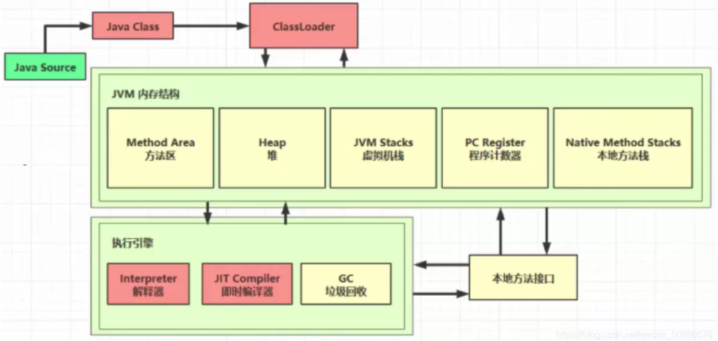

## class load

类加载与字节码技术



1、类文件结构

通过 javac 类名.java 编译 java 文件后，会生成一个 .class 的文件！

```text
0000000 ca fe ba be 00 00 00 34 00 23 0a 00 06 00 15 09
0000020 00 16 00 17 08 00 18 0a 00 19 00 1a 07 00 1b 07
0000040 00 1c 01 00 06 3c 69 6e 69 74 3e 01 00 03 28 29
0000060 56 01 00 04 43 6f 64 65 01 00 0f 4c 69 6e 65 4e
0000100 75 6d 62 65 72 54 61 62 6c 65 01 00 12 4c 6f 63
0000120 61 6c 56 61 72 69 61 62 6c 65 54 61 62 6c 65 01
0000140 00 04 74 68 69 73 01 00 1d 4c 63 6e 2f 69 74 63
0000160 61 73 74 2f 6a 76 6d 2f 74 35 2f 48 65 6c 6c 6f
0000200 57 6f 72 6c 64 3b 01 00 04 6d 61 69 6e 01 00 16
0000220 28 5b 4c 6a 61 76 61 2f 6c 61 6e 67 2f 53 74 72
0000240 69 6e 67 3b 29 56 01 00 04 61 72 67 73 01 00 13
0000260 5b 4c 6a 61 76 61 2f 6c 61 6e 67 2f 53 74 72 69
0000300 6e 67 3b 01 00 10 4d 65 74 68 6f 64 50 61 72 61
0000320 6d 65 74 65 72 73 01 00 0a 53 6f 75 72 63 65 46
0000340 69 6c 65 01 00 0f 48 65 6c 6c 6f 57 6f 72 6c 64
0000360 2e 6a 61 76 61 0c 00 07 00 08 07 00 1d 0c 00 1e
0000400 00 1f 01 00 0b 68 65 6c 6c 6f 20 77 6f 72 6c 64
0000420 07 00 20 0c 00 21 00 22 01 00 1b 63 6e 2f 69 74
0000440 63 61 73 74 2f 6a 76 6d 2f 74 35 2f 48 65 6c 6c
0000460 6f 57 6f 72 6c 64 01 00 10 6a 61 76 61 2f 6c 61
0000500 6e 67 2f 4f 62 6a 65 63 74 01 00 10 6a 61 76 61
0000520 2f 6c 61 6e 67 2f 53 79 73 74 65 6d 01 00 03 6f
0000540 75 74 01 00 15 4c 6a 61 76 61 2f 69 6f 2f 50 72
0000560 69 6e 74 53 74 72 65 61 6d 3b 01 00 13 6a 61 76
0000600 61 2f 69 6f 2f 50 72 69 6e 74 53 74 72 65 61 6d
0000620 01 00 07 70 72 69 6e 74 6c 6e 01 00 15 28 4c 6a
0000640 61 76 61 2f 6c 61 6e 67 2f 53 74 72 69 6e 67 3b
0000660 29 56 00 21 00 05 00 06 00 00 00 00 00 02 00 01
0000700 00 07 00 08 00 01 00 09 00 00 00 2f 00 01 00 01
0000720 00 00 00 05 2a b7 00 01 b1 00 00 00 02 00 0a 00
0000740 00 00 06 00 01 00 00 00 04 00 0b 00 00 00 0c 00
0000760 01 00 00 00 05 00 0c 00 0d 00 00 00 09 00 0e 00
0001000 0f 00 02 00 09 00 00 00 37 00 02 00 01 00 00 00
0001020 09 b2 00 02 12 03 b6 00 04 b1 00 00 00 02 00 0a
0001040 00 00 00 0a 00 02 00 00 00 06 00 08 00 07 00 0b
0001060 00 00 00 0c 00 01 00 00 00 09 00 10 00 11 00 00
0001100 00 12 00 00 00 05 01 00 10 00 00 00 01 00 13 00
0001120 00 00 02 00 14

```

据 JVM 规范，类文件结构如下：

```text
u4       magic
u2             minor_version;
u2             major_version;
u2             constant_pool_count;
cp_info        constant_pool[constant_pool_count-1];
u2             access_flags;
u2             this_class;
u2             super_class;
u2             interfaces_count;
u2             interfaces[interfaces_count];
u2             fields_count;
field_info     fields[fields_count];
u2             methods_count;
method_info    methods[methods_count];
u2             attributes_count;
attribute_info attributes[attributes_count];
```

1）魔数

U4 magic
对应字节码文件的 0~3 个字节
0000000 ca fe ba be 00 00 00 34 00 23 0a 00 06 00 15 09
ca fe ba be ：意思是 .class 文件，不同的东西有不同的魔数，比如 jpg、PNG 图片等！

2）版本

U2 minor_version;
u2 major_version;
0000000 ca fe ba be 00 00 00 34 00 23 0a 00 06 00 15 09
00 00 00 34：34H(16 进制) = 52(10 进制)，代表 JDK8

3）常量池
…

[参考文档](https://docs.oracle.com/javase/specs/jvms/se8/html/jvms-2.html#jvms-2.5.5)

## 2、字节码指令

可参考：

[字节码指令](https://docs.oracle.com/javase/specs/jvms/se8/html/jvms-6.html#jvms-6.5)

### 1）javap 工具

Java 中提供了 javap 工具来反编译 class 文件

### 2）图解方法执行流程

Todo zsj

代码

```java
public class Demo3_1 {
 public static void main(String[] args) {
  int a = 10;
  int b = Short.MAX_VALUE + 1;
  int c = a + b;
  System.out.println(c);
    }
}
```

常量池载入运行时常量池

常量池也属于方法区，只不过这里单独提出来了


方法字节码载入方法区

(stack=2，locals=4) 对应操作数栈有 2 个空间(每个空间 4 个字节)，局部变量表中有 4 个槽位。


执行引擎开始执行字节码

Bipush 10

- 将一个 byte 压入操作数栈(其长度会补齐 4 个字节)，类似的指令还有
  - sipush 将一个 short 压入操作数栈(其长度会补齐 4 个字节)
  - ldc 将一个 int 压入操作数栈
  - ldc2_w 将一个 long 压入操作数栈（**分两次压入**，因为 long 是 8 个字节）
  - 这里小的数字都是和字节码指令存在一起，**超过 short 范围的数字存入了常量池**

Istore 1

将操作数栈栈顶元素弹出，放入局部变量表的 slot 1 中

对应代码中的 a = 10

3）通过字节码指令分析问题

代码

[csdn](https://blog.csdn.net/weixin_50280576/article/details/113784268)
