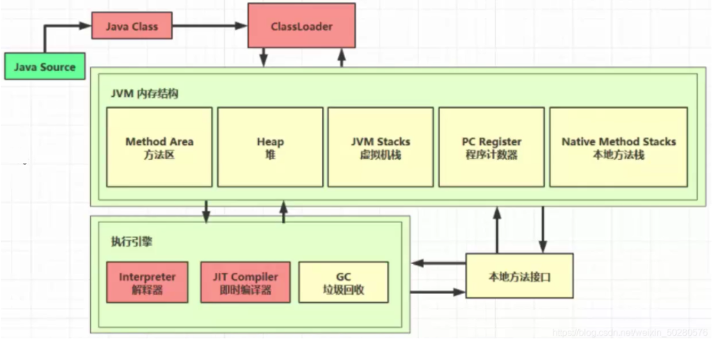
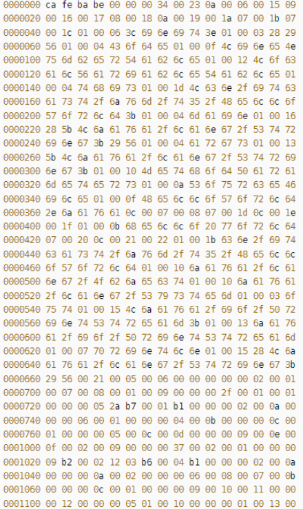
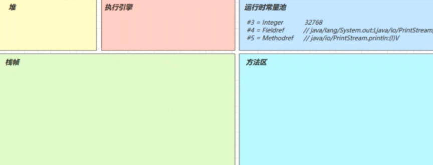
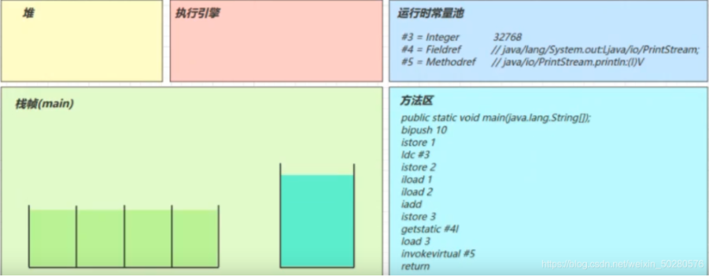

## JVM类加载与字节码技术&内存模型

## class load

类加载与字节码技术



1、类文件结构

通过 javac 类名.java 编译 java 文件后，会生成一个 .class 的文件！下图是字节码文件：




据 JVM 规范，类文件结构如下：

```text
u4       magic
u2             minor_version;
u2             major_version;
u2             constant_pool_count;
cp_info        constant_pool[constant_pool_count-1];
u2             access_flags;
u2             this_class;
u2             super_class;
u2             interfaces_count;
u2             interfaces[interfaces_count];
u2             fields_count;
field_info     fields[fields_count];
u2             methods_count;
method_info    methods[methods_count];
u2             attributes_count;
attribute_info attributes[attributes_count];
```

1）魔数

U4 magic
对应字节码文件的 0~3 个字节
0000000 ca fe ba be 00 00 00 34 00 23 0a 00 06 00 15 09
ca fe ba be：意思是 .class文件，不同的东西有不同的魔数，比如jpg、PNG 图片等！

2）版本

U2 minor_version;
u2 major_version;
0000000 ca fe ba be 00 00 00 34 00 23 0a 00 06 00 15 09
00 00 00 34：34H(16 进制) = 52(10 进制)，代表 JDK8

3）常量池

常量池在java用于保存在编译期已确定的，已编译的class文件中的一份数据。它包括了关于类，方法，接口等中的常量，也包括字符串常量，如String s = "java"这种申明方式；当然也可扩充，执行器产生的常量也会放入常量池，故认为常量池是JVM的一块特殊的内存空间。

[参考文档](https://docs.oracle.com/javase/specs/jvms/se8/html/jvms-2.html#jvms-2.5.5)

## 2、字节码指令

可参考：

[字节码指令](https://docs.oracle.com/javase/specs/jvms/se8/html/jvms-6.html#jvms-6.5)

### 1、javap 工具

Java中提供了`javap`工具来反编译 class 文件

### 2）图解方法执行流程

代码

```java
public class Demo3_1 {
 public static void main(String[] args) {
  int a = 10;
  int b = Short.MAX_VALUE + 1;
  int c = a + b;
  System.out.println(c);
    }
}
```

常量池载入运行时常量池

常量池也属于方法区，只不过这里单独提出来了



方法字节码载入方法区

(stack=2，locals=4) 对应操作数栈有 2 个空间(每个空间 4 个字节)，局部变量表中有 4 个槽位。



执行引擎开始执行字节码

Bipush 10

- 将一个 byte 压入操作数栈(其长度会补齐 4 个字节)，类似的指令还有
  - sipush 将一个 short 压入操作数栈(其长度会补齐 4 个字节)
  - ldc 将一个 int 压入操作数栈
  - ldc2_w 将一个 long 压入操作数栈（**分两次压入**，因为 long 是 8 个字节）
  - 这里小的数字都是和字节码指令存在一起，**超过 short 范围的数字存入了常量池**

Istore 1

将操作数栈栈顶元素弹出，放入局部变量表的 slot 1 中

对应代码中的 `a = 10`

3）通过字节码指令分析问题

代码

[csdn](https://blog.csdn.net/weixin_50280576/article/details/113784268)
