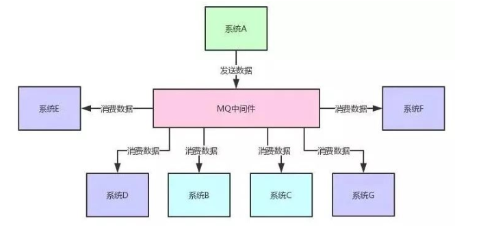
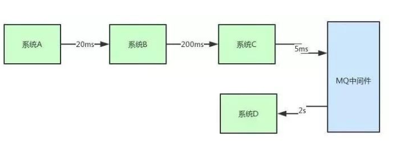
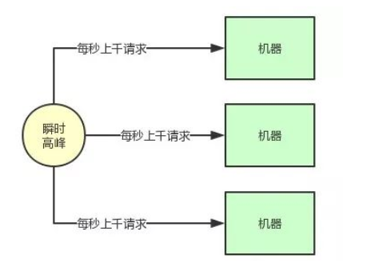
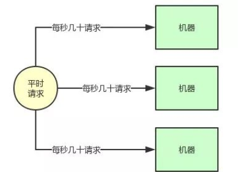
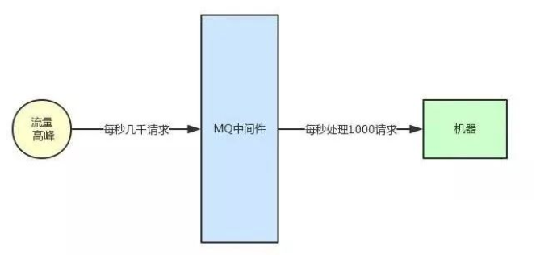

## 为什么一定要用消息中间件？

消息中间件是分布式系统常用的组件，无论是异步化、解耦、削峰等都有广泛的应用价值。我们通常会认为，消息中间件是一个可靠的组--这里所谓的可靠是指：只要我们消息成功投递到了消息中间件，消息就不会丢失，即消息肯定会至少保证消息能被消费者成功消费一次，这是消息中间件最基本的特性之一。

举个栗子：一个消息M发送到了消息中间件，消息投递到了消费程序A，A接收到了消息，消费程序A消费到一半的时候，程序重启了，这时候，这个消息并没有标记为消费成功，这个消息还会继续投递给这个消费者，直到其消费成功，MQ才会停止投递。

然而这种可靠的特性导致，消息可能被多次投递。举个栗子：还是刚刚那个例子，程序A接收到这个消息M并完成消费逻辑之后，正想通知消息中间件“我已经消费成功了”的时候，程序就重启了，那么对于消息中间件来说，这个消息并没有成功消费过，所以他还会继续投递。这时候对于应用程序A来说，看起来就是这个消息明明消费成功了，但是消息中间件还在重复投递。

基于消息的投递可靠（消息不丢）是优先级更高的，所以消息补充的人物就会转移到应用程序自我实现，这也是为什么RocketMQ的文档里强调的，消费逻辑需要自我实现幂等。背后的逻辑其实就是：不丢和补充是矛盾的（在分布式场景下），但消息重复是有解决方案的，而消息丢失是很麻烦的。

## Exactly-Once

在消息中间件里，有一个投递语义的概念，而这个语义里有一个叫”Exactly Once”，即消息肯定会被成功消费，并且只会被消费一次。以下是阿里云里对Exactly Once的解释：

Exactly-Once（确切一次） 是指发送到消息系统的消息只能被消费端处理且仅处理一次，即使生产端重试消息发送导致某消息重复投递，该消息在消费端也只被消费一次。

## 一、你们用的是什么消息中间件？

这个首先你可以说下你们公司选用的是什么消息中间件，比如用的是RabbitMQ，然后可以初步给一些你对不同MQ中间件技术的选型分析。

**举个例子**：比如说`ActiveMQ`是老牌的消息中间件，国内很多公司过去运用的还是非常广泛的，功能很强大。

但是问题在于没法确认`ActiveMQ`可以支撑互联网公司的高并发、高负载以及高吞吐的复杂场景，在国内互联网公司落地较少。而且使用较多的是一些传统企业，用ActiveMQ做异步调用和系统解耦。

然后你可以说说`RabbitMQ`，他的好处在于可以支撑`高并发、高吞吐、性能很高`，同时有非常完善便捷的后台管理界面可以使用。

另外，他还支持集群化、高可用部署架构、消息高可靠支持，功能较为完善。

而且经过调研，国内各大互联网公司落地大规模RabbitMQ集群支撑自身业务的case较多，国内各种中小型互联网公司使用RabbitMQ的实践也比较多。

除此之外，`RabbitMQ`的开源社区很活跃，较高频率的迭代版本，来修复发现的bug以及进行各种优化，因此综合考虑过后，公司采取了`RabbitMQ`。

但是`RabbitMQ`也有一点缺陷，就是他自身是基于erlang语言开发的，所以导致较为难以分析里面的源码，也较难进行深层次的源码定制和改造，毕竟需要较为扎实的erlang语言功底才可以。

然后可以聊聊`RocketMQ`，是阿里开源的，经过阿里的生产环境的超高并发、高吞吐的考验，性能卓越，同时还支持分布式事务等特殊场景。

而且`RocketMQ`是基于Java语言开发的，适合深入阅读源码，有需要可以站在源码层面解决线上生产问题，包括源码的二次开发和改造。

另外就是Kafka

Kafka提供的消息中间件的功能明显较少一些，相对上述几款MQ中间件要少很多。

但是Kafka的优势在于专为超高吞吐量的实时日志采集、实时数据同步、实时数据计算等场景来设计。

因此Kafka在大数据领域中配合实时计算技术（比如Spark Streaming、Storm、Flink）使用的较多。但是在传统的MQ中间件使用场景中较少采用。

## 二、为什么要使用消息中间件？

回答这个问题，其实就是让你先说说消息中间件的常见使用场景，然后结合你们自身系统对应的使用场景，说一下在你们系统中引入消息中间件是解决了什么问题。

1、系统解耦

假设你有个系统A，这个系统A会产出一个核心数据，现在下游有系统B和系统C需要这个数据。

那简单，系统A就是直接调用系统B和系统C的接口发送数据给他们就好了。

整个过程，如下图所示：

systemA=发送数据=>systemB、systemc

但是现在要是来了系统D、系统E、系统F、系统G，等等，十来个其他系统慢慢的都需要这份核心数据呢？

大家可别以为这是开玩笑，一个大规模系统，往往会拆分为几十个甚至上百个子系统，每个子系统又对应N多个服务，这些系统与系统之间有着错综复杂的关系网络。

如果某个系统产出一份核心数据，可能下游无数的其他系统都需要这份数据来实现各种业务逻辑。

此时如果你要是采取上面那种模式来设计系统架构，那么绝对你负责系统A的同学要被烦死了。

先是来一个人找他要求发送数据给一个新的系统H，系统A的同学要修改代码然后在那个代码里加入调用新系统H的流程。

一会那个系统B是个陈旧老系统要下线了，告诉系统A的同学：别给我发送数据了，接着系统A再次修改代码不再给这个系统B。

然后如果要是某个下游系统突然宕机了呢？

系统A的调用代码里是不是会抛异常？那系统A的同学会收到报警说异常了，结果他还要去care是下游哪个系统宕机了。

所以在实际的系统架构设计中，如果全部采取这种系统耦合的方式，在某些场景下绝对是不合适的，系统耦合度太严重。

并且互相耦合起来并不是核心链路的调用，而是一些非核心的场景（比如上述的数据消费）导致了系统耦合，这样会严重的影响上下游系统的开发和维护效率。

因此在上述系统架构中，就可以采用MQ中间件来实现系统解耦。

系统A就把自己的一份核心数据发到MQ里，下游哪个系统感兴趣自己去消费即可，不需要了就取消数据的消费，如下图所示：

2、异步调用

假设你有一个系统调用链路，是系统A调用系统B，一般耗时20ms；系统B调用系统C，一般耗时200ms；系统C调用系统D，一般耗时2s，如下图所示。

现在最大的问题就是：

用户一个请求过来巨慢无比，因为走完一个链路，需要耗费：

20ms + 200ms + 2000ms（2s） = 2220ms，

也就是2秒多的时间。但是实际上，链路中的系统A调用系统B，系统B调用系统C，这两个步骤起来也就220ms。

就因为引入了系统C调用系统D这个步骤，导致最终链路执行时间是2秒多，直接将链路调用性能降低了10倍，这就是导致链路执行过慢的罪魁祸首。

那此时我们可以思考一下，是不是可以将系统D从链路中抽离出去做成异步调用呢？

其实很多的业务场景是可以允许异步调用的。

举个例子：你平时点个外卖，咔嚓一下子下订单然后付款了，此时账户扣款、创建订单、通知商家给你准备菜品。

接着，是不是需要找个骑手给你送餐？那这个找骑手的过程，是需要一套复杂算法来实现调度的，比较耗时。

但是其实稍微晚个几十秒完成骑手的调度都是ok的，因为实际并不需要在你支付的一瞬间立马给你找好骑手，也没那个必要。

那么我们是不是就可以把找骑手给你送餐的这个步骤从链路中抽离出去，做成异步化的，哪怕延迟个几十秒，但是只要在一定时间范围内给你找到一个骑手去送餐就可以了。

这样是不是就可以让你下订单点外卖的速度变得超快？支付成功之后，直接创建好订单、账户扣款、通知商家立马给你准备做菜就ok了，这个过程可能就几百毫秒。

然后后台异步化的耗费可能几十秒通过调度算法给你找到一个骑手去送餐，但是这个步骤不影响我们快速下订单。

当然我们不是说那些大家熟悉的外卖平台的技术架构就一定是这么实现的，只不过是用一个生活中常见的例子给大家举例说明而已。

所以上面的链路也是同理，如果业务流程支持异步化的话，是不是就可以考虑把系统C对系统D的调用抽离出去做成异步化的，不要放在链路中同步依次调用。

这样，实现思路就是系统A -> 系统B -> 系统C，直接就耗费220ms后直接成功了。

然后系统C就是发送个消息到MQ中间件里，由系统D消费到消息之后慢慢的异步来执行这个耗时2s的业务处理。通过这种方式直接将核心链路的执行性能提升了10倍。

整个过程，如下图所示：

3、流量削峰

假设你有一个系统，平时正常的时候每秒可能就几百个请求，系统部署在8核16G的机器的上，正常处理都是ok的，每秒几百请求是可以轻松抗住的

但是如下图所示，在高峰期一下子来了每秒钟几千请求，瞬时出现了流量高峰，此时你的选择是要搞10台机器，抗住每秒几千请求的瞬时高峰吗？

那如果瞬时高峰每天就那么半个小时，接着直接就降低为了每秒就几百请求，如果你线上部署了很多台机器，那么每台机器就处理每秒几十个请求就可以了，**这不是有点浪费机器资源吗？**

大部分时候，每秒几百请求，一台机器就足够了，但是为了抗那每天瞬时的高峰，硬是部署了10台机器，每天就那半个小时有用，别的时候都是浪费资源的。

但是如果你就部署一台机器，那会导致瞬时高峰时，一下子压垮你的系统，因为绝对无法抗住每秒几千的请求高峰。

此时我们就可以用MQ中间件来进行流量削峰。所有机器前面部署一层MQ，平时每秒几百请求大家都可以轻松接收消息。

一旦到了瞬时高峰期，一下涌入每秒几千的请求，就可以积压在MQ里面，然后那一台机器慢慢的处理和消费。

等高峰期过了，再消费一段时间，MQ里积压的数据就消费完毕了。

**这个就是很典型的一个MQ的用法**，用有限的机器资源承载高并发请求，如果业务场景允许异步削峰，高峰期积压一些请求在MQ里，然后高峰期过了，后台系统在一定时间内消费完毕不再积压的话，那就很适合用这种技术方案。
