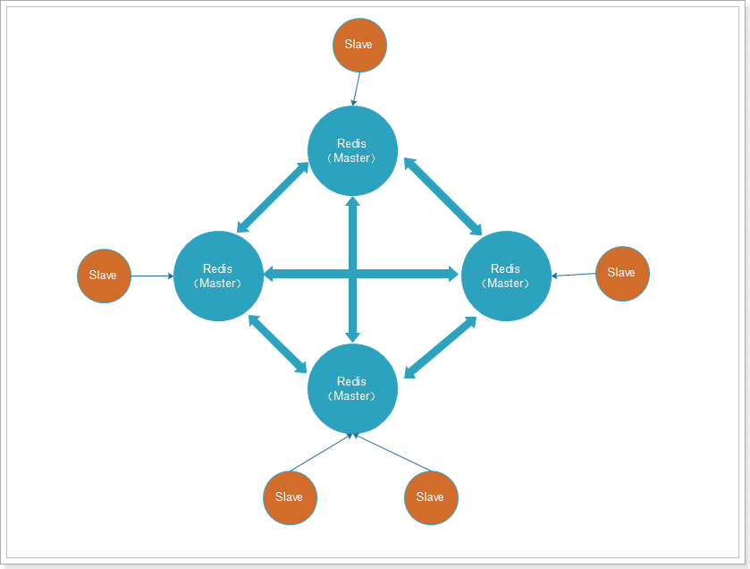

  
## 为什么说REDIS是单线程的？?

近乎所有与Java相关的面试都会问到缓存的问题，基础一点的会问到什么是“二八定律”、什么是”热数据和冷数据“，复杂一点的会问到缓存雪崩、缓存穿透，缓存预热，缓存更新、缓存降级等问题，这些看似不常见的概念，都会与我们的缓存服务器相关，一般常见的缓存服务器有Redis，Memcached等，而笔者目前最常用的也只有Redis这一种。

数据库、缓存和消息中间件。

它支持多种类型的数据结构，如字符串（Strings），散列（Hash)、列表、集合、有序集合与范围查找，位图，地图空间索引半径查询。

内置了复制，LUA脚本，LRU驱动事件，事务（不同级别的磁盘持久化，并通过REDIS哨兵和自动分区提供高可用性。

# Redis

缓存主要用来存放那些读写比很高、很少变化的数据。
没有热点的访问。 缓存使用的内存资源非常宝贵，只能将最新访问的数据缓存起来，而把历史数据清理出缓存。即缓存资源应该留给 20%的热点数据。
数据不一致与脏读。 一般会对缓存设置失效时间，超过失效时间，就要从数据库重新加载。因此应用要忍受一定时间的数据不一致。另一种策略是数据更新时立即更新缓存，不过这也会带来更多的系统开销和事务一致性的问题。
缓存可用性。 业务发展到一定阶段时，缓存会承担大部分数据访问的压力，数据库已经习惯了有缓存的日子，所以当缓存服务器崩溃时，数据库会因为完全不能承受如此大的压力而宕机，进而导致整个网站不可用。这种情况被称作缓存雪崩，发生这种故障，甚至不能简单地重启缓存服务器和数据库服务器来恢复网站访问。 解决方式：1、缓存热备(当某台服务器宕机时，将缓存访问切换到热备服务器上。)；2、缓存服务器集群。

## 缓存预热

系统上线后，将相关的缓存数据直接加载到缓存系统。这样就可以避免在用户请求的时候，先查询数据库，然后再将数据缓存的问题！用户直接查询事先被预热的缓存数据！

解决思路：

1. 直接写个缓存刷新页面，上线时手工操作下；
2. 数据量不大，可以在项目启动的时候自动进行加载；
3. 定时刷新缓存。

缓存中存放的是热点数据，热点数据是缓存系统用 LRU 对不断访问的数据筛选出来的，这个过程需要较长的时间。新启动的缓存系统没有任何数据，此时系统的性能和数据库负载都不太好。因此可以选择在启动缓存是就把热点数据预加载好。

LRU 是 Least Recently Used 的缩写，即最近最少使用

## 缓存穿透

因为不恰当的业务或恶意攻击，持续高并发地访问某一个不存在的数据，如果缓存不保存该数据，就会有大量的请求压力落在数据库上。简单的解决方式是把请求的不存在的数据也放进缓存，其 value 是 null。

## 缓存降级

当访问量剧增、服务出现问题（如响应时间慢或不响应）或非核心服务影响到核心流程的性能时，仍然需要保证服务还是可用的，即使是有损服务。系统可以根据一些关键数据进行自动降级，也可以配置开关实现人工降级。

降级的目的是保证核心服务可用，即使是有损的。而且有些服务是无法降级的（如加入购物车、结算）。

在进行降级之前要对系统进行梳理，看看系统是不是可以丢卒保帅；从而梳理出哪些必须誓死保护，哪些可降级；比如可以参考日志级别设置预案；

1. 一般：比如有些服务偶尔因为网络抖动或者服务正在上线而超时，可以自动降级；
2. 警告：有些服务在一段时间内成功率有波动（如在95~100%）之间），可以自动降级或人工降级，并发送告警；
3. 错误：比如可用率低于90%，或者数据库连接池被打爆了，或者访问量突然猛增到系统能承受的最大阈值，此时可以根据情况自动降级或者人工降级。
4. 严重错误：比如因为特殊原因数据操作了，此时需要紧急人工降级。

- Redis 支持数据的持久化，可以将内存中的数据保持在磁盘中，重启的时候可以再次加载进行使用,而 Memecache 把数据全部存在内存之中。
- 集群模式：memcached 没有原生的集群模式，需要依靠客户端来实现往集群中分片写入数据；但是 redis 目前是原生支持 cluster 模式的.

## REDIS到底有多快？

REDIS采用的是基于NCP的采用的是单进程单线程模型的KV数据库，由C语言编写，官方提供的数据是可以达到100000+的QPS（每秒查询次数）。这个数据不必担进行多线程的同样基于内存的KV数据库差！

多路IO服用模型，非阻塞IO。

使用底层模型不同，它们之间底层实现方式以及客户端之间通信的应用协议不一样，

- Redis 使用单线程：Memcached 是多线程，非阻塞 IO 复用的网络模型；Redis 使用单线程的多路 IO 复用模型。


1. 完全基于内存
2. 数据结构简单，对数据操作也简单
3. 使用多路 I/O 复用模型，充分利用 CPU 资源

- 代码更清晰，处理逻辑更简单
- 不用去考虑各种锁的问题，不存在加锁释放锁操作，没有因为锁而导致的性能消耗
- 不存在多进程或者多线程导致的 CPU 切换，充分利用 CPU 资源

### Redis 16 个常见使用场景

1、缓存
2、数据共享分布式
3、分布式锁
4、全局ID
5、计数器
6、限流
7、位统计
8、购物车
9、用户消息时间线timeline
10、消息队列
11、抽奖
12、点赞、签到、打卡
13、商品标签
14、商品筛选
15、用户关注、推荐模型
16、排行榜

## Redis 的集群方式

Redis 集群可以分为**主从集群**和**分片集群**两类。

**主从集群**

一般一主多从，主库用来写数据，从库用来读数据。结合哨兵，可以再主库宕机时从新选主，**目的是保证 Redis 的高可用**。

**分片集群**

是数据分片，我们会让多个 Redis 节点组成集群，并将 16383 个插槽分到不同的节点上。存储数据时利用对 key 做 hash 运算，得到插槽值后存储到对应的节点即可。因为存储数据面向的是插槽而非节点本身，因此可以做到集群动态伸缩。**目的是让 Redis 能存储更多数据。**

1）主从集群

主从集群，也是读写分离集群。一般都是一主多从方式。

Redis 的复制(replication)功能允许用户根据一个 Redis 服务器来创建任意多个该服务器的复制品，其中被复制的服务器为主服务器(master)，而通过复制创建出来的服务器复制品则为从服务器(slave)。

只要主从服务器之间的网络连接正常，主从服务器两者会具有相同的数据，主服务器就会一直将发生在自己身上的数据更新同步 给从服务器，从而一直保证主从服务器的数据相同。

- 写数据时只能通过主节点完成
- 读数据可以从任何节点完成
- 如果配置了`哨兵节点`，当 master 宕机时，哨兵会从 salve 节点选出一个新的主。

主从集群分两种：

 

带有哨兵的集群：


2）分片集群

主从集群中，每个节点都要保存所有信息，容易形成木桶效应。并且当数据量较大时，单个机器无法满足需求。此时我们就要使用分片集群了。


集群特征：

- 每个节点都保存不同数据
- 所有的 redis 节点彼此互联(PING-PONG 机制),内部使用二进制协议优化传输速度和带宽.

- 节点的 fail 是通过集群中超过半数的节点检测失效时才生效.

- 客户端与 redis 节点直连,不需要中间 proxy 层连接集群中任何一个可用节点都可以访问到数据

- redis-cluster 把所有的物理节点映射到[0-16383]slot(插槽)上，实现动态伸缩

为了保证 Redis 中每个节点的高可用，我们还可以给每个节点创建 replication(slave 节点)，如图：



出现故障时，主从可以及时切换：


## Redis 的常用数据类型

支持多种类型的数据结构，主要区别是 value 存储的数据格式不同：

- string：最基本的数据类型，二进制安全的字符串，最大 512M。
- list：按照添加顺序保持顺序的字符串列表。
- set：无序的字符串集合，不存在重复的元素。
- sorted set：已排序的字符串集合。
- hash：key-value 对格式

## Redis 事务机制

Redis 事务功能是通过 MULTI、EXEC、DISCARD 和 WATCH 四个原语实现的。

Redis 会将一个事务中的所有命令序列化，然后按顺序执行。但是 Redis 事务不支持回滚操作，命令运行出错后，正确的命令会继续执行。

- `MULTI`: 用于开启一个事务，它总是返回 OK。 MULTI 执行之后，客户端可以继续向服务器发送任意多条命令，这些命令不会立即被执行，而是被放到一个**待执行命令队列**中
- `EXEC`：按顺序执行命令队列内的所有命令。返回所有命令的返回值。事务执行过程中，Redis 不会执行其它事务的命令。
- `DISCARD`：清空命令队列，并放弃执行事务， 并且客户端会从事务状态中退出
- `WATCH`：Redis 的乐观锁机制，利用 compare-and-set(CAS)原理，可以监控一个或多个键，一旦其中有一个键被修改，之后的事务就不会执行

使用事务时可能会遇上以下两种错误：

- 执行 EXEC 之前，入队的命令可能会出错。比如说，命令可能会产生语法错误(参数数量错误，参数名错误，等等)，或者其他更严重的错误，比如内存不足（如果服务器使用 `maxmemory` 设置了最大内存限制的话）。
  - Redis 2.6.5 开始，服务器会对命令入队失败的情况进行记录，并在客户端调用 EXEC 命令时，拒绝执行并自动放弃这个事务。
- 命令可能在 EXEC 调用之后失败。举个例子，事务中的命令可能处理了错误类型的键，比如将列表命令用在了字符串键上面，诸如此类。
  - 即使事务中有某个/某些命令在执行时产生了错误， 事务中的其他命令仍然会继续执行，不会回滚。

### Redis 不支持回滚

优点：

- Redis 命令只会因为错误的语法而失败(并且这些问题不能在入队时发现)，或是命令用在了错误类型的键上面：这也就是说，从实用性的角度来说，失败的命令是由**编程错误**造成的，而这些错误应该在开发的过程中被发现，而不应该出现在生产环境中。
- 因为不需要对回滚进行支持，所以 Redis 的内部可以保持简单且快速。

鉴于没有任何机制能避免程序员自己造成的错误， 并且这类错误通常不会在生产环境中出现， 所以 Redis 选择了更简单、更快速的无回滚方式来处理事务。

## Redis 事务

其实是把一系列 Redis 命令放入队列，然后批量执行，执行过程中不会有其它事务来打断。不过与关系型数据库的事务不同，Redis 事务不支持回滚操作，事务中某个命令执行失败，其它命令依然会执行。

为了弥补不能回滚的问题，Redis 会在事务入队时就检查命令，如果命令异常则会放弃整个事务。

因此，只要程序员编程是正确的，理论上说 Redis 会正确执行所有事务，无需回滚。

## 事务执行一半的时候 Redis 宕机怎么办？

Redis 有持久化机制，因为可靠性问题，我们一般使用 AOF 持久化。

事务的所有命令也会写入 AOF 文件，但是如果在执行 EXEC 命令之前，Redis 已经宕机，则 AOF 文件中事务不完整。使用 `redis-check-aof` 程序可以移除 AOF 文件中不完整事务的信息，确保服务器可以顺利启动。

## Redis 的 Key 过期策略

### 为什么需要内存回收？

- 1、在 Redis 中，set 指令可以指定 key 的过期时间，当过期时间到达以后，key 就失效了；
- 2、Redis 是基于内存操作的，所有的数据都是保存在内存中，一台机器的内存是有限且很宝贵的。

基于以上两点，为了保证 Redis 能继续提供可靠的服务，Redis 需要一种机制清理掉不常用的、无效的、多余的数据，失效后的数据需要及时清理，这就需要内存回收了。

Redis 的内存回收主要分为过期删除策略和内存淘汰策略两部分。

### 过期删除策略

删除达到过期时间的 key。

- 1）定时删除

对于每一个设置了过期时间的 key 都会创建一个定时器，一旦到达过期时间就立即删除。该策略可以立即清除过期的数据，对内存较友好，但是缺点是占用了大量的 CPU 资源去处理过期的数据，会影响 Redis 的吞吐量和响应时间。

- 2）惰性删除

当访问一个 key 时，才判断该 key 是否过期，过期则删除。该策略能最大限度地节省 CPU 资源，但是对内存却十分不友好。有一种极端的情况是可能出现大量的过期 key 没有被再次访问，因此不会被清除，导致占用了大量的内存。

> 在计算机科学中，懒惰删除(英文：lazy deletion)指的是从一个散列表(也称哈希表)中删除元素的一种方法。在这个方法中，删除仅仅是指标记一个元素被删除，而不是整个清除它。被删除的位点在插入时被当作空元素，在搜索之时被当作已占据。

- 3）定期删除

每隔一段时间，扫描 Redis 中过期 key 字典，并清除部分过期的 key。该策略是前两者的一个折中方案，还可以通过调整定时扫描的时间间隔和每次扫描的限定耗时，在不同情况下使得 CPU 和内存资源达到最优的平衡效果。

在 Redis 中，`同时使用了定期删除和惰性删除`。不过 Redis 定期删除采用的是随机抽取的方式删除部分 Key，因此不能保证过期 key 100%的删除。

Redis 结合了定期删除和惰性删除，基本上能很好的处理过期数据的清理，但是实际上还是有点问题的，如果过期 key 较多，定期删除漏掉了一部分，而且也没有及时去查，即没有走惰性删除，那么就会有大量的过期 key 堆积在内存中，导致 redis 内存耗尽，当内存耗尽之后，有新的 key 到来会发生什么事呢？是直接抛弃还是其他措施呢？有什么办法可以接受更多的 key？

### 内存淘汰策略

Redis 的内存淘汰策略，是指内存达到 maxmemory 极限时，使用某种算法来决定清理掉哪些数据，以保证新数据的存入。

Redis 的内存淘汰机制包括：

- noeviction: 当内存不足以容纳新写入数据时，新写入操作会报错。
- allkeys-lru：当内存不足以容纳新写入数据时，在键空间（`server.db[i].dict`）中，移除最近最少使用的 key(这个是最常用的)。
- allkeys-random：当内存不足以容纳新写入数据时，在键空间（`server.db[i].dict`）中，随机移除某个 key。
- volatile-lru：当内存不足以容纳新写入数据时，在设置了过期时间的键空间（`server.db[i].expires`）中，移除最近最少使用的 key。
- volatile-random：当内存不足以容纳新写入数据时，在设置了过期时间的键空间（`server.db[i].expires`）中，随机移除某个 key。
- volatile -ttl：当内存不足以容纳新写入数据时，在设置了过期时间的键空间（`server.db[i].expires`）中，有更早过期时间的 key 优先移除。

  4.0 新增 lfu

Allkey-lfu 针对所有的 key 删除最近最不常使用
volatile-lfu 针对设置过期时间的 key 删除最近最不常使用

### maxmemory-policy 可以配置要使用哪一个淘汰机制

什么时候会进行淘汰？

Redis 会在每一次处理命令的时候(processCommand 函数调用 freeMemoryIfNeeded)判断当前 redis 是否达到了内存的最大限制，如果达到限制，则使用对应的算法去处理需要删除的 key。

在淘汰 key 时，Redis 默认最常用的是 LRU 算法(Latest Recently Used)。Redis 通过在每一个 redisObject 保存 lru 属性来保存 key 最近的访问时间，在实现 LRU 算法时直接读取 key 的 lru 属性。

具体实现时，Redis 遍历每一个 db，从每一个 db 中随机抽取一批样本 key，默认是 3 个 key，再从这 3 个 key 中，删除最近最少使用的 key。

### Redis 过期策略

包含定期删除和惰性删除两部分。定期删除是在 Redis 内部有一个定时任务，会定期删除一些过期的 key。惰性删除是当用户查询某个 Key 时，会检查这个 Key 是否已经过期，如果没过期则返回用户，如果过期则删除。

但是这两个策略都无法保证过期 key 一定删除，漏网之鱼越来越多，还可能导致内存溢出。当发生内存不足问题时，Redis 还会做内存回收。内存回收采用 LRU 策略，就是最近最少使用。其原理就是记录每个 Key 的最近使用时间，内存回收时，随机抽取一些 Key，比较其使用时间，把最老的几个删除。

Redis 的逻辑是：最近使用过的，很可能再次被使用

## Redis 在项目使用

### 共享 session

在分布式系统下，服务会部署在不同的 tomcat，因此多个 tomcat 的 session 无法共享，以前存储在 session 中的数据无法实现共享，可以用 redis 代替 session，解决分布式系统间数据共享问题。

### 数据缓存

Redis 采用内存存储，读写效率较高。我们可以把数据库的访问频率高的热点数据存储到 redis 中，这样用户请求时优先从 redis 中读取，减少数据库压力，提高并发能力。

### 异步队列

Reids 在内存存储引擎领域的一大优点是提供 list 和 set 操作，这使得 Redis 能作为一个很好的消息队列平台来使用。而且 Redis 中还有 pub/sub 这样的专用结构，用于 1 对 N 的消息通信模式。

## Redis 的缓存击穿、缓存雪崩、缓存穿透

### 缓存穿透

> 什么是缓存穿透
> 正常情况下，我们去查询数据都是存在。那么请求去查询一条压根儿数据库中根本就不存在的数据，也就是缓存和数据库都查询不到这条数据，但是请求每次都会打到数据库上面去。这种查询不存在数据的现象我们称为**缓存穿透**。
>
> 穿透带来的问题
>
> 如果有黑客会对你的系统进行攻击，拿一个不存在的 id 去查询数据，会产生大量的请求到数据库去查询。可能会导致你的数据库由于压力过大而宕掉。

#### 解决办法

缓存空值：之所以会发生穿透，就是因为缓存中没有存储这些空数据的 key。从而导致每次查询都到数据库去了。那么我们就可以为这些 key 对应的值设置为 null 丢到缓存里面去。后面再出现查询这个 key 的请求的时候，直接返回 null 。这样，就不用在到数据库中去走一圈了，但是别忘了设置过期时间。

BloomFilter(布隆过滤)：将所有可能存在的数据哈希到一个足够大的 bitmap 中，一个一定不存在的数据会被 这个 bitmap 拦截掉，从而避免了对底层存储系统的查询压力。在缓存之前在加一层 BloomFilter ，在查询的时候先去 BloomFilter 去查询 key 是否存在，如果不存在就直接返回，存在再走查缓存 -> 查 DB。

缓存穿透有两种解决方案：

其一、是把不存在的 key 设置 null 值到缓存中。

其二、使用布隆过滤器，将所有可能存在的数据哈希到一个足够大的BITMAP中，一个一定不存在的数据会被这个BITMAP拦截掉，从而避免了对底层存储系统的查询压力。

如果一个查询返回的数据为空（不管使数据存在，还是系统故障），我们仍然把这个空结果进行缓存，但他的过期时间会很短，最长不超过五分钟。通过这个直接设置的默认值存放在缓存，这样第二次缓存中获取就会有值了，而不会继续访问数据库。

设置 null 值可能被恶意针对，攻击者使用大量不存在的不重复 key ，那么方案一就会缓存大量不存在 key 数据。此时我们还可以对 Key 规定格式模板，然后对不存在的 key 做**正则规范**匹配，如果完全不符合就不用存 null 值到 redis，而是直接返回错误。

### 缓存击穿

概念：key 可能会在某些时间点被超高并发地访问，是一种非常“热点”的数据。

这个时候，需要考虑一个问题：缓存被“击穿”的问题。当这个 key 在失效的瞬间，redis 查询失败，持续的大并发就穿破缓存，直接请求数据库，就像在一个屏障上凿开了一个洞。

解决方案：

使用互斥锁(mutex key)：就是在缓存失效的时候(判断拿出来的值为空)，不是立即去 load db，而是先使用 Redis 的 SETNX 去 set 一个互斥 key，当操作返回成功时，再进行 load db 的操作并回设缓存；否则，就重试整个 get 缓存的方法。SETNX，是「SET if Not eXists」的缩写，也就是只有不存在的时候才设置，可以利用它来实现互斥的效果。

软过期：也就是逻辑过期，不使用 redis 提供的过期时间，而是业务层在数据中存储过期时间信息。查询时由业务程序判断是否过期，如果数据即将过期时，将缓存的时效延长，程序可以派遣一个线程去数据库中获取最新的数据，其他线程这时看到延长了的过期时间，就会继续使用旧数据，等派遣的线程获取最新数据后再更新缓存。

推荐使用互斥锁，因为软过期会有业务逻辑侵入和额外的判断。

缓存击穿主要担心的是某个 Key 过期，更新缓存时引起对数据库的突发高并发访问。

因此我们可以在更新缓存时采用互斥锁控制，只允许一个线程去更新缓存，其它线程等待并重新读取缓存。例如 Redis 的 setnx 命令就能实现互斥效果。

### 缓存雪崩

概念：是指在某一个时间段，缓存集中过期失效。对这批数据的访问查询，都落到了数据库上，对于数据库而言，就会产生周期性的压力波峰（波动）。

解决方案：

- 数据分类分批处理：采取不同分类数据，缓存不同周期
- 相同分类数据：采用固定时长加随机数方式设置缓存
- 热点数据缓存时间长一些，冷门数据缓存时间短一些
- 避免 redis 节点宕机引起雪崩，搭建主从集群，保证高可用

::: tip 总结

解决缓存雪崩问题的关键是让缓存 Key 的过期时间分散。因此我们可以把数据按照业务分类，然后设置不同过期时间。相同业务类型的 key，设置固定时长加随机数。尽可能保证每个 Key 的过期时间都不相同。

:::

另外，Redis 宕机也可能导致缓存雪崩，因此我们还要搭建 Redis 主从集群及哨兵监控，保证 Redis 的高可用。

## 数据库与缓存数据一致性

实现方案：

- 本地缓存同步：当前微服务的数据库数据与缓存数据同步，可以直接在数据库修改时加入对 Redis 的修改逻辑，保证一致。
- 跨服务缓存同步：服务 A 调用了服务 B，并对查询结果缓存。服务 B 数据库修改，可以通过 MQ 通知服务 A，服务 A 修改 Redis 缓存数据
- 通用方案：使用 Canal 框架，伪装成 MySQL 的 salve 节点，监听 MySQL 的 binLog 变化，然后修改 Redis 缓存数据

## Redis 存储对象信息是用 Hash 还是 String

Redis 内部使用一个 RedisObject 对象来表示所有的 key 和 value，RedisObject 中的 type，则是代表一个 value 对象具体是何种数据类型，它包含字符串（String）、链表（List）、哈希结构（Hash）、集合（Set）、有序集合（Sorted set）。

日常工作中我们存储对象信息的时候，一般有两种做法，一种是用 Hash 存储，另一种是 String 存储。但好像并没有所谓的最佳实践，那么实际上到底用什么数据结构存储更好呢？

首先简单回顾下，Redis 的 Hash 和 String 结构。

String
String 数据结构是简单的 key-value 类型，value 其实不仅是 String，也可以是数字。Redis 中的 String 可以表示很多语义：

字符串（bits）

整数

浮点数

这三种类型，Redis 会根据具体的场景完成自动转换，并且根据需要选取底层的承载方式。String 在Redis 内部存储默认就是一个字符串，被 RedisObject 所引用，当遇到 incr、decr 等操作时会转成数值型进行计算，此时 RedisObject 的 encoding 字段为int。

在存储过程中，我们可以将用户信息使用 Json 序列化成字符串，然后将序列化后的字符串存入 Redis 进行缓存。

由于 Redis 的字符串是动态字符串，可以修改，内部结构类似于 Java 的 ArrayList，采用预分配冗余空间的方式来减少内存的频繁分配。如上图所示，内部为当前字符串实际分配的空间 capacity，一般高于实际字符串长度 len。

假设我们要存储的结构是：

```json
{
  "name": "xiaowang",
  "age": "35"
}
```

如果此时将此用户信息的 name 改为“xiaoli”，再存到 Redis 中，Redis 是不需要重新分配空间的。而且我们在读取和存储数据的时候只需要对做 Json 序列化与反序列化，比较方便。

Hash
Hash 在很多编程语言中都有着很广泛的应用，而在 Redis 中也是如此。在 Redis 中，Hash 常常用来缓存一些对象信息，如用户信息、商品信息、配置信息等，因此也被称为字典（dictionary），Redis 的字典使用 Hash table 作为底层实现， 一个 Hash table 里面可以有多个哈希表节点，而每个哈希表节点保存了字典中的一个键值对。实际上，Redis 数据库底层也是采用 Hash table 来存储键值对的。

Redis 的 Hash 相当于 Java 的 HashMap，内部结构实现与 HashMap 一致，即数组+链表结构。只是 reHash 方式不一样。

前面说到 String 适合存储用户信息，而 Hash 结构也可以存储用户信息，不过是对每个字段单独存储，因此可以在查询时获取部分字段的信息，节省网络流量。不过 Redis 的 Hash 的值只能是字符串，存储上面的那个例子还好，如果存储的用户信息变为：

```json
{
  "name": "xiaowang",
  "age": 25,
  "clothes": {
    "shirt": "gray",
    "pants": "read"
  }
}
```

那么该如何存储"clothes"属性又变成了该用 String 还是 Hash 的问题。

适合用 String 存储的情况：

- 每次需要访问大量的字段
- 存储的结构具有多层嵌套的时候

适合用 Hash 存储的情况：

- 在大多数情况中只需要访问少量字段
- 自己始终知道哪些字段可用，防止使用 `mget` 时获取不到想要的数据

::: info 总结

介绍了Redis 存储对象信息是用 Hash 还是 String，建议是大部分情况下使用 String 存储就好，毕竟在存储具有多层嵌套的对象时方便很多，占用的空间也比 Hash 小。当我们需要存储一个特别大的对象时，而且在大多数情况中只需要访问该对象少量的字段时，可以考虑使用 Hash。

:::
