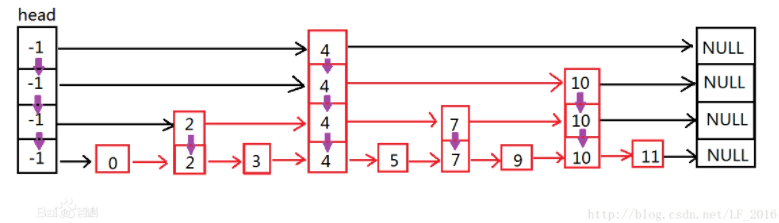

# redis

## tiaoyou

比如业务请求里，会经常用公司 ID 向风控模块看风险情况，那么就可以用 ID 做键，风控字段做值，另外再把 null 放到键里，以放缓存击穿。

## 跳表

我们保存了热点数据到缓存，缓存层 redis 和 存储层 mysql 的数据存在时间窗口的不一致性，redis 跟更新策略有关

会使代码维护成本增加，新增数据，要同时处理缓存和数据库的逻辑，增大开发成本

搭建缓存集群，无形中增加运维成本

跳表在原有的有序链表上面增加了多级索引，通过索引来实现快速查找。

### 跳表的原理

跳表就是一种可以进行二分查找的有序链表。跳表的数据结构模型如图 1:

可以看到，跳表在原有的有序链表上面增加了多级索引，通过索引来实现快速查找。

首先在最高级索引上查找最后一个小于当前查找元素的位置，然后再跳到次高级索引继续查找，直到跳到最底层为止，这时候以及十分接近要查找的元素的位置了(如果查找元素存在的话)。

由于根据索引可以一次跳过多个元素，所以跳查找的查找速度也就变快了。

## Redis 持久化

### RDB

默认情况下，Redis 使用的是 RDB 持久化。

RDB 持久化可以使用 `save` 或 `bgsave`，为了不阻塞主进程业务，一般都使用 bgsave，流程

- Save 命令执行一个同步保存操作，将当前 Redis 实例的所有数据快照(snapshot)以 RDB 文件的形式保存到硬盘。
- BGSAVE 命令执行之后立即返回 OK ，然后 Redis fork 出一个新子进程，原来的 Redis 进程(父进程)继续处理客户端请求，而子进程则负责将数据保存到磁盘，然后退出。由子进程将内存中的所有数据写入到一个临时的 RDB 文件中。 完成写入操作之后，旧的 RDB 文件会被新的 RDB 文件替换掉。

#### RDB 持久化相关配置

- `save 60 10000`：如果在 60 秒内有 10000 个 key 发生改变，那就执行 RDB 持久化。
- `stop-writes-on-bgsave-error yes`：如果 Redis 执行 RDB 持久化失败(常见于操作系统内存不足)，那么 Redis 将不再接受 client 写入数据的请求。
- `rdbcompression yes`：当生成 RDB 文件时，同时进行压缩。
- `dbfilename dump.rdb`：将 RDB 文件命名为 dump.rdb。
- `dir /var/lib/redis`：将 RDB 文件保存在`/var/lib/redis`目录下。

当然在实践中，我们通常会将`stop-writes-on-bgsave-error`设置为`false`，同时让监控系统在 Redis 执行 RDB 持久化失败时发送告警，以便人工介入解决，而不是粗暴地拒绝 client 的写入请求。

#### RDB 持久化优点

- RDB 持久化文件小，Redis 数据恢复时速度快
- 子进程不影响父进程，父进程可以持续处理客户端命令
- 子进程 fork 时采用 copy-on-write 方式，大多数情况下，没有太多的内存消耗，效率比较好。

#### RDB 持久化缺点

- 子进程 fork 时采用 copy-on-write 方式，如果 Redis 此时写操作较多，可能导致额外的内存占用，甚至内存溢出
- RDB 文件压缩会减小文件体积，但通过时会对 CPU 有额外的消耗
- 如果业务场景很看重数据的持久性 (durability)，那么不应该采用 RDB 持久化。譬如说，如果 Redis 每 5 分钟执行一次 RDB 持久化，要是 Redis 意外奔溃了，那么最多会丢失 5 分钟的数据。

### AOF 持久化

**AOF 持久化相关的配置**

可以使用`appendonly yes`配置项来开启 AOF 持久化。Redis 执行 AOF 持久化时，会将接收到的写命令追加到 AOF 文件的末尾，因此 Redis 只要对 AOF 文件中的命令进行回放，就可以将数据库还原到原先的状态。
　　与 RDB 持久化相比，AOF 持久化的一个明显优势就是，它可以提高数据的持久性 (durability)。因为在 AOF 模式下，Redis 每次接收到 client 的写命令，就会将命令`write()`到 AOF 文件末尾。
　　然而，在 Linux 中，将数据`write()`到文件后，数据并不会立即刷新到磁盘，而会先暂存在 OS 的文件系统缓冲区。在合适的时机，OS 才会将缓冲区的数据刷新到磁盘（如果需要将文件内容刷新到磁盘，可以调用`fsync()`或`fdatasync()`）。
　　通过`appendfsync`配置项，可以控制 Redis 将命令同步到磁盘的频率：

- `always`：每次 Redis 将命令`write()`到 AOF 文件时，都会调用`fsync()`，将命令刷新到磁盘。这可以保证最好的数据持久性，但却会给系统带来极大的开销。
- `no`：Redis 只将命令`write()`到 AOF 文件。这会让 OS 决定何时将命令刷新到磁盘。
- `everysec`：除了将命令`write()`到 AOF 文件，Redis 还会每秒执行一次`fsync()`。在实践中，推荐使用这种设置，一定程度上可以保证数据持久性，又不会明显降低 Redis 性能。

#### AOF 持久化缺点

- 文件体积大
- 文件大导致服务数据恢复时效率较低

Redis 会不断将接收到的写命令追加到 AOF 文件中，导致 AOF 文件越来越大。过大的 AOF 文件会消耗磁盘空间，并且导致 Redis 重启时更加缓慢。为了解决这个问题，在适当情况下，Redis 会对 AOF 文件进行重写，去除文件中冗余的命令，以减小 AOF 文件的体积。在重写 AOF 文件期间， Redis 会启动一个子进程，由子进程负责对 AOF 文件进行重写。
　　可以通过下面两个配置项，控制 Redis 重写 AOF 文件的频率：

- `auto-aof-rewrite-min-size 64mb`
- `auto-aof-rewrite-percentage 100`

上面两个配置的作用：当 AOF 文件的体积大于 64MB，并且 AOF 文件的体积比上一次重写之后的体积大了至少一倍，那么 Redis 就会执行 AOF 重写。

#### AOF 持久化优点

- 持久化频率高，数据可靠性高
- 没有额外的内存或 CPU 消耗

RDB 持久化文件体积较小，但是保存数据的频率一般较低，可靠性差，容易丢失数据。另外 RDB 写数据时会采用 Fork 函数拷贝主进程，可能有额外的内存消耗，文件压缩也会有额外的 CPU 消耗。

aof 持久化可以做到每秒钟持久化一次，可靠性高。但是持久化文件体积较大，导致数据恢复时读取文件时间较长，效率略低

::: info 注：数据恢复流程说明
（1）AOF持久化开启且存在AOF文件时，优先加载AOF文件。

（2）AOF关闭或者AOF文件不存在时，加载RDB文件。

（3）加载AOF/RDB文件成功后，Redis启动成功。

（4）AOF/RDB文件存在错误时，Redis启动失败并打印错误信息。
:::
