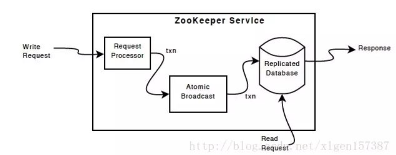
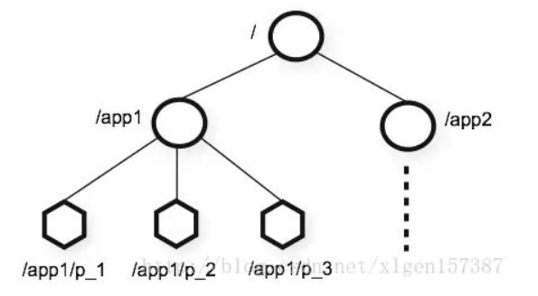
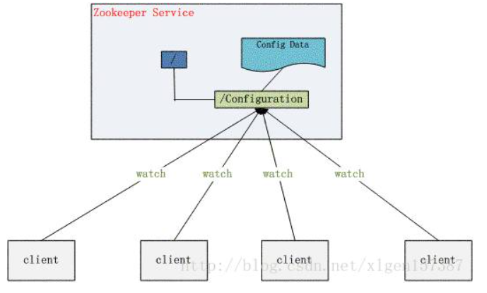
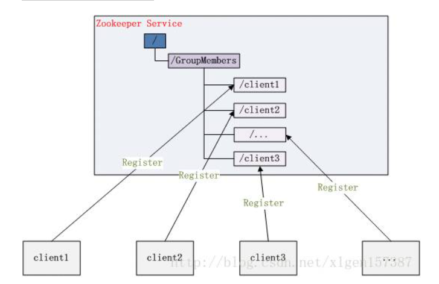

## 概念

`ZooKeeper`是Hadoop下的一个子项目，它是一个针对大型分布式系统的可靠协调系统；它提供的功能包括：配置维护、名字服务、分布式同步、组服务等；它是集群的管理者，监视着集群中各个节点的状态根据节点提交的反馈进行下一步合理操作。它的目标就是封装好复杂易出错的关键服务，将简单易用的接口和性能高效、功能稳定的系统提供给用户。

Zookeeper一个最常用地使用场景就是用于担任服务生产者和服务消费者的注册中心，服务生产者将自己提供的服务注册到Zookeeper中心，服务的消费者在进行服务调用的时候先到Zookeeper中查找服务，获取到服务生产者的详细信息之后，再去调用服务生产者的内容与数据，简单示例图如下：

分布式应用程序可以基于Zookeeper实现诸如数据发布/订阅、负载均衡、命名服务、分布式协调/通知、集群管理、Master选举、分布式锁和分布式队列等功能。

客户端的读请求可以被集群中的任意一台机器处理，如果读请求在节点上注册了监听器，这个监听器也是由所连接的zookeeper机器来处理。对于写请求，这些请求会同时发给其他zookeeper机器并且达成一致后，请求才会返回成功。因此，随着zookeeper的集群机器增多，读请求的吞吐会提高但是写请求的吞吐会下降。

有序性是zookeeper中非常重要的一个特性，所有的更新都是全局有序的，每个更新都有一个唯一的时间戳，这个时间戳称为zxid（ZookeeperTransactionId）。而读请求只会相对于更新有序，也就是读请求的返回结果中会带有这个zookeeper最新的zxid。

## ZooKeeper提供了什么

### 文件系统

Zookeeper提供一个多层级的节点命名空间（节点称为znode）。与文件系统不同的是，这些节点都可以设置关联的数据，而文件系统中只有文件节点可以存放数据而目录节点不行。

Zookeeper为了保证高吞吐和低延迟，在内存中维护了这个树状的目录结构，这种特性使得Zookeeper不能用于存放大量的数据，每个节点的存放数据上限为1M。

### ZAB协议

ZAB协议是为分布式协调服务Zookeeper专门设计的一种支持崩溃恢复的原子广播协议。

ZAB协议包括两种基本的模式：崩溃恢复和消息广播。

当整个zookeeper集群刚刚启动或者Leader服务器宕机、重启或者网络故障导致不存在过半的服务器与Leader服务器保持正常通信时，所有进程（服务器）进入崩溃恢复模式，首先选举产生新的Leader服务器，然后集群中Follower服务器开始与新的Leader服务器进行数据同步，当集群中超过半数机器与该Leader服务器完成数据同步之后，退出恢复模式进入消息广播模式，Leader服务器开始接收客户端的事务请求生成事物提案来进行事务请求处理。

## ZNODDE节点类型

- 持久节点（PERSISTENT）：除非手动删除，否则节点一直存在于Zookeeper上
- 临时节点（EPHEMERAL）：临时节点的生命周期与客户端会话绑定，一旦客户端会话失效（客户端与zookeeper连接断开不一定会话失效），那么这个客户端创建的所有临时节点都会被移除。
- 持久顺序节点（PERSISTENT_SEQUENTIAL）：基本特性同持久节点，只是增加了顺序属性，节点名后边会追加一个由父节点维护的自增整型数字。
- 临时顺序节点（EPHEMERAL_SEQUENTIAL）：基本特性同临时节点，增加了顺序属性，节点名后边会追加一个由父节点维护的自增整型数字。

## Leader 选举

Leader选举是保证分布式数据一致性的关键所在。

当Zookeeper集群中的一台服务器出现以下两种情况之一时，需要进入Leader选举。

1. 服务器初始化启动。
2. 服务器运行期间无法和Leader保持连接。

## 服务器启动时期的Leader选举

若进行Leader选举，则至少需要两台机器，这里选取3台机器组成的服务器集群为例。在集群初始化阶段，当有一台服务器Server1启动时，其单独无法进行和完成Leader选举，当第二台服务器Server2启动时，此时两台机器可以相互通信，每台机器都试图找到Leader，于是进入Leader选举过程。选举过程如下

1. 每个Server发出一个投票。由于是初始情况，Server1和Server2都会将自己作为Leader服务器来进行投票，每次投票会包含所推举的服务器的myid和ZXID，使用(myid, ZXID)来表示，此时Server1的投票为(1, 0)，Server2的投票为(2, 0)，然后各自将这个投票发给集群中其他机器。
2. 接受来自各个服务器的投票。集群的每个服务器收到投票后，首先判断该投票的有效性，如检查是否是本轮投票、是否来自LOOKING状态的服务器。
3. 处理投票。针对每一个投票，服务器都需要将别人的投票和自己的投票进行PK，PK规则如下
   - 优先检查`ZXID`。ZXID比较大的服务器优先作为Leader。
   - 如果ZXID相同，那么就比较myid。myid较大的服务器作为Leader服务器。
   - 对于Server1而言，它的投票是(1, 0)，接收Server2的投票为(2, 0)，首先会比较两者的ZXID，均为0，再比较myid，此时Server2的myid最大，于是更新自己的投票为(2, 0)，然后重新投票，对于Server2而言，其无须更新自己的投票，只是再次向集群中所有机器发出上一次投票信息即可。
4. 统计投票。每次投票后，服务器都会统计投票信息，判断是否已经有过半机器接受到相同的投票信息，对于Server1、Server2而言，都统计出集群中已经有两台机器接受了(2, 0)的投票信息，此时便认为已经选出了Leader。
5. 改变服务器状态。一旦确定了Leader，每个服务器就会更新自己的状态，如果是Follower，那么就变更为FOLLOWING，如果是Leader，就变更为LEADING。

Zookeeper保证了如下分布式一致性特性：

- 最终一致性：为客户端展示同一视图，这是 ZooKeeper 最重要的性能。
- 可靠性：如果消息被一台服务器接受，那么它将被所有的服务器接受。
- 实时性：：ZooKeeper 不能保证两个客户端同时得到刚更新的数据，如果需要最新数据，应该在读数据之前调用sync()接口。
- 等待无关（wait-free)：慢的或者失效的client不干预快速的client的请求。
- 原子性：更新只能成功或者失败，没有中间其他状态。
- 顺序一致性：对于所有server，同一消息发布顺序一致。

## Q&A

### 1、为什么需要server?

1. ZooKeeper 需保证高可用和强一致性;
2. 为了支持更多的客户端，需要增加更多的Server;
3. Follower增多会导致投票阶段延迟增大，影响性能。

### 2、在Zookeeper中ObServer起到什么作用？

1. ObServer不参与投票过程，只同步 leader的状态 ;
2. Observers接受客户端的连接，并将写请求转发给 leader节点 ;
3. 加入更多ObServer节点，提高伸缩性，同时还不影响吞吐率。

### 3、为什么在Zookeeper中Server数目一般为奇数？

我们知道在Zookeeper中 Leader 选举算法采用了Zab协议。Zab核心思想是当多数 Server 写成功，则任务数据写成功。 

1. 如果有3个Server，则最多允许1个Server挂掉。
2. 如果有4个Server，则同样最多允许1个Server挂掉。既然3个或者4个Server，同样最多允许1个Server挂掉，那么它们的可靠性是一样的，所以选择奇数个ZooKeeper Server即可，这里选择3个Server。

### 4、ZooKeeper 写数据流程

ZooKeeper 的写数据流程主要分为以下几步：

1. 比如 Client 向 ZooKeeper 的 Server1 上写数据，发送一个写请求。
2. 如果Server1不是Leader，那么Server1 会把接受到的请求进一步转发给Leader，因为每个ZooKeeper的Server里面有一个是Leader。这个Leader 会将写请求广播给各个Server，比如Server1和Server2， 各个Server写成功后就会通知Leader。
3. 当Leader收到大多数 Server 数据写成功了，那么就说明数据写成功了。如果这里三个节点的话，只要有两个节点数据写成功了，那么就认为数据写成功了。写成功之后，Leader会告诉Server1数据写成功了。
4. Server1会进一步通知 Client 数据写成功了，这时就认为整个写操作成功。

### 5、ZooKeeper 组件

ZooKeeper组件显示了ZooKeeper服务的高级组件。 除了请求处理器，组成ZooKeeper服务的每个服务器复制其自己的每个组件的副本。

Replicated Database是包含整个数据树的内存数据库。 更新操作会记录到磁盘里以进行可恢复性，并且写操作将在放到内存数据库之前序列化到磁盘。

每个ZooKeeper服务器服务客户端。 客户端连接到一个服务器以提交irequest。 读取请求从每个服务器数据库的本地副本服务。 更改服务状态（写入请求）的请求由协议进行处理。

作为协议协议的一部分，来自客户端的所有写请求被转发到单个服务器，称为leader。 其余的ZooKeeper服务器（称为followers）从领导者接收消息提议并同意消息传递。 消息层负责在失败时替换领导者，并与leader同步followers。

## 三、ZooKeeper 应用场景总结

### 1、统一命名服务

统一命名服务的命名结构图如下所示：

1、在分布式环境下，经常需要对应用/服务进行统一命名，便于识别不同服务。

1. 类似于域名与ip之间对应关系，ip不容易记住，而域名容易记住。
2. 通过名称来获取资源或服务的地址，提供者等信息。

2、按照层次结构组织服务/应用名称。

a）可将服务名称以及地址信息写到ZooKeeper上，客户端通过ZooKeeper获取可用服务列表类。

### 2、配置管理

配置管理结构图如下所示：

1、分布式环境下，配置文件管理和同步是一个常见问题。

1. 一个集群中，所有节点的配置信息是一致的，比如 Hadoop 集群。
2. 对配置文件修改后，希望能够快速同步到各个节点上。

2、配置管理可交由ZooKeeper实现。

1. 可将配置信息写入ZooKeeper上的一个Znode。
2. 各个节点监听这个Znode。
3. 一旦Znode中的数据被修改，ZooKeeper将通知各个节点。

### 3、集群管理

集群管理结构图如下所示：

1、分布式环境中，实时掌握每个节点的状态是必要的。

a）可根据节点实时状态做出一些调整。

2、可交由ZooKeeper实现。

1. 可将节点信息写入ZooKeeper上的一个Znode。
2. 监听这个Znode可获取它的实时状态变化。

3、典型应用

a）HBase中Master状态监控与选举。

### 4、分布式通知与协调

1. 分布式环境中，经常存在一个服务需要知道它所管理的子服务的状态。
 - NameNode需知道各个Datanode的状态。
 - JobTracker需知道各个TaskTracker的状态。
2. 心跳检测机制可通过ZooKeeper来实现。
3. 信息推送可由ZooKeeper来实现，ZooKeeper相当于一个发布/订阅系统。

### 5、分布式锁

处于不同节点上不同的服务，它们可能需要顺序的访问一些资源，这里需要一把分布式的锁。

分布式锁具有以下特性：

1. ZooKeeper是强一致的。比如各个节点上运行一个ZooKeeper客户端，它们同时创建相同的Znode，但是只有一个客户端创建成功。
2. 实现锁的独占性。创建Znode成功的那个客户端才能得到锁，其它客户端只能等待。当前客户端用完这个锁后，会删除这个Znode，其它客户端再尝试创建Znode，获取分布式锁。
3. 控制锁的时序。各个客户端在某个Znode下创建临时Znode，这个类型必须为CreateMode.EPHEMERAL_SEQUENTIAL，这样该Znode可掌握全局访问时序。

### 6、分布式队列

分布式队列分为两种：

1. 当一个队列的成员都聚齐时，这个队列才可用，否则一直等待所有成员到达，这种是同步队列。
 - 一个job由多个task组成，只有所有任务完成后，job才运行完成。
 - 可为job创建一个/job目录，然后在该目录下，为每个完成的task创建一个临时的Znode，一旦临时节点数目达到task总数，则表明job运行完成。
2. 队列按照FIFO方式进行入队和出队操作，例如实现生产者和消费者模型。

