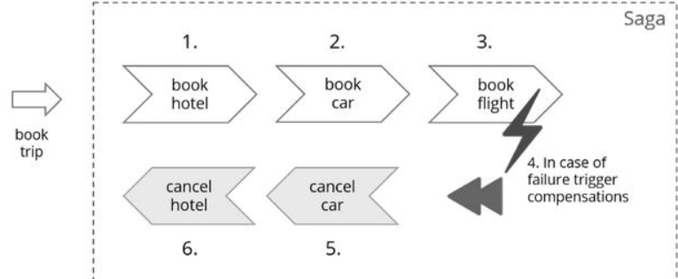
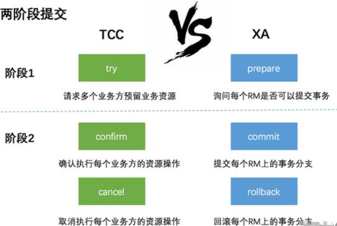

  
解决跨库操作的数据一致性问题：

在分布式或者微服务架构中，每个服务都有自己的数据源，使用不同事务管理器，如果A服务去调用B服务，B服务执行失败了，A服务的事务和B服务的事务都会回滚，这时候是不存在事务问题的，但是如果A服务B服务执行成功之后出现异常，A服务的事原子性务会回滚，但是B服务的事务不会回滚，此时就存在分布式事务问题。

## 使用场景：

- 转账：包含转出和转入操作
- 网购：包含下单、扣减库存、支付操

### 事务的4个特性ACID

原子性（Atomicity）：操作这些指令时，要么全部执行成功，要么全部不执行。只要其中一个指令执行失败，所有的指令都执行失败，数据进行回滚，回到执行指令前的数据状态。

一致性（Consistency）<Badge text="总量不变" />：事务的执行使数据从一个状态转换为另一个状态，数据库的完整性约束没有被破坏。

>拿转账来说，假设用户A和用户B 两者的钱加起来一共是2000，那么不管A和B之间如何转账，转几次账，事务结束后两个用户的钱相加起来应该还得是2000，这就是事务的一致性。

隔离性（Isolation）<Badge text="信息彼此独立，互不干扰" />：隔离性是当多个用户并发访问数据库时，比如操作同一张表时，数据库为每一个用户开启的事务，不能被其他事务的操作所干扰，多个并发事务之间要相互隔离。

>即要达到这么一种效果：对于任意两个并发的事务T1和T2，在事务T1看来，T2要么在T1开始之前就已经结束，要么在T1结束之后才开始，这样每个事务都感觉不到有其他事务在并发地执行。

持久性（Durability）：当事务正确完成后，它对于数据的改变是永久性的。不会轻易丢失

```sql
begin transaction； 
// 本地数据库操作：张三减少金额 
// 本地数据库操作：李四增加金额 
commit transation;
```

随着互联网的快速发展，软件系统由原来的单体应用转变为分布式应用，下图描述了单体应用向微服务的演变：分布式系统会把一个应用系统拆分为可独立部署的多个服务，因此需要服务与服务之间远程协作才能完成事务操 作，这种分布式系统环境下由不同的服务之间通过网络远程协作完成事务称之为分布式事务，例如用户注册送积分 事务、创建订单减库存事务，银行转账事务等都是分布式事务。

典型的场景就是微服务架构 微服务之间通过远程调用完成事务操作。 比如：订单微服务和库存微服务，下单的 同时订单微服务请求库存微服务减库存。 简言之：跨JVM进程产生分布式事务。

```sql
begin transaction；
//1.本地数据库操作：张三减少金额
//2.远程调用：让李四增加金额 
commit transation;
```

### CAP定理

CAP原则指的是在一个分布式系统中，不可能同时满足以下三点。

一致性（Consistency）<Badge text="副本最新" />

指强一致性，在写操作完成后开始的任何读操作都必须返回该值，或者后续写操作的结果。

可用性（Availability）<Badge text="高可用" />：

可用性是指，每次向未崩溃的节点发送请求，总能保证收到响应数据（允许不是最新数据）

分区容忍性（Partition tolerance）<Badge text="能容忍网络分区" />：分布式系统在遇到任何网络分区故障的时候，仍然能够对外提供满足一致性和可用性的服务,，也就是说，服务器A和B发送给对方的任何消息都是可以放弃的，也就是说A和B可能因为各种意外情况，导致无法成功进行同步，分布式系统要能容忍这种情况。除非整个网络环境都发生了故障。

1. 使用MQ
2. 使用Seata

CP  满足原子和分区容错，也就是说，要放弃可用。当系统被分区，为了保证原子性，必须放弃可用性，让服务停用。
AP 满足可用性和分区容错，当出现分区，同时为了保证可用性，必须让节点继续对外服务，这样必然导致失去原子性。

### 一致性 <Badge text="数据一致性" />

一致性可以分为强一致性与弱一致性。所谓强一致性，即复制是同步的，弱一致性，即复制是异步的。

ap 不是完全放弃数据一致性，而是牺牲强一致性换取弱一致性。

## seata

- TC (Transaction Coordinator) - 事务协调者
维护全局和分支事务的状态，驱动全局事务提交或回滚；
- TM (Transaction Manager) - 事务管理器
定义全局事务的范围：开始全局事务、提交或回滚全局事务；
- RM (Resource Manager) - 资源管理器
管理分支事务处理的资源，与TC交互以注册分支事务和报告分支事务的状态，并驱动分支事务提交或回滚；

Seata是阿里巴巴退出的一款用来解决分布式事务问题的框架，他经过天猫双十一的考验，很有可能成为解决分布式事务问题的主流框架

4、Seata分布式事务框架实现原理？

Seata有三个组成部分：事务协调器TC：协调者、事务管理器TM：发起方、资源管理器RM：参与方

1. 发起方会向协调者申请一个全局事务id ，并保存到ThreadLocal中（为什么要保存到ThreadLocal中？弱引用，线程之间不会发生数据冲突）
2. Seata 数据源代理发起方和参与方的数据源，将前置镜像和后置镜像写入到undo_log表中，方便后期回滚使用
3. 发起方获取全局事务id，通过改写Feign客户端请求头传入全局事务id。
4. 参与方从请求头中获取全局事务id保存到ThreadLocal中，并把该分支注册到SeataServer中。
5. 如果没有出现异常，发起方会通知协调者，协调者通知所有分支，通过全局事务id和本地事务id删除undo_log数据，如果出现异常，通过undo_log逆向生成sql语句并执行，然后删除undo_log语句。如果处理业务逻辑代码超时，也会回滚

## AT事务模式

分布式事务工作机制

前提： 基于支持本地 ACID 事务的关系型数据库；（mysql、oracle）

Java 应用，通过JDBC访问数据库；

整体机制就是两阶段提交协议的演变：

一阶段： “业务数据“和“回滚日志记录“在同一个本地事务中提交，释放本地锁和连接资源；

二阶段： 如果没有异常异步化提交，非常快速地完成； 如果有异常回滚通过一阶段的回滚日志进行反向补偿； 

具体举例说明整个AT分支的工作过程：

## sagas事务模式

最终一致性

又称为Long-running-transaction(长事务)，核心思想是把一个长事务分为多个本地事务来完成，由一个`Process Manager` 统一协调。如果成功，则继续往下执行，如果失败，则调用补偿操作。

每个业务都至少需要实现正向、反向两个接口。

我们看如下一个业务场景。在购买旅游套餐业务操作涉及到三个操作，他们分别是预定车辆，预定宾馆，预定机票，他们分别属于三个不同的远程接口。可能从我们程序的角度来说他们不属于一个事务，但是从业务角度来说是属于同一个事务的。



他们的执行顺序如上图所示，所以当发生失败时，会依次进行取消的补偿操作。

因为长事务被拆分了很多个业务流，所以 Saga 事务模型最重要的一个部件就是流程管理器(Process Manager)。

在执行到第3步时，发生了失败，回退的过程也比较复杂，特别是子业务比较多的场景。

如何实现数据的一致性呢？如下罗列了一些方案。

1. 如果失败，可以发生消息到MQ，消费者根据状态，去重试，或者执行回退操作。同时，也可以进一步检查数据的一致性。
2. 建立一个定时任务去检查数据的完整性，如果第3步失败了，定时任务会检测到并修复数据。
3. 本地操作日志或DB日志。

## TCC事务模型

TCC(Try Confirm Cancel)事务模型的思想和2PC提交有点类似。下图是TCC和2PC(XA)的对比。




1. 在阶段一：XA模型中，各个RM准备提交各自的事务分支，事实上就是准备提交资源的更新操作（insert、delete、update等），而在TCC中，是主业务活动请求(try)各个从业务服务检查和预留资源。
2. 阶段二：2PC（XA）根据第一阶段每个RM是否都prepare成功，判断是要提交还是回滚。如果都prepare成功，那么就commit每个事务分支，反之则rollback每个事务分支。
3. TCC中，如果在第一阶段所有业务资源都预留成功，那么confirm各个从业务服务，否则取消(cancel)所有从业务服务的资源预留请求。

TCC两阶段提交与2PC/XA两阶段提交的区别是：

- 2PC是资源层面的分布式事务，强一致性，在两阶段提交的整个过程中，一直会持有资源的锁。
- TCC是业务层面的分布式事务，最终一致性，不会一直持有资源的锁。

是目前最火的一种柔性事务方案，其核心思想是：针对每个操作，都要注册一个与其对应的确认和补偿（撤销）操作

所谓的 TCC 编程模式，也是两阶段提交的一个变种，不同的是 TCC 为在业务层编写代码实现的两阶段提交。

### 注意事项：

最常见的主要是这三种异常，分别是空回滚、幂等、悬挂。

1、允许空回滚：

事务协调器在调用TCC服务的一阶段TRY操作时，可能会出现因为丢包而导致的网络超时，此时事务协调器会触发二阶段回滚，调用TCC服务的CANCEL操作；

TCC服务在未收到TRY请求的情况下受到CANCEL请求，这种场景被称为空回滚；TCC服务在实现时应当允许空回滚的执行。

那怎么解决空回滚呢？前面提到，Cancel 要识别出空回滚，直接返回成功。那关键就是要识别出这个空回滚。**思路很简单就是需要知道一阶段是否执行，如果执行了，那就是正常回滚；**如果没执行，那就是空回滚。因此，需要一张额外的事务控制表，其中有分布式事务 ID 和分支事务 ID，第一阶段 Try 方法里会插入一条记录，表示一阶段执行了。Cancel 接口里读取该记录，如果该记录存在，则正常回滚；如果该记录不存在，则是空回滚。

3、防悬挂控制

事务协调器在调用TCC服务的一阶段TRY操作时，可能会出现网络拥堵而导致的超时，此时事务协调器会触发二阶段回滚，调用TCC服务的CANCEL操作；在此之后，拥堵在网络上的一阶段TRY数据包被TCC服务收到，出现了二阶段CanCEL请求比一阶段TRY请求先执行的情况。

用户在实现TCC服务时，应该允许空回滚，但是要拒绝执行空回滚之后到来的一阶段TRY请求；

大家是否想到了刚才解决空回滚和幂等时用到的事务控制表，可以在二阶段执行时插入一条事务控制记录，状态为已回滚，这样当一阶段执行时，先读取该记录，如果记录存在，就认为二阶段已经执行；否则二阶段没执行。

4、幂等控制

无论是网络数据包重传，还是异常事务的补偿执行；用户在实现TCC，需要考虑幂等控制，即TRY、CONFIRM、CANCEL执行一次和执行多次的业务结果是一样的；

接下来是幂等。幂等就是对于同一个分布式事务的同一个分支事务，重复去调用该分支事务的第二阶段接口，因此，要求 TCC 的二阶段 Confirm 和 Cancel 接口保证幂等，不会重复使用或者释放资源。如果幂等控制没有做好，很有可能导致资损等严重问题。

什么样的情形会造成重复提交或回滚？从图中可以看到，提交或回滚是一次 TC 到参与者的网络调用。因此，网络故障、参与者宕机等都有可能造成参与者 TCC 资源实际执行了二阶段防范，但是 TC 没有收到返回结果的情况，这时，TC 就会重复调用，直至调用成功，整个分布式事务结束。

TCC 分别指 Try、Confirm、Cancel ，一个业务操作要对应的写这三个方法。

第一阶段

Try（尝试）：

完成所有业务检查(一致性)
预留必须业务资源(准隔离性)

第二阶段

本阶段根据第一阶段的结果，决定是执行confirm还是cancel

Confirm（确认）：执行真正的业务执行业务 不做任何业务检查

- 只使用Try阶段预留的业务资源
- 释放Try阶段预留的业务资源

Cancle（取消） - 释放Try阶段预留的业务资源 以下单扣库存为例，

- Try 阶段去占库存（资源的检测与预留）；
- Confirm 阶段则实际扣库存（执行的业务操作提交）；
- 如果库存扣减失败 Cancel 阶段进行回滚，释放库存（预留资源释放）；


### 一个完整的TCC事务参与方包括三部分：

- 发起方
- 参与方：服务必须实现Try、Confirm 和Cancel三个接口，供发起方服务调用，由于Confirm和Cancel操作可能被重复调用，故要求Confirm和Cancel两个接口必须是幂等的。
- tc：记录维护TCC全局事务的事务状态和每个从业务服务的子事务状态，并在业务活动提交时确认所有的TCC型操作的confirm操作，在业务活动取消时调用所有TCC型操作的cancel操作。

并发控制 ➢允许空回滚 ➢防悬挂控制 ➢幂等控制

TCC 不存在资源阻塞的问题，因为每个方法都直接进行事务的提交，一旦出现异常通过则 Cancel 来进行回滚补偿，这也就是常说的补偿性事务。
    
原本一个方法，现在却需要三个方法来支持，可以看到 TCC 对业务的侵入性很强，而且这种模式并不能很好地被复用，会导致开发量激增。还要考虑到网络波动等原因，

为保证请求一定送达都会有重试机制，所以考虑到接口的幂等性。

### tcc 案例

 账务拆分的业务场景如下，分别位于三个不同分库的帐户A、B、C，A和B一起向C转帐共80元：
 
 1、Try：尝试执行业务。
 
 完成所有业务检查(一致性)：检查A、B、C的帐户状态是否正常，帐户A的余额是否不少于30元，帐户B的余额是否不少于50元。
 
 预留必须业务资源(准隔离性)：帐户A的冻结金额增加30元，帐户B的冻结金额增加50元，这样就保证不会出现其他并发进程扣减了这两个帐户的余额而导致在后续的真正转帐操作过程中，帐户A和B的可用余额不够的情况。
 
 2、Confirm：确认执行业务。
 
 真正执行业务：如果Try阶段帐户A、B、C状态正常，且帐户A、B余额够用，则执行帐户A给账户C转账30元、帐户B给账户C转账50元的转帐操作。
 
 不做任何业务检查：这时已经不需要做业务检查，Try阶段已经完成了业务检查。
 
 只使用Try阶段预留的业务资源：只需要使用Try阶段帐户A和帐户B冻结的金额即可。
 
 3、Cancel：取消执行业务
 
 释放Try阶段预留的业务资源：如果Try阶段部分成功，比如帐户A的余额够用，且冻结相应金额成功，帐户B的余额不够而冻结失败，则需要对帐户A做Cancel操作，将帐户A被冻结的金额解冻掉。
 
 [实例代码](https://gitee.com/SHIJINGSPACE/seata-tcc-main)
 
### 一个稳定的、高可用的、扩展性强的TCC事务管理器（seata）

### TCC事务的优点和限制

解决了跨应用业务操作的原子性问题，在诸如组合支付、账务拆分场景非常实用。 

TCC实际上把数据库层的二阶段提交上提到了应用层来实现，对于数据库来说是一阶段提交，规避了数据库层的2PC性能低下问题。
 
TCC事务的缺点，主要就一个：

TCC的Try、Confirm和Cancel操作功能需业务提供，开发成本高。

当然，对TCC事务的这个缺点是否是缺点，是一个见仁见智的事情。

## 基于消息的分布式事务

基于消息的分布式事务与上面的方案很不同，适合执行周期长且实时性要求不高的场景。

基于消息的分布式事务是指当发起方执行完本地事务后并发出一条消息，参与方一定能够接收消息并处理事务成功，此方案强调的是只要消息发给参与方最终事务要达到一致。

一般使用消息中间件完成。

事务发起方（消息生产方）将消息发给消息中间件，事务参与方从消息中间件接收消息，事务发起方和消息中间件之间，事务参与方（消息消费方）和消息中间件之间都是通过网络通信。

发起方将消息发给消息中间件，参与方从消息中间件接收消息，发起方和消息中间件之间，参与方和消息中间件之间都是通过网络通信。


本地事务与消息发送的原子性问题

- 保证数据库操作与发送消息的一致性，不会出现只有一个成功，另一个不成功的情况
- 事务参与方接收消息的可靠性
- 事务参与方必须能够从消息队列接收到消息，如果接收消息失败可以重复接收消息
- 消息重复消费的问题 

由于网络的存在，若某一个消费节点超时但是消费成功，此时消息中间件会重复投递此消息，就导致了消息的重复消费

RocketMQ 事务消息设计则主要是为了解决发起方的消息发送与本地事务执行的原子性问题，

RocketMQ 的设计中 broker 与提供者的双向通信能力，使得 broker 天生可以作为一个事务协调者存在；而 RocketMQ 本身提供的存储机制为事务消息提供了持久化能力；

RocketMQ 的高可用机制以及可靠消息设计则为事务消息在系统发生异常时依然能够保证达成事务的最终一致性。

发起方发消息到mq，mq 将消息状态标记为prepared，这条消息消费者无法消费到。

mq接受到发起方发送的消息回应发送成功

发起方执行本地业务代码； 本地事务执行成功，向mq发送commit消息，mq 接受到commit 消息把状态置为可消费，此时消费者（参与方）正常消费消息 参与方本地事务执行失败，向mq发送rollback 消息，mq接收到rollback 消息删除消息 参与方消费消息成功向mq回应ack 确认消费消息成功，否则重复接收，这里ack默认自动回应。 如果参与者执行本地事务时，宕机或超时，mq 会不停询问同组的其他消费者来获取事务执行状态。mq 会根据会回查结构来确定是否投递消息；
