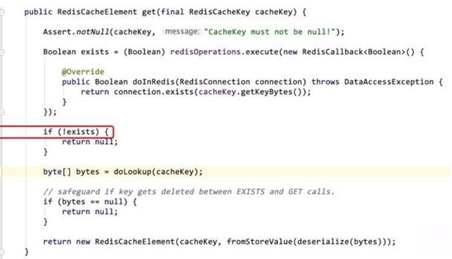
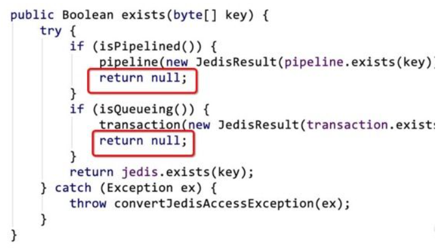

# 一个 NullPointerException ，竟然有这么多花样

## 问题

有个问题实在定位不出来（随机出现的一个空指针异常），可否帮忙看看!☺

敢问各位大佬，在使用spring 的缓存注解@Cacheable 时，缓存配置的时redis，客户端Jedis ,生产时单点，线上是否碰到过随机的空指针异常，有spring的RedisCache在get时抛出的；

这里就涉及到一个重要的问题，那就是提问的艺术

比如说：我们常见的错误提问方式是：

你们有没有遇到过XXX问题？【X】

看到这样的问题着实让人脑壳疼，其实简单的常见问题网上搜一下都有

复杂的问题基本和业务相关，别人碰到和你一样的问题的概率很小

比较正确的提问姿势应该是把问题具体描述出来

我做了什么事， 我期望的结果是XX，但是目前出现的结果又是XX ，异常栈信息如下XX【v】

感兴趣的自然会出声，不感兴趣的那也没办法

等他出来，再做工作交接，但是得把现有的问题处理处理，再交接。

要写个交接文档，包括流程、操作表之类的，代码实现具体类、方法。

有还有另一种奇葩问法：

XX功能怎么做，如何实现？

## 案发现场

我们先看一下给出的异常栈

```java
java.lang.NullPointerException
 at org.springframework.data.redis.cache.RedisCache.get(RedisCache.java:180)
 at org.springframework.data.redis.cache.RedisCache.get(RedisCache.java:133)
 at org.springframework.cache.transaction.TransactionAwareCacheDecorator.get(TransactionAwareCacheDecorator.java:69)
 at org.springframework.cache.interceptor.AbstractCacheInvoker.doGet(AbstractCacheInvoker.java:71)
 at org.springframework.cache.interceptor.CacheAspectSupport.findInCaches(CacheAspectSupport.java:537)
 at org.springframework.cache.interceptor.CacheAspectSupport.findCachedItem(CacheAspectSupport.java:503)
 at org.springframework.cache.interceptor.CacheAspectSupport.execute(CacheAspectSupport.java:389)
 at org.springframework.cache.interceptor.CacheAspectSupport.execute(CacheAspectSupport.java:327)
 at org.springframework.cache.interceptor.CacheInterceptor.invoke(CacheInterceptor.java:61)
```

根据异常栈我们很轻松就能定位到源码位置



很明显exists为null，就会出现本篇的NullPointerException。当然如果这样三分钟没到本篇就草率结束，明显有失肥朝的男儿本色！另外若当真如此草率，那么关注肥朝公众号的意义何在？肥朝公众号的老粉丝们都知道，肥朝的海量源码实战类文章，都有三个特点

- 从源码原理角度分析，为什么会出现这个问题？
- 如何解决掉这个问题？
- 我们如何深度思考，不断从这次经历中压榨出最大价值。（非常重点！）

比如就拿这个问题来说，按照我们正常的思维惯性，我们看到176行有个return，又知道exists是null，那么我们点进connection.exists(cacheKey.getKeyBytes())这个方法一探究竟。



结果发现果然如我们所料，这里竟然有两个return null的情况,这个时候就有粉丝把持不住，要九浅一深直入源码分析，看这两个条件什么时候满足。但是肥朝想说的是，且慢动手！

你注意看这段代码

```java
class T{
Boolean exists = (Boolean) redisOperations.execute(new RedisCallback<Boolean>() {

        @Override
        public Boolean doInRedis(RedisConnection connection) throws DataAccessException {
            return connection.exists(cacheKey.getKeyBytes());
        }
    });
}
```

