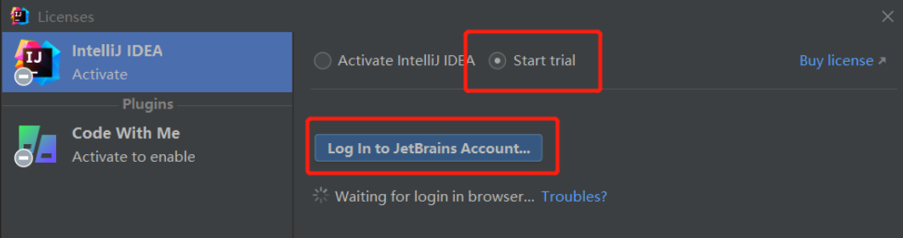

## IDEA-2021：激活 

1、下载idea和破解工具

([idea下载](https://www.jetbrains.com/idea/))

[ja-netfilter【idea破解工具】](https://github.com/ja-netfilter/ja-netfilter/releases)

2、修改配置

将`ja-netfilter`解压后，在`config`文件夹里打开`mymap.conf`

在文件末尾加上这几行：

```conf
[MyMap]
EQUAL,licenseeName->sj
EQUAL,gracePeriodDays->30
EQUAL,paidUpTo->2200-12-31
```

C:\Users\Administrator\AppData\Roaming\JetBrains\IntelliJIdea2021.3

在该文件夹目录下找到文件`idea64.exe.vmoptions`【用于配置IDEA运行时虚拟机参数，并不是项目运行的配置】，用编译器打开 

添加代理插件的本地路径。

-javaagent:E:\download\ja-netfilter-v2.2.2\ja-netfilter-v2.2.2\ja-netfilter.jar

```vmoptions
-Xmx2032m
-Djava.net.preferIPv4Stack=true
-Dfile.encoding=UTF-8
-javaagent:E:\download\ja-netfilter-v2.2.2\ja-netfilter-v2.2.2\ja-netfilter.jar
```

3、打开idea：

初次弹窗：我们选择start trial  - log in to JetBrains Account，弹出界面：

  

没有账号的话，自己注册一个账号，免费的。

参考：

- [idea64.exe.vmoptions文件详解](https://blog.csdn.net/qq_16268979/article/details/118635094)
- [idea破解教程](https://blog.csdn.net/qq_41973729/article/details/122353737?spm=1001.2101.3001.6650.5&utm_medium=distribute.pc_relevant.none-task-blog-2~default~CTRLIST~Rate-5.pc_relevant_paycolumn_v3&depth_1-utm_source=distribute.pc_relevant.none-task-blog-2~default~CTRLIST~Rate-5.pc_relevant_paycolumn_v3&utm_relevant_index=8)

## idea插件

1. Alibaba Java Coding Guidelines
2. iBATIS/MyBatis plugin
3. GsonFormat
4. Stack Overflow
5. Background Image Plus
6. Lombok
7. CodeGlance
8. generatAllSetter
9. gitee
10. copilot（代码补全）
11. GrepFormatPlus
12. GrepConsole
13. JRebel and XRebel
14. Markdown Image Support
15. MetricsReloaded
16. CamelCase
17. RestfulTool
18. statistic
19. Translation
20. vue.js

IDE eval reset
jrebel and xrebel
camelcase

## IDEA配置修改

1、自动编译开关（代码完成-> 区分大小写）

构建、运行、部署 =》编译器（自动构建项目）

2、忽略大小写开关

  

3、取消单行显示tabs的操作（编辑器->编辑器选项卡->在单行显示选项卡）

  

4、项目文件编码（编辑器-》文件编码）

5、滚轴修改字体大小（常规-》鼠标控制）

