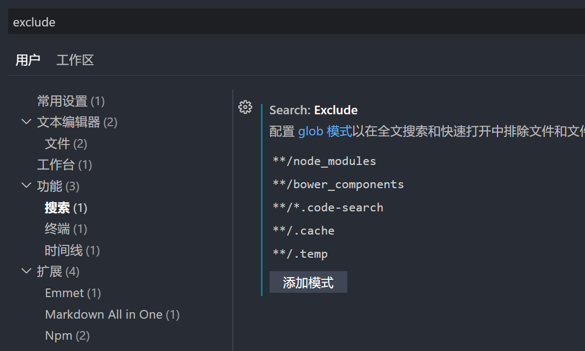

## vscode插件

安装插件

- one dark pro
- google translate
- github copilot
- gitee
- git history
- markdown all in one

注意：markdown和copilot插件的tab键和发生冲突，markdown扩展插件的`markdown.extension.onShiftTabKey`快捷键修改，替换tab键或者取消，如`shift+tab`。

## 快捷键修改

因为习惯使用Idea，所以将尽量将vscode的配置和idea保持一致。

- 将下一个查找匹配项添加到选择 ctrl+d 替换成 ctrl+w
- 向下复制行 `shift+alt+upArrow` 替换成 `ctrl+d`
- 视图：切换主侧栏的可见：ctrl+b 改成 alt+1
- 删除行：`ctrl+y`

## vscode配置修改
 
1、选中单词的分隔符

Editor: `Word Separators`：执行单词相关的导航或操作时作为单词分隔符的字符。

双击选中单词，有一些中文的字符识别不了，设置单词分隔符，添加中文分隔符包括`，：；、？。！（）`等；

2、自动保存

autosave：选为onfocuschange

其它选项分别是

- off：永不自动保存更新后的文件 （他是个默认选项）
- afterDelay：当文件修改后的时间超过“Files:Auto Save Delay”中配置的值时自动进行保存
- onWindowChange：窗口失去焦点时自动保存更新后的文件

3、 搜索文件，排除某些文件夹

exclude

功能-》搜索 配置glob模式以在全文搜索和快速打开中排除文件和文件夹

  
